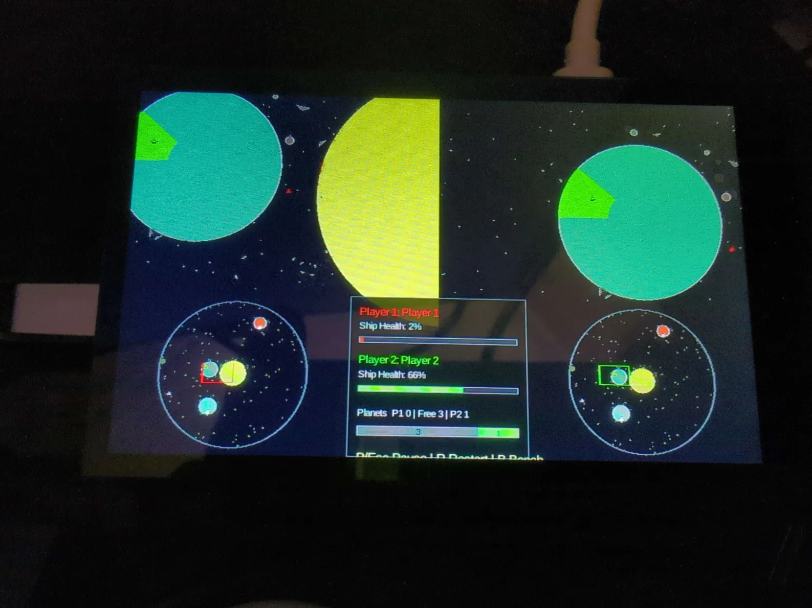

# Space-Wars

A reboot of a 2008 UW Bothell CSS 450 school project (Allan + CK, JOGL/Java)
as a cross-platform (Linux / Windows / Raspberry Pi) AI testbed in Rust + Slint.

# On target hardware
Below is a zoomed out view of a CTF game mode.


## Status

The local launcher currently hosts four playable scenarios:

- **Spacewars** — the two-player arcade reboot. Its ships, escape pods,
  asteroids, physical debris, projectiles, celestial bodies, spaceport sensors,
  and laser queries share the canonical Rapier mechanics world; gameplay still
  owns gravity fields, damage, capture, rebuilding, and effects.
- **Pizza** — a seeded interactive gravity-and-collision ball simulation.
  Rapier owns rigid-body motion and contacts while the scenario supplies mutual
  gravity and gameplay damage. Click empty space to make a ball, or grab and
  fling an existing one.
- **Rover Lab** — a Rapier 2D feasibility scenario for a three-body rover with
  independently driven pin-slot suspension wheels on a rotating circular planet.
- **Falling** — the pinned MIT-licensed NES homebrew running on this repository's
  Rust-native mapper-0 emulator, with pixel-perfect native video, exact-rational
  realtime pacing, and bounded 48 kHz device audio.

Textures and sounds for Spacewars have yet to be done. Pizza retains its
Classic collision implementation as a benchmark reference. Mutual gravity is
shared by both mechanics backends and can use the exact oracle or deterministic
Barnes-Hut `full`/`fast` presets.

See [`docs/design/reboot-rust-slint.md`](docs/design/reboot-rust-slint.md).
The deterministic Classic/Rapier Pizza benchmark is documented in
[`docs/pizza-performance-lab.md`](docs/pizza-performance-lab.md).
The accepted physics ownership and lifecycle design is documented in
[`docs/design/physics-architecture.md`](docs/design/physics-architecture.md).

A Rust-native NES engine is also under development. Its mapper-0 cartridge,
cycle-oriented RP2A03 CPU, scalar 2C02 PPU, complete five-channel APU,
deterministic 48 kHz sample/frame/state API, checkpoints, portable savestates,
reference captures, and generated test tools live in `crates/engine-nes`.
Falling now exercises that core through a dedicated realtime worker, bounded
input/video/audio handoffs, and the ordinary launcher, pause, restart, and
relaunch lifecycle. See
[`docs/design/rust-nes-engine.md`](docs/design/rust-nes-engine.md) and
[`crates/engine-nes/REFERENCE.md`](crates/engine-nes/REFERENCE.md). The mapper
and additional-scenario workflow is in
[`docs/nes-extension-guide.md`](docs/nes-extension-guide.md), and desktop/Pi
milestone results are recorded in
[`docs/nes-validation.md`](docs/nes-validation.md).

## Run locally

Start the launcher:

```sh
cargo run -p engine-client
```

Or start a scenario directly:

```sh
cargo run -p engine-client -- --scenario pizza
cargo run -p engine-client -- --scenario rover-lab
cargo run -p engine-client -- --scenario spacewars
cargo run -p engine-client -- --scenario falling
```

Rover Lab uses d-pad left/right to drive, `B` or d-pad down to brake, and a
hold/release of `A` to charge and jump. Keyboard equivalents are `W` forward,
`S` brake, `X` reverse, `Space` jump, and `R` reset.

Falling uses the d-pad, `A`, `B`, and `Start` as an NES controller. `Select`
opens the host controls menu so a gamepad-only player can restart or return to
the launcher. Keyboard equivalents are the arrow keys, `Z`/`Space`, `X`, and
`Enter`; `Esc` opens the host pause menu.

## Raspberry Pi / kiosk launch

The Pi image launches the scenario selector fullscreen:

```sh
engine-client --fullscreen --config-dir /var/lib/spacewars --renderer raster --raster-scale 2.0
```

`--fullscreen` leaves the launcher visible so a scenario can be selected while
requesting fullscreen presentation. The image selects Slint's LinuxKMS backend
with `SLINT_BACKEND`; `--kiosk` remains available when booting directly into the
saved scenario is preferred. The same settings directory can also be selected
with `SPACEWARS_CONFIG_DIR`.

See [`docs/pi-kiosk.md`](docs/pi-kiosk.md) for the current Pi runbook and
example systemd service. The Yocto image scaffold is under [`yocto/`](yocto/).

Once an OTA-capable image has been flashed, build and deploy an update from the
repository root:

```sh
./update.sh
```

This updates `spacewars@spacewars.local` by default, reboots into the newly
written A/B slot, and verifies that `spacewars-kiosk.service` is active. Use
`./update.sh --skip-build` to deploy the existing image or `./update.sh --help`
for target, user, image, SSH key, dry-run, and confirmation options.

## History

- **2008**: Original Java + JOGL game. Binary, assets, and report preserved under
  [`reference/`](reference/).
- **2015**: C++/Qt5 + OpenGL physics sandbox, stalled. Preserved on the
  [`archive/2015-qt`](https://github.com/aortez/space-wars/tree/archive/2015-qt)
  branch.
- **2026**: Reboot in Rust + Slint.
