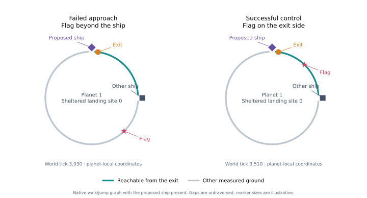

# Remaining enemy approach: route topology

The [destination failure experiment](capture-destination-retry.md) preserves a
useful neutral capture, then returns to the sole remaining enemy destination.
That approach still fails. In the retained cover-response trace, both visits
probe sites 0–7 and all eight report disconnected outbound ground routes. Each
leaves 25 candidates unmeasured. With cover response disabled, both visits
repeat exposed site 41 until the native eight-cover-replan limit.

Earlier [exhaustive route diagnostics](capture-cover-alternatives.md) found no
sheltered round trip at the first visit's observed clocks. Repeated probes are
therefore not sufficient evidence that rotating the probe list would enable
this capture. We must distinguish a disconnected base graph from a path cut by
the bot's proposed parked hull, and remeasure the later visit.

## Diagnostic contract

`--probe-cover-topology true` requires the existing fixed-clock cover probe.
It records the native 512-bearing outer-contour graph, its rejected footings,
and each observed site's hull-induced node/edge removals. The native joint
round-trip search supplies outbound/return paths and diagnostics. Every result
must exactly match the separate native eight-site diagnostic batches.

An additional route on the base graph omits the bot's proposed parked ship.
This is a counterfactual used to locate a constraint. Other physical obstacles
remain; it is never admitted to gameplay and cannot certify landing, walking,
jetpack traversal or a completed capture. Graph disconnection describes this
measurement model, not every physically possible route. The probe does not
remove the opponent, terrain, debris or any world object.

All additional queries execute on a cloned world after the ordinary control
decision, with separate timing and sensor profiles. No diagnostic result enters
the bot, sensor demand or shared planner. Omit the option to retain the existing
cover-probe output shape. No gameplay code, policy, default, weight or deadline
changes in this investigation.

## Frozen replay plan

Freeze the diagnostic, analysis, tests and this plan before inspecting new
route measurements. Replay these three existing destination-memory-enabled
runs from `target/destination-retry/v1`, preserving every gameplay argument:

| Source | Cover response | World ticks |
| --- | --- | --- |
| Directed failure, flag -0.8 | On | 3,270; 3,930; 8,580; 9,030 |
| Directed failure, flag -0.8 | Off | 9,270; 9,720 |
| Successful directed control, flag +0.8 | On | 3,510 |

All are seat 0, seed 42. These are seven known observations in three correlated
replays, not fresh strength trials. Keep unavailable observations in the
denominator. Require byte-exact native controller/planner streams, matching
physical/mission/progress reports, unchanged sensor counters and shared work
allocations. Bind each diagnostic observation and mission record to its exact
trace row. Audit graph identities, removed edges/nodes, directed paths, route
lengths, joint endpoints and native route parity. Retain source/raw hashes and
any failed audit instead of overwriting it.

Use base-graph components, footing rejection reasons and hull counterfactuals
to choose the next intervention. A wider survey, new traversal method or altered
combat/capture handoff would require its own declared gameplay experiment.

```sh
python3 tools/probe-capture-topology.py \
  --study target/destination-retry/v1 \
  --binary target/capture-topology/surface_mission_soak-COMMIT \
  --out target/capture-topology/v1
```

The first audit stopped after the second replay because it incorrectly required
the optional `cover_response` report field when that option was disabled. The
failed `v1` output is preserved. The corrected audit checks both field presence
and value; rerun the same plan and frozen binary into `v2`. No gameplay, clocks,
source cases or diagnostic measurements change for this correction.

The `v2` replays pass physical parity. Review found that the search-history
extractor also labeled later ordinary selected-site refreshes as probes after
the successful control's search had finished. `v3` excludes post-finish rows;
both prior outputs remain preserved. The same seven-clock plan and binary are
unchanged. Tests cover omitted metadata and retained finished search records.

## Results

**The proposed parked ship disconnects the sheltered approach.** All six
failure snapshots, including the return after the neutral capture, give the
same result. The base ground graph has one strongly connected component of
503 footings and 1,004 directed edges. Its other nine sampled bearings
(380–388) fail capsule clearance, alongside the opponent's parked ship. There
are no missing-floor or steep-floor rejections in these base measurements.

| Observation | Sites | Covered sites | Native covered round trips | Covered round trips without proposed hull |
| --- | ---: | ---: | ---: | ---: |
| Each failed-approach snapshot, six clocks | 59 | 37 | 0 | 37 |
| Successful +0.8 control, tick 3,510 | 59 | 37 | 37 | 37 |

All 59 observed sites have a modeled round trip on the base graph. Adding the
proposed parked hull removes access at 54 sites in each failure snapshot;
all 37 sheltered sites then report disconnected outbound routes. Only exposed
sites 41–45 retain complete trips. In the successful control, 53 sites retain
complete trips with the hull present, including all 37 sheltered sites.



For sheltered site 0, the parked hull removes nine more footings and 20 edges,
splitting the graph into components of 119 and 375 footings. The exit's start
node is 501. The failed target's chosen footing without the hull is node 316,
in the other component. The control's flag footing is node 452, in the exit's
component. Its native route reaches the flag and a boarding entrance without
crossing the hull. The diagram uses actual measured positions; its ship
markers illustrate location, not collision shape.

Thus repeating the same eight probes is real, but rotating them or measuring
all remaining sites would not provide a sheltered **walk/jump** route at these
observations. Both cover-response searches request sites 0–7, measure eight
disconnected routes and leave 25 candidates unmeasured. The offline full-site
probe resolves those omissions for diagnosis only. The successful control
selects a covered route from its ordinary shortlist without extra probes.

### Verification and retained evidence

The complete run is `target/capture-topology/v3`, using frozen diagnostic
implementation `b925912` and corrected auditor `28ffaa9`. The preserved binary
`target/capture-topology/surface_mission_soak-b925912` has SHA-256
`a8b2c4c9ea4ceb4e9c7cd004d4e0c1f58f4296b4ebbf7b79df72ef8b66518456`.
The final summary hash is
`46a1384a7cbf2ad954c935ff505be0c76b0ded62555a4d8dd590d4ad8e1a6918`.

The [manifest](data/capture-approach-topology-v1.json) records counts, provenance,
checks and the decision. The linked [compressed inputs](data/capture-approach-topology-v1.json.gz)
preserve the exact final summary and diagnostic JSON documents, plus the two
prior audit summaries. Native trace and work files remain under the recorded
local run paths, with hashes and replay commands retained in the summary.

All three physical/mission/progress reports and all 18 native controller/planner
streams match their source runs. Sensor parity covers 32,400 player observations.
The unchanged planner audits 32,400 ticks, with maxima of three graph operations
and 97 physics queries under the original 4/384 dispatch allowances. Every
diagnostic observation and mission record matches its exact trace row.
All 413 per-site topology routes match the separate native sensor measurements
in 56 bounded batches. Graph edges, path lengths and joint endpoints also pass.

Five scenario objective tests, 39 harness tests and 623 Python tests pass
(667 total). Formatting, strict AI Clippy with `--no-deps`, and profiled/normal
release builds pass. Scenario Clippy reports the same seven findings in
unchanged files, with none in the added diagnostic. The maximum added topology
measurement is 19.255 ms on this host; exhaustive route batches reach 41.099 ms.
These are additional offline measurements outside live quotas, not Pi budgets.

### Next intervention

The subsequent [powered forecast and physical execution study](capture-jetpack-approaches.md)
tested these exact observations. The existing powered model restores all 37
sheltered routes at each failed snapshot, and fresh local powered controllers
complete all six blocked captures and departures. The paired walking
controllers fail before landing; both models complete the walkable control.
Mission integration and delivery under live work allowances remain untested.

The existing [prospective jetpack crossing](bot-jetpack-landing.md) model
can propose one measured crossing of the bot's own parked ship, which directly
addresses the disconnected components. `material_mission_v11` already uses
`JetpackRoundTrip`; v12 and v13 explicitly use `JointRoundTrip`, so their landing
forecast cannot currently admit this powered alternative. Two-sided boarding
does not change the initial exit footing.

The counterfactual without a hull did not itself prove a jetpack route would
pass fuel, geometry, moving-frame and launch-window checks, or physically
complete the capture. Those checks and local physical attempts are now recorded
in the follow-up study. Validate policy integration with its original work
allowance, fresh on-foot evidence, actual claims/boarding and armed opponents.
Keep the successful walkable control and failed forecasts.
Do not reinterpret removing the hull in the diagnostic as permission to walk
through it, remove objects or change equipment.

These three source runs use `--mode quiet`: the harness suppresses weapon fire
while the controller retains its exposure checks. They isolate landing and
route selection; they do not establish whether armed combat can clear the
blockage. No default, gameplay policy, sensor demand or retry limit changes in
this investigation.
