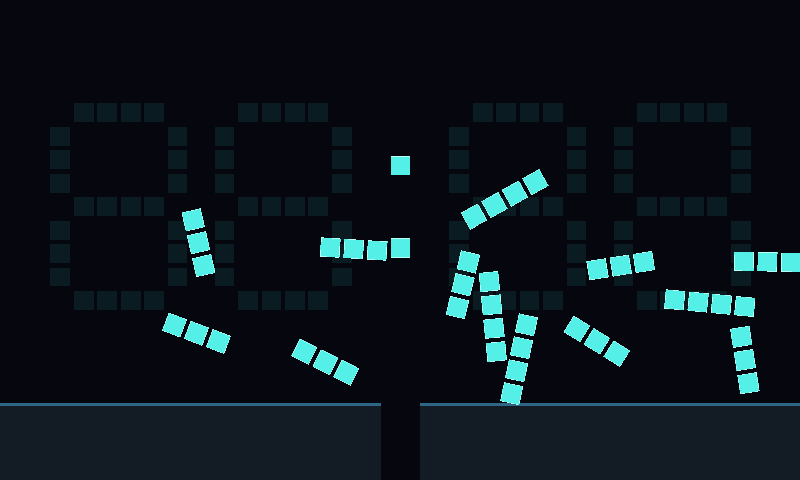
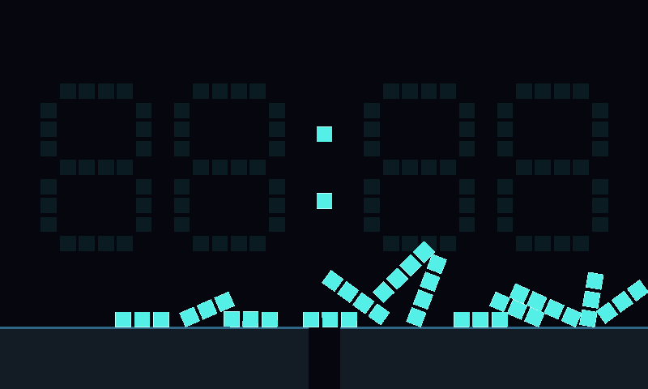
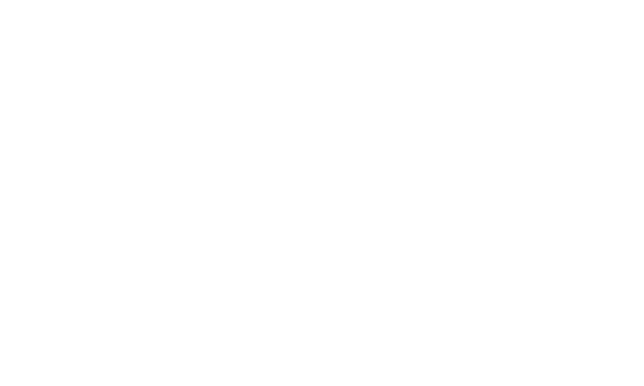
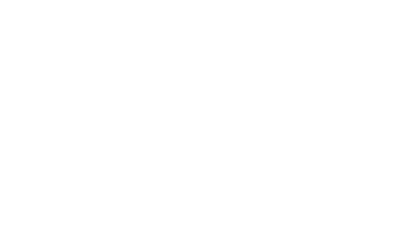
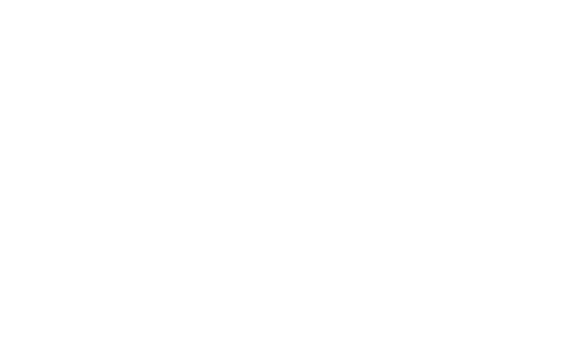
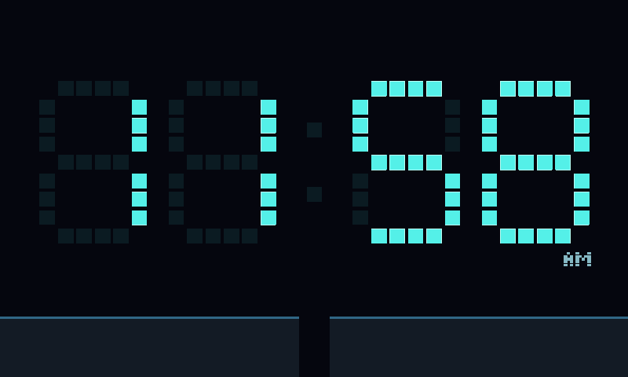
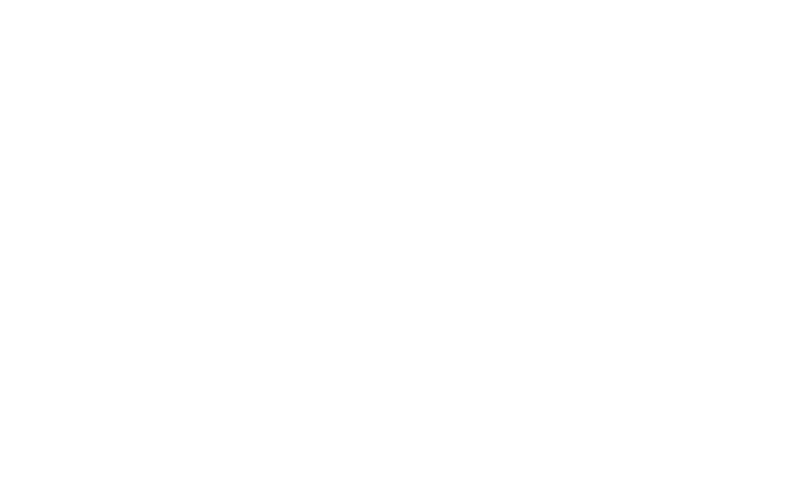
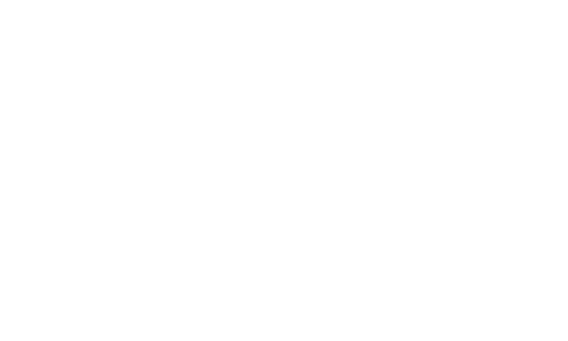
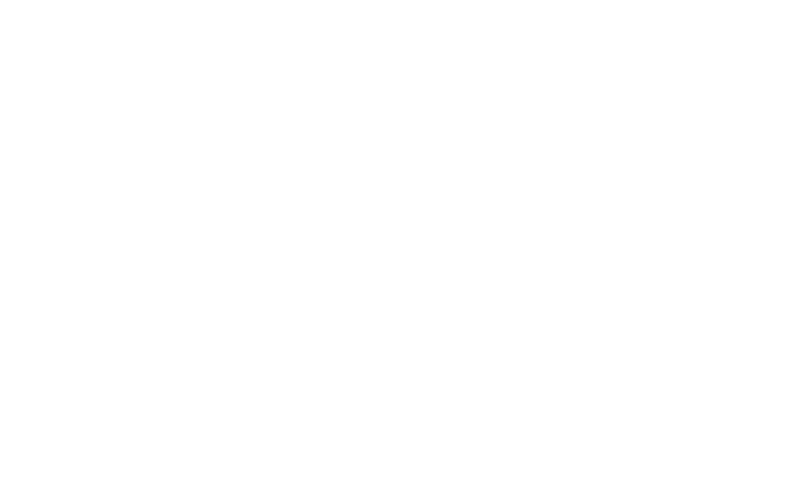
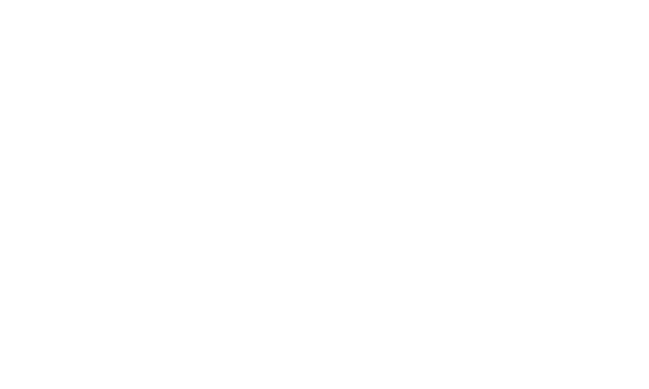

# Clock

Clock displays the device's local `HH:MM`, with a blinking seconds colon and
12/24-hour formats. The client supplies wall-clock readings; the scenario never
reads the system clock. Configure the device's timezone/NTP as described in
[Pi kiosk](pi-kiosk.md).

## Events

Choose **Clock → Settings → Event Profile** using touch, keyboard, or gamepad.
The **Falling** and **Color Cycle** switches select the automatic event mix;
both default to On and are saved with the other Clock settings. These values
can also be changed live through **Pause → Clock Controls**, without relaunching.

| Profile | Idle wait before selecting an event |
| --- | --- |
| Off | No automatic events; manual triggers and menu previews remain available |
| Calm (default) | Seeded 45–75 seconds |
| Demo | Seeded 6–10 seconds |

One global schedule selects one enabled, eligible event, avoiding the previous
kind when another is eligible. Adding event types does not multiply the trigger
rate. Events never overlap. After completion or cancellation, there is a shared
2-second cooldown, followed by a new idle wait. Each kind also has an automatic
reuse delay; the scheduler waits longer if no enabled event is eligible yet.
With both switches Off, no automatic event is scheduled.

| Event ID | Effect | Duration | Automatic reuse delay after completion |
| --- | --- | --- | --- |
| `falling` | Digit geometry / rigid bodies | 3.5 s fall + 1.5 s reform | 30 s |
| `color-cycle` | Appearance only | 6 s | 15 s |

Falling releases the illuminated seven-segment bars as compound rigid
bodies: their square cells stay together while the bars tumble and collide
with the arena floor, side walls, and each other. The floor's center drain is
open. Dim anchor cells remain visible behind the action.

Color Cycle eases the illuminated cells and colon through violet, pink, gold,
and green, returning to the normal cyan palette. Digits remain anchored and
follow live time throughout; the event creates no physics objects.

All durations use fixed 60 Hz simulation ticks, so pause freezes the event and
its schedule. The strict `clock trigger` command requires unpaused, synchronized,
idle Clock gameplay. It bypasses automatic enablement and per-kind reuse delays, but not
the shared busy/cooldown guard. Previewing does not enable an event or change
the selected profile.

## Live controls

Press **Start** on the controller or **P/Esc** on the keyboard, then choose
**Clock Controls**. You can also tap **Clock Controls** at the top-right of the
running clock face. D-pad/left stick or arrow keys move selection; A/Enter
selects. Left/right changes a choice row or moves between side-by-side buttons.
B/Esc goes back; Start resumes without previewing. C/F1 still opens controls help.
Menu and host keyboard shortcuts use Slint's backend-neutral input path on both
desktop and LinuxKMS; physical gameplay key bindings for other scenarios are
unchanged.

The page changes **12/24-hour format**, **Off/Calm/Demo cadence**, and the
**Falling/Color Cycle automatic switches**. Changes apply at the next host tick,
even while paused, and are saved for restart/relaunch. A save failure is shown
on the page; settings then remain active for the current session. Setting
changes do not interrupt the current animation or reset its physics, event ID,
or cooldown. A format change during a fall takes effect as the digits reform.

Choose a **Preview Event**, then **Preview & Resume** to replace any active event
or cooldown with a clean preview, even if that event or automatic events are
Off. This releases previous physics/appearance resources, preserves the scenario
instance and monotonic event IDs, synchronizes the latest time, and resumes.
It is deliberately different from the strict, non-replacing `clock trigger`.

These are ordinary guarded UI controls, also available to CLI automation:

```sh
spacewars-cli ui activate gameplay.clock-controls --expect-screen gameplay
spacewars-cli ui wait --screen pause.clock --scenario clock --timeout 3s
spacewars-cli ui state --json
spacewars-cli ui activate pause.clock.event-profile.next --expect-screen pause.clock
spacewars-cli ui activate pause.clock.preview-event.next --expect-screen pause.clock
spacewars-cli ui activate pause.clock.preview --expect-screen pause.clock
spacewars-cli ui wait --screen gameplay --scenario clock --timeout 3s
```

Use the current UI revision as `--expect-revision` for guarded scripts. Setting
changes acknowledge a queued operation; controls are temporarily disabled until
applied. Wait for a newer UI revision with enabled controls before another
mutation. Animation ticks still do not invalidate UI revision guards.

The face reforms using the **latest** reading, even across minute/hour changes
or a host-time correction. Resizing during an event restores the current face
and enters cooldown. Restart/relaunch starts a fresh seeded schedule. Physics
exists only during the falling phase: at most 28 moving bars plus four arena
bodies and 100 colliders, with no accumulating debris.

## Extending the event system

The face owns the latest time, stable segment identities, layout, and normal
appearance. `EventSchedule` owns only cadence, eligibility, selection, and
cooldowns. The typed `ActiveEvent` enum delegates to event-local implementations
in `scenarios/clock/src/events/`; each owns its phase and temporary resources.
Animation randomness uses a separate per-event seed, never the schedule's RNG.

The catalog declares each event's affected area and timing. Add a kind, its
settings/launcher control, catalog entry, and an enum implementation when adding
an event; keep shared lifecycle tests and add event-specific tests. Finishing or
resizing drops the active event and restores the latest face and base palette.
Restart/relaunch constructs a fresh scenario. There is no plugin framework and
no concurrent composition yet: affected-area metadata does not permit overlap.

This slice does not implement time-change triggers, cell disintegration,
melting/water, or duck events. Those can add bounded event-local representations
without moving scheduling or wall-clock reads into the individual animations.

## Public controls and synchronized captures

Run on the machine hosting `engine-client` (on the Pi, via SSH):

```sh
spacewars-cli clock state --json
spacewars-cli clock events --json
spacewars-cli clock trigger falling --json
spacewars-cli clock wait --phase falling --event-id 1 --min-phase-tick 45
spacewars-cli screenshot /tmp/clock-falling.png
spacewars-cli clock wait --phase reforming --event-id 1 --min-phase-tick 35
spacewars-cli screenshot /tmp/clock-reforming.png
spacewars-cli clock wait --lifecycle idle --event-id 1
spacewars-cli clock trigger color-cycle --json
spacewars-cli clock wait --event color-cycle --phase cycling --event-id 2 --min-phase-tick 72
spacewars-cli screenshot /tmp/clock-color-cycle.png
```

Use the event ID returned by `trigger`, not necessarily `1`. For robust remote
captures, run wait and screenshot in the same SSH session; do not manually race
the animation or sleep a guessed duration. A screenshot captures the next
available rendered frame, not an exact simulation tick.

`clock state` uses schema version **3** and reports scenario-instance revision,
event ID, lifecycle (`idle`, `active`, `cooldown`), active event kind, event-local
phase (`falling`, `reforming`, `cycling`), pause state, profile, schedule, current
reading/target digits, palette RGB, physics counts, and typed live `settings`.
Kind and phase are null
outside an active event. `phase_tick` counts ticks in the event's current phase,
or in idle/cooldown when no event is active. The embedded event catalog includes
enablement and per-kind automatic-ready ticks; `clock events` displays it.
These diagnostics do not affect `ui state` revisions.

`clock trigger` fetches state and guards the mutation with both instance revision
and event ID; `--expect-scenario-revision` and `--expect-event-id` override those
guards. The socket response acknowledges a pending request; the CLI additionally
waits for the next event to start. A subsequent host pause/restart may supersede
a pending trigger. `clock wait` binds to the current instance by default and
fails if it changes. `--timeout` bounds the entire CLI operation. Structured
failures retain the current Clock state when available, including on timeout.
Wait predicates can combine lifecycle, kind, phase, event ID, and minimum phase
tick. A raw `clock trigger` request must include schema version 3, `event`
(`falling` or `color-cycle`), `expected_scenario_revision`, and
`expected_event_id`. Unknown events, missing guards, and old schemas are rejected.

## Verification

```sh
cargo test --locked -p scenario-clock -p spacewars-control -p spacewars-cli
SPACEWARS_KEEP_FUNCTIONAL_ARTIFACTS=1 xvfb-run -a \
  cargo test --locked -p engine-client --test ui_control_functional -- \
  --ignored --test-threads=1
```

See [functional tests](functional-tests.md) for display setup, coverage, and
failure artifacts. The same CLI works on the deployed Pi for phase-aware smoke
tests and screenshots.

## Device captures

Captured on the local Raspberry Pi 5, 800×480 LinuxKMS software output with
raster scale 2.0 (2026-09-06). The captured fall reported 60 FPS / 60 updates per
second and 17 bodies / 47 colliders; reforming and idle reported zero physics
objects. These are observations for this scene, not a performance guarantee.
Pause/resume, restart, stale-request rejection, and automatic Demo events were
also exercised on the device, with no kiosk service restarts.

[Initial face](screenshots/clock/idle.png)

| Falling | Floor contact |
| --- | --- |
|  |  |

| Reforming | Recovered |
| --- | --- |
|  |  |

| Discoverable settings | Raster-compatible AM/PM |
| --- | --- |
|  |  |

### Event mix and Color Cycle

The multi-event build was also deployed and checked on the same Pi on
2026-09-06. Both automatic event kinds reported approximately 60 FPS / 60 updates
per second at raster scale 2.0. Color Cycle had zero bodies/colliders; the
captured Falling event had 20 bodies / 58 colliders, returning to zero during
reformation. Pause/resume preserved the color phase and resumed with the latest
time, including a minute change. Restart reset the event ID and palette, then
Demo automatically ran Color Cycle followed by Falling. The service reported
zero restarts. These are smoke-test observations, not a long-run benchmark.

| Individual event switches | Automatic Falling through the shared scheduler |
| --- | --- |
|  |  |

| Color Cycle: violet | Color Cycle: gold |
| --- | --- |
|  |  |

[Pink phase](screenshots/clock/color-cycle-pink.png) ·
[Recovered cyan face with the latest time](screenshots/clock/color-cycle-recovered.png)

### Live controls

Verified on the Pi at 800×480, raster scale 2.0 (2026-09-06). Changing format,
profile and enablement while Falling was paused preserved its instance, event
ID, tick 159 and 19 bodies / 53 colliders. Preview & Resume replaced it with
Color Cycle without relaunching, immediately reduced physics counts to zero,
and returned to an idle cyan face. Disabled events remained previewable; the
original saved settings were restored after the check.

[Live Clock controls](screenshots/clock/live-controls.png) ·
[Falling preview](screenshots/clock/live-falling.png) ·
[Color Cycle replacing Falling](screenshots/clock/live-color-cycle.png)
