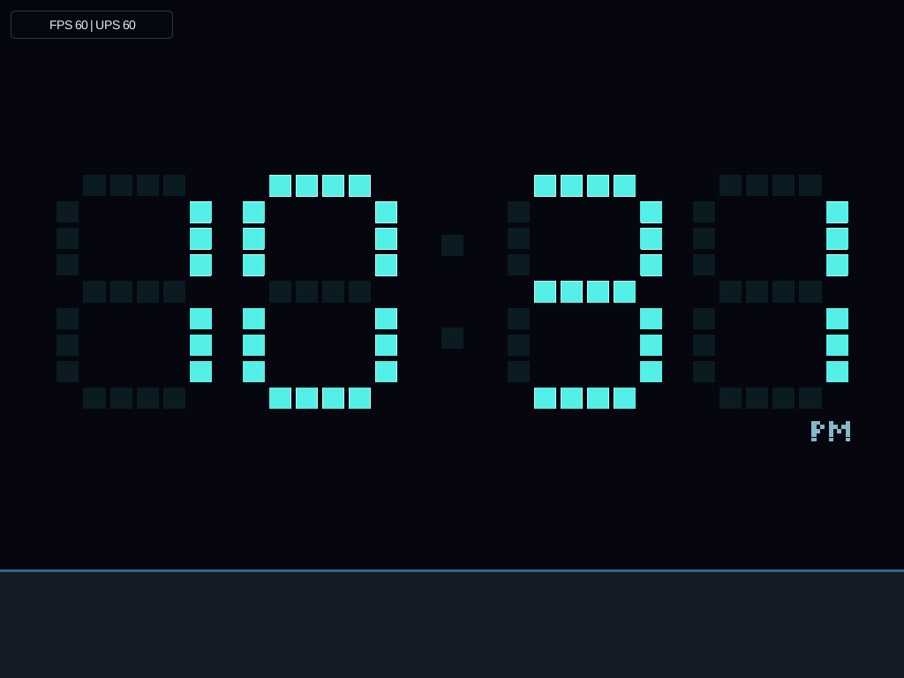
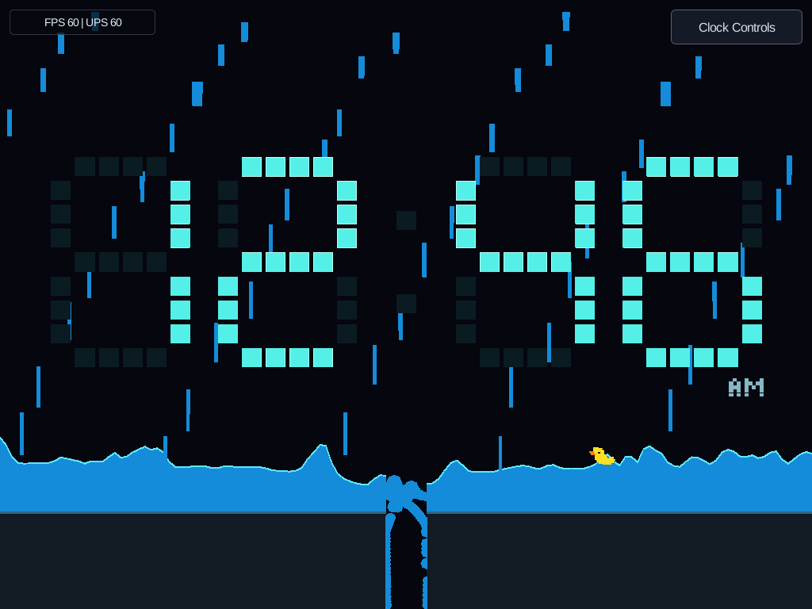
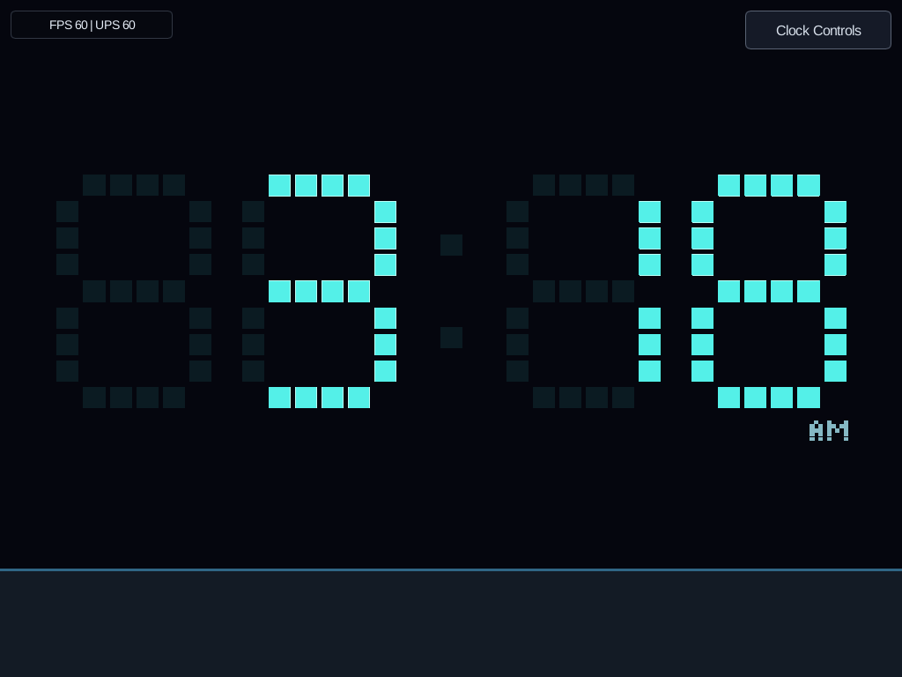
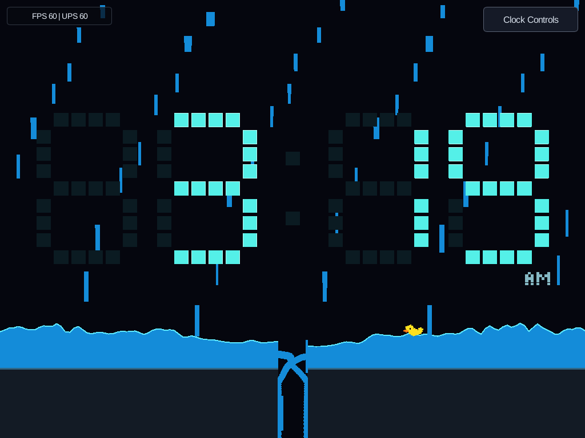
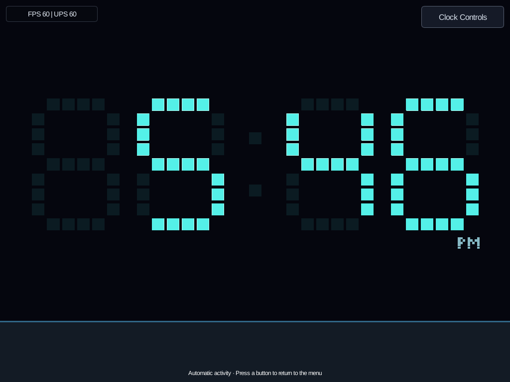
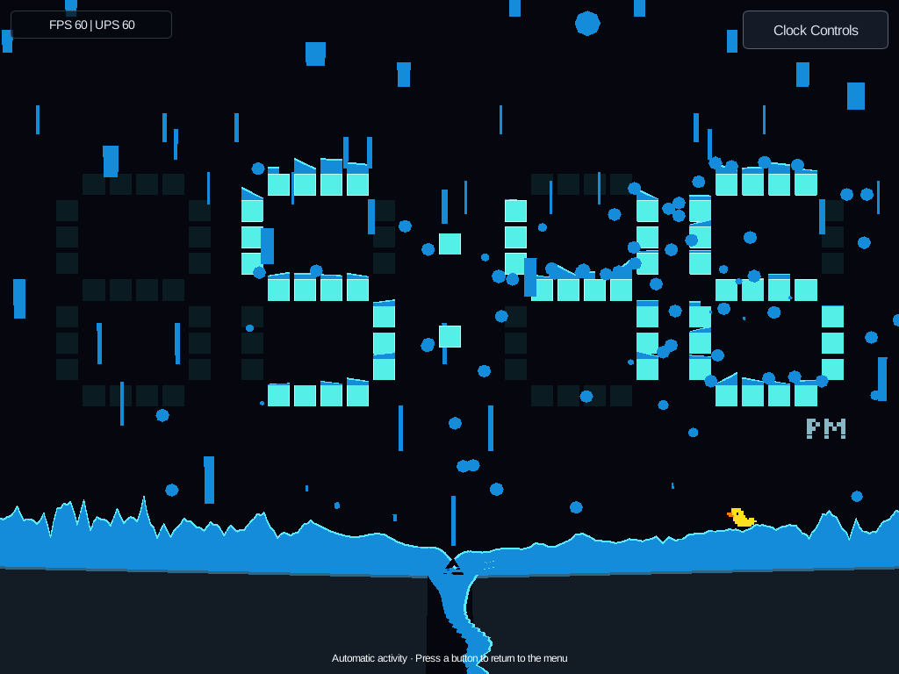
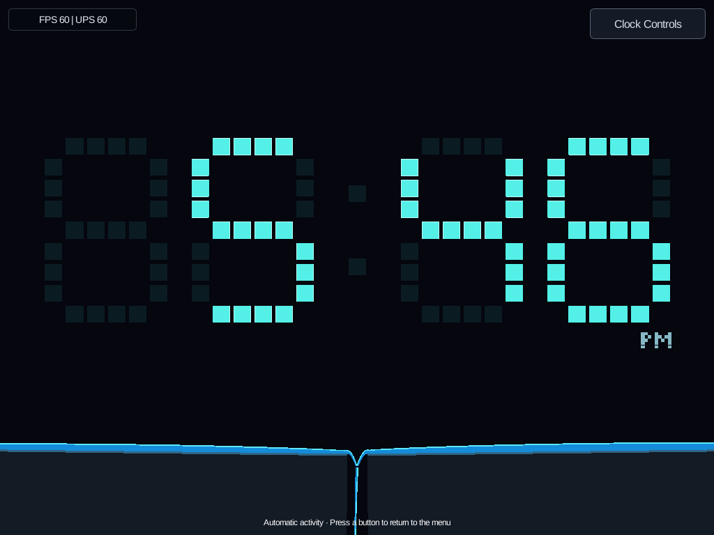

# Clock

Clock displays the device's local `HH:MM`, with a blinking seconds colon and
12/24-hour formats. The client supplies wall-clock readings; the scenario never
reads the system clock. Configure the device's timezone/NTP as described in
[Pi kiosk](pi-kiosk.md).

Implementation checkpoint for [#19](https://github.com/aortez/space-wars/issues/19):
the useful clock, Falling and Color Cycle are merged, as are Meltdown (#52),
Duck and composed Marquee/saved text (#53), and time-change-triggered Digit Slide.
The issue's September 6 resume notes predate those deliveries. The current Duck
upgrade (#69) adds calibrated platform planning and generated wall-tag courses;
Rain (#79) adds variable showers and a passive floating rubber duck. Storm effects,
flashlight/glow polish and concurrent events remain future work.

## Events

Choose **Clock → Settings → Event Profile** using touch, keyboard, or gamepad.
The **Falling**, **Color Cycle**, **Meltdown**, **Duck**, **Marquee**, and **Rain** controls select the periodic event mix.
**Digit Slide** enables minute-change transitions. All switches
default to On and are saved with the other Clock settings. These values
can also be changed live through **Pause → Clock Controls**, without relaunching.

| Profile | Idle wait before selecting an event |
| --- | --- |
| Off | No automatic events; manual triggers and menu previews remain available |
| Calm (default) | Seeded 45–75 seconds |
| Demo | Seeded 6–10 seconds |

One global periodic schedule selects one enabled, eligible event, avoiding the previous
kind when another is eligible. Adding event types does not multiply the trigger
rate. Events never overlap. After completion or cancellation, there is a shared
2-second cooldown, followed by a new idle wait for periodic events. Digit Slide
preserves the pending periodic deadline instead of restarting that wait; a
deadline reached during the slide runs after cooldown. Each kind also has an automatic
reuse delay; the scheduler waits longer if no enabled event is eligible yet.
With all switches Off, no automatic event is scheduled. Older settings files
retain their existing switches and default missing event switches to On;
the Off profile still disables every automatic event.

| Event ID | Effect | Duration | Automatic reuse delay after completion |
| --- | --- | --- | --- |
| `falling` | Digit geometry / rigid bodies | 3.5 s fall + 1.5 s reform | 30 s |
| `color-cycle` | Appearance only | 6 s | 15 s |
| `meltdown` | Individual cells, pooling water and drain | 3 s melt + 4 s drain + 1.5 s reform | 40 s |
| `duck` | Temporary floor course and a physical wall-tag runner | 35 s envelope, exit appears 20 s after spawn | 30 s |
| `marquee` | Composed content motion and lighting, no physics | 12 s, including 0.75 s fades | 20 s |
| `digit-slide` | Changed digits roll down inside clipped slots, no physics | 0.8 s | 2 s |
| `rain` | Variable showers, pools and a passive rubber duck | 20 s rain + 20 s drain + 2 s cleanup | 45 s |

### Managed floor and drain

The ordinary floor is **closed by default**, including unsynchronized startup,
idle/cooldown, Color Cycle, Marquee and Digit Slide. Falling acquires the center
drain before creating its temporary material. It stays fully open through
recovery/cleanup, then closes after the event's bodies and remaining visuals
have been released. Preview replacement, resize and
restart use the same ownership boundary. Pausing or disabling a currently running
event does not close the drain underneath it.

Rain and normal Meltdown own a shared load-responsive floor: two panels start flat and closed,
gently slope/retract as water accumulates, then close more slowly as it drains.
Measured nearby runoff delays closure, and Rain's duck in the passage holds enough
clearance to get out. Thin residual drips cannot latch the hatch at its peak
opening. The same panel geometry drives the water bed, visible banks and two
persistent kinematic colliders while Rain's duck exists. Meltdown instead tests
its ballistic blocks against the panel tops without creating any rigid bodies.
No attraction force pulls water or the duck to the drain. During event recovery,
remaining water is explicitly reclaimed and the responsive floor blends back
to the ordinary closed floor; that visual recovery is not physical drainage.

The obstacle-course Duck and development water labs own their custom floors
instead; they do not also open the ordinary drain. Their physical floor/pit/tank
geometry is unchanged. The Duck course keeps its entrance/exit fade to the
ordinary closed floor; water labs return to it on completion.

One small scenario-owned manager is sufficient because events cannot overlap.
Its fixed geometry supplies Falling's slabs. Rain and Meltdown's shared
event-owned actuator updates only each event's two existing
floor pools, conservatively remapping retained water and releasing uncovered
strips. It reuses allocated scratch and, in Rain, persistent colliders. The event manager
itself still needs no per-tick request queue; other events keep their old floors.

`clock state` reports `floor`: `closed`, `drain-open`, or `event-owned` in both
JSON and text diagnostics. Schema 10 requires a matching client and CLI; this
does not add another saved setting or change the Clock action payload version.

Focused regressions cover each event's complete ownership lifetime, pause,
replacement, resize/restart, and matching floor/pool bounds at six aspect ratios:

```sh
cargo test --locked -p scenario-clock floor_tests
cargo test --locked -p engine-client --bin engine-client managed_floor
```

The real-client Rain workflow also checks the floor state through preview,
paused controls, cleanup and restart. Rendering tests retain exact clock-face
recovery while allowing the intended drain closure below it.

### Rain and the rubber duck

Choose **Rain: Off / Varied / Light / Medium / Heavy** in the launcher settings
or live **Clock Controls**. Varied chooses a seeded amount for each visit;
changing the setting affects the next event, not water already falling. Rain's
amount is separate from the global Calm/Demo event frequency. Older settings
default to Varied with Rain enabled, preserving all existing choices.
Preview **Rain → Preview & Resume** to run it immediately, including when Off.

Rain ramps up and down over 20 simulated seconds. Stratified, jittered drops
collect on lit digit pixels, spill through their real gaps and reach the two
sloping floor pools. A wet time change releases water from retired pixels.
Local water must
remain at least 0.65 digit-pitches deep for half a second before the hatch opens;
depth is checked again before releasing one duck. Light showers normally never
reach that threshold, so no duck appears. The entrance door closes and disappears after
release. The ordinary jumping **Duck** event and its two brains are unchanged.

The rubber duck is a passive dynamic Rapier box with density 0.45 relative to
water. Existing `BuoyantBody` integration applies buoyancy, flow-relative drag
and torque to its actual pose. There is no swimming AI, surface snapping or
drain attraction. The hull clears either drain lip in every orientation; once
unsupported it falls under gravity. Its sprite follows the body's rotation.
This is one-way coupling: the duck does not displace water yet, and falling
parcels do not directly push it. Future player/bot forces can be applied at the
same physical-body boundary without replacing the flotation model.

The event uses **320 columns, at most 512 water parcels, and one dynamic body**:
128 floor columns plus 192 digit columns; 192 parcel slots are protected for
atomic digit retirement. With a duck there are four bodies/five colliders: one
duck, two persistent moving panels and a fixed pair of side walls. The rigid
world is allocated only for the duck's visit and released when it exits.
Source admission
reserves two new parcel slots for this tick's outlets; already airborne outlet
parcels count toward the same budget. Capacity pressure defers unadmitted rain
without inventing or deleting liquid. Remaining requested rain is cancelled when
the source ends. The digits, colon and AM/PM remain anchored and live throughout.

The last two seconds explicitly reclaim remaining water, fade any stranded
duck and blend any remaining panel opening back to the ordinary closed floor.
This is bounded cleanup, **not** a successful drain exit. `clock state`
reports the resolved amount, seed, local/required depth, water accounting,
capacity counters and duck pose. Its duck phase distinguishes `waiting`,
`opening`, `floating`, `exited`, `not-spawned`, and `reclaimed`.
Volumes use full-size digit-cell area equivalents (1,000,000 micro-units per
cell); injected ≈ pooled + in-flight + drained + reclaimed, allowing independent
rounding. Rain also reports `floor_open_milli` (0–1000), `floor_load_milli`
(average depth in world units × 1000), `floor_motion_deferrals` and
`floor_clearance_holds`. These fields default to zero when reading older state.
The top-level floor mode is `event-owned` throughout Rain, even at its closed
start; ownership is distinct from opening. Requested/scheduled budget is not additional liquid. Rain diagnostics
are null once the event is over. Pause freezes everything; resize, restart and
preview replacement release all temporary resources.

Tests cover still-water equilibrium, the same drain run with drag on/off,
seeded replay, depth-gated entry, source backpressure, conservation, deadline
cleanup, live time and settings, both render paths, and real-client controls.
The initial sweep of three display shapes × eight seeds produced 48 physical
drain exits in Medium/Heavy and 24 no-spawn Light runs. This is a regression
sample, not a guarantee for every possible seed. See the
[performance lab](clock-performance-lab.md) for the fixed Heavy Rain benchmark.

Local validation for this slice: 474 selected unit tests and four headless
binary tests passed; all ten Clock real-client workflows were verified on the
local X display. Raster/menu captures were checked at device-sized viewports;
no Pi deployment was performed. Rust 1.89 workspace/all-target checking, formatting,
and strict scoped Clock/common/control/CLI lint passed. Full-client strict lint
still reports existing warnings in unrelated host/raster/gamepad/mission code;
those were left outside this change.

### Digit Slide

Digit Slide is triggered by a forward minute change, not the periodic lottery.
Only changed slots move: old cells roll out below while new cells enter from
above. Dim slot outlines stay fixed; the colon and AM/PM always follow the latest
reading. A minute/hour/midnight rollover works in either time format, including
12-hour blank leading digits. The transition is sampled from two four-digit
snapshots and elapsed ticks; it creates no bodies, particles or growing lists.
It uses fewer than 300 draw primitives, with clipping shared by both render paths.

Initial synchronization, backwards/skipped minutes, a forward reading gap over
three seconds, and zero-duration control synchronization snap to the latest time.
If another event or cooldown is active, the slide is skipped, never queued. A
changed target during a slide cancels it immediately; seconds/duplicate readings
do not restart it. Pause freezes playback. Format changes that alter the digits,
resize, restart and preview replacement release the transition. Turning its
switch Off leaves the current slide alone; the Off profile disables all automatic
events, including slides. With only Digit Slide enabled there is no periodic timer.

Manual `digit-slide` triggers and **Preview & Resume** roll the *current* digits
out and back in. They never fabricate a different clock reading. This preview
works even with the switch/profile Off and is reported as `preview: true`.

Falling releases the illuminated seven-segment bars as compound rigid
bodies: their square cells stay together while the bars tumble and collide
with the arena floor, side walls, and each other. The floor's center drain opens
for the event and closes after reforming. Dim anchor cells remain visible behind the action.
In 12-hour mode, AM/PM tumbles with the digits: each letter is one small
compound body whose pixel colliders match its visible shape. There is no
second anchored copy of the label.

Color Cycle eases the illuminated cells and colon through violet, pink, gold,
and green, returning to the normal cyan palette. Digits remain anchored and
follow live time throughout; the event creates no physics objects.

Meltdown releases the lit digit cells roughly bottom-up, with small seeded
delays. They stay cyan, square and solid-looking while falling, including through
existing water. Gravity, slight rotation and side-wall reflection remain cheap
ballistic motion, without rigid bodies or block-block collisions. Reaching the
actual inclined panel top converts each block once: normally 70% of its
area goes directly into the pool/drain across its footprint, while 30% sprays
upward as three small water drops. The drops use the same volume ledger and
parcel budget as spills; they rejoin a pool on descent or leave through the drain.
When parcel capacity is tight, optional spray is reduced and that volume goes
directly into the pool/drain instead. This replaces the earlier in-air softening
effect, following dirtsim's solid-block → floor impact → water sequence. Contact
uses the rotated square, not its bounding box; blocks that fit through the open
gap stay solid and count as drained material only after leaving the screen.
Water accumulates on the initially closed panels and makes them slope/open,
using Rain's load filtering and slow movement limits. The colon and dim
face outline stay visible. After seven seconds, the latest time rebuilds bottom-up
over 1.5 seconds while remaining water is explicitly reclaimed with eased timing.
The reusable `engine-water` model drives flow from surface-level differences,
with damping and conservative donor limits. There is no forced inward current.
The eight-and-a-half-second event envelope is unchanged; not all material drains
physically before its explicit final cleanup.

In 12-hour mode, AM/PM also breaks into its individual pixels. These retain
their smaller size and label color until floor impact; each supplies 0.0324 of
a full digit cell's water volume. Both effects latch the original letters while
material is falling, then recover to the **latest** AM/PM. Format changes during
an event take effect at recovery too: 12→24 fades/removes the old label, while
24→12 introduces the new label as the face reforms. The water-lab previews keep
their live, anchored face and fixed source volume.

The normal Meltdown ceiling is **119 cells** (96 digit cells plus at most 23
AM/PM pixels), **128 columns and 192 spill parcels**, with no Rapier bodies.
The additional 64 parcel slots accommodate water released by retracting floor
edges as well as ordinary overflow. Optional impact spray is reduced once 32
parcels are live; its volume goes to the bank/gap rather than being deleted.
Stationary development water labs retain their 128-parcel ceiling.
Each 60 Hz tick uses four bounded pool substeps. Overflow travels as ballistic
parcels: the renderer stretches/thins their ribbons with falling speed, and the
model can collect them in a lower basin. Water is counted as drained only after
leaving the lower world boundary, not upon crossing a ledge. Full parcel capacity
holds water upstream. This is a fixed-down, unit-depth approximation, not a general
fluid solver. Solid blocks do not collide with one another; crossing water
streams use the engine's existing bounded mixing.
Shared surface-edge heights replace the staircase with connected trapezoids,
preserving total area over each continuous wet, flat run. Dry gaps and bed steps
are not bridged. Ribbons taper with acceleration and are clipped to the drain
channel, when one is present, instead of having their corners pushed onto the banks.
Responsive-panel outfalls follow their moving lips without a fixed channel. Splash drops use
the outer screen walls instead of the narrow drain channel. Compact water parcels
have area-preserving rounded outlines, including at the top of their flight.
These are bounded
convex polygons supported by both existing render paths, not a new fluid solver.

Reform cleanup is accounted separately from drainage. Preview replacement,
resize and restart drop the entire event-local representation. This does not
depend on destructible terrain. See [the water design](design/water.md) for model
limits, performance measurements, and the optional buoyancy/displacement experiments.

To inspect a stepped basin spilling into a closed collecting pool, use the
development-only override below, then select **Clock Controls → Preview Event:
Meltdown → Preview**. It replaces Meltdown's material source for that process;
normal startup is unchanged, and no extra launcher scenario or setting is added.
The optional preview also includes an orange floating box, yellow floating ball,
and dense red sinking box. These are real Rapier bodies with one-way buoyancy
and drag; they do not displace water or make waves. Normal Meltdown remains
body-free. The preview's banks are shared between drawing and physics geometry.

```sh
SPACEWARS_CLOCK_WATER_LAB=1 cargo run --release -p engine-client -- --scenario clock
```

For the next experiment, set `SPACEWARS_CLOCK_WATER_LAB=displacement` instead.
This uses a closed tank with a controlled orange box that lowers into the water
and withdraws, raising/lowering the mean level and producing ripples. A yellow
buoyant ball shows the response; the dashed line marks the original water level.
`displacement-control` runs the same geometry and motion with displacement off.
The box is kinematic and the ball remains one-way coupled. This is a bounded,
single axis-aligned box/flat-tank approximation, not a watertight flow obstacle
or full body/fluid solver. Both tank modes use three bodies and five colliders,
and reclaim the water during normal event recovery. See the
[displacement model and benchmark commands](design/water.md#closed-tank-displacement-experiment).

`SPACEWARS_CLOCK_WATER_LAB=floating` drops a freely moving orange box into that
tank: the box now changes the water, and buoyancy from that water acts on the
same box. `floating-control` disables its displacement for comparison; `sinking`
uses a denser red box that settles on the floor. Rotation is solver-locked for
this first axis-aligned binding, while translation remains free. The yellow
ball remains a one-way observer. These modes retain the same three-body/five-
collider budget, preview controls and cleanup lifecycle. See
[dynamic feedback, tests and limitations](design/water.md#dynamic-box-feedback).

`SPACEWARS_CLOCK_WATER_LAB=rotating` uses the same tank with the orange box
tilted and spinning at spawn, with rotation unlocked. Its changing orientation
now displaces water too; buoyancy and drag determine how it rights itself.
`rotating-control` preserves the same initial motion but disables displacement
feedback. The original locked modes stay available for comparison. Small rocking
can remain during this short preview; longer settling and off-center-impulse
tests are described in [rotating box feedback](design/water.md#rotating-box-feedback).
These remain single-box, closed-tank experiments, not sealed flow barriers.

`SPACEWARS_CLOCK_WATER_LAB=multiple` adds a second box and enables displacement
for all three bodies, including the ball. Overlapping hulls count their combined
occupied area only once; Rapier still handles their contact and rotation.
`multiple-control` retains the same bodies without water-level feedback.

`SPACEWARS_CLOCK_WATER_LAB=spilling` puts those three dynamic bodies in an upper
basin filled to a lowered right-hand rim, with an empty collecting pool below.
Entry raises the surface and pushes water over the rim; that liquid stays in the
collector even as the bodies rise again. The red box sinks, while the orange
box and yellow ball float. `spilling-control` has identical initial geometry and
motion but no displacement, so it does not overflow. It uses four bodies/nine
colliders and 128 columns in total. These are still environment-only Meltdown
previews, not new scenarios; normal Clock startup is unchanged. See
[spilling displacement and verification](design/water.md#displacement-driven-spills).

Duck opens a side door and spawns a yellow pixel duck. The entrance door closes
behind it, then disappears for the rest of the visit. The duck makes two vertical
warm-up jumps, measures its sustained running speed along the entrance runway,
then plays wall-tag across raised platforms and gaps. Each visit independently
selects a seeded course pattern and movement personality. The patterns are:

- **Platforms:** the original two/three randomly spaced raised platforms.
- **Terraces:** low–high–low steps, with seeded height variation.
- **Two-jump:** a small landing platform between two runways. Arrival position
  and speed determine whether there is room for another running takeoff.
- **Shortcut:** a low intermediate platform that can be landed on or skipped
  in one longer jump to the following surface.

Authored patterns keep their runway/gap widths and vary raised heights by ±10%.
All preserve a safe adjacent-platform route for Careful, in both directions.
The entrance side is seeded too. Each landing becomes the starting point for the
next planned jump. The opposite
door is entirely hidden for 20 simulation seconds after spawn (warm-up included).
When it appears, the duck finishes its current crossing, turning at the entrance
if necessary, and leaves through the exit. The course fades away, restoring the
ordinary closed floor; the clock follows live time throughout.

The duck uses **one dynamic round body** and one fixed body/collider per landing
surface, including the entrance and exit runways: normally **four to six bodies
and colliders**. The course ceiling is seven surfaces plus the duck, with no
joints or growing particle/entity lists. An acceleration-limited movement controller provides
standing, walking, running and grounded jumping. Run speed is 1.4 times walk
speed; the tuned jump height is 50% higher than the original duck's. It slows
near a safe turnaround line inside each edge and reverses through acceleration,
not by reflecting velocity or teleporting the body. The sprite faces its chosen
travel direction independently of the entrance-side course mirroring.

The rule controller measures actual body motion, not the actuator's tuning:
peak height and flight time from two clean vertical jumps, acceleration during
the runway run-up, and a rolling median of up to nine steady grounded speed
samples. Side/ceiling-disturbed jumps are discarded
and retried; airborne, blocked, accelerating and turnaround motion cannot train
the run-speed estimate. The median prevents an isolated speed spike from
becoming a permanent maximum. Warm-up height uses the conservative lower of the
two observations. Calibration then freezes for this course; those observations
remain local to this event instance. Braking and airborne steering use the same
symmetric acceleration-limited actuator as the grounded run-up.

Each Duck event now chooses a **Careful** or **Flowing** personality once at
creation, with a seeded 50/50 choice. It keeps that personality throughout its
warm-up, crossings, turnarounds and exit. Repeated visits can have different
personalities; they do not have to alternate. A separate seeded stream leaves
course geometry, entrance side and the event schedule unchanged, making both
the choice and movement replayable. The personalities can evolve separately
without removing either style.

The **Careful** jumping profile preserves the deliberate stop-and-hop
motion. Its planner reconstructs a ballistic arc from the measured height and flight
time, using its descending intersection with the next platform's height. It
tries at most three inset landing points, checks body clearance along the arc,
and leaves headroom in jump height, speed and acceleration. The duck approaches
and brakes at the takeoff point, jumps from real support, and steers/brakes
toward its target. A landing only succeeds after an actual upward Rapier contact
with the intended surface inside its safe landing interval. The next plan uses
that actual support, not the predicted landing time. Short, long and wrong-surface
landings are counted separately; unreachable plans are refused and retried at
a bounded rate. Gravity and Rapier contacts handle the resulting motion.

Generation checks every adjacent link in **both directions** against conservative
capabilities, with at most 16 candidates before using a fixed fallback course.
This is bounded, course-local planning, not general-purpose pathfinding or
learning a policy. The ordered route and stationary platforms keep it cheap.
The old two-hurdle/pit course
is retained as a regression fixture, not a separate scenario or UI choice.

The **Flowing** jumping profile uses the same body, gravity, jump impulse,
speed limits, calibration and generated course. It considers three takeoff
positions and three landing positions, carrying constant horizontal speed through
flight and touchdown. A two-link lookahead scores the approach/flight time of
the next jump too, preferring landings that leave a running continuation. There
are at most 9 + 9×9 + 9 + 9 = **108 candidate arcs** per planning decision, with at most 120
clearance samples per arc. There is no second physics world or per-frame route
search; the small candidate arrays are stack allocated.

Both takeoff and landing retain room to brake safely. At launch, the planned
arc is re-anchored to the actual position and checked again; after contact, the
next decision uses actual support/velocity, not the prediction. If a running
takeoff is unavailable or invalidated, Flowing falls back to the **unchanged
Careful hop**. Edge landing candidates include a tick of launch-position margin
so a slightly early actual takeoff does not immediately invalidate the landing.

Flowing also considers skipping **one** intermediate platform. It compares the
direct jump's estimated approach/flight time with the two adjacent links,
requiring at least a 5% saving when a running route exists. The existing fallback
penalty is used for a non-running continuation; this is a bounded heuristic,
not a globally optimal route search. The entire arc must clear the intervening
platform and leave braking room on the destination. Unavailable/obstructed
shortcuts are refused. Jump strength is unchanged. A linked pair of jumps always
has real ground contact between them: this is **not an airborne double jump**.
Moving platforms, variable-height jumps and longer searches remain future work.

To compare profiles, use the same `--seed` and preview sequence:

```sh
# Normal operation: a seeded mix, chosen once per Duck visit.
cargo run --release -p engine-client -- --scenario clock --seed 42

# Force the original deliberate hop for comparison.
SPACEWARS_CLOCK_DUCK_PROFILE=careful \
  cargo run --release -p engine-client -- --scenario clock --seed 42

# Running jumps where the course leaves enough room; careful hops elsewhere.
SPACEWARS_CLOCK_DUCK_PROFILE=flowing \
  cargo run --release -p engine-client -- --scenario clock --seed 42

# Revisit a specific test course with the trajectory overlay.
SPACEWARS_CLOCK_DUCK_PROFILE=flowing SPACEWARS_CLOCK_DUCK_COURSE=two-jump \
  SPACEWARS_CLOCK_DUCK_DEBUG=1 \
  cargo run --release -p engine-client -- --scenario clock --seed 42
```

The environment override is read when creating/restarting the Clock scenario;
`careful` and `flowing` force a personality, while unset, `mixed`, or unknown
values use the seeded mix. It is not a persistent menu setting. Changing the
override requires relaunching the process. Standard benchmark mode remains
pinned to Careful on the original Platforms pattern. The course override accepts
`platforms`, `terraces`, `two-jump`, or `shortcut`; unset, `mixed`, and unknown
values select a seeded pattern. Preview Duck through Clock Controls after
launching. Use `shortcut` in the last command to watch platform skipping, or
switch the personality to `careful` to watch the adjacent route on the same course.
These overrides are independent and do not change event scheduling.
The seeded physics comparison below
exercises both profiles.
The upright pixel sprite and sliding doors are presentation, not articulated
physics. Doors are logical backstage entry/exit markers, not trapping colliders.

Phases are `opening`, `running`, `exiting`, and `resetting`. A fall or a runner
still blocked at 34.5 seconds enters reset; successful exits normally occur sooner.
`exiting` starts when the door appears, even if the duck is still heading toward
the entrance before its final return crossing.
Reset immediately drops all physics, fades the course over half a second, and
keeps the last outcome available until the fixed 35-second event envelope ends.
Resize, restart, or preview replacement also release the whole event. Narrow
layouts scale the duck and jump height down; wider layouts increase running
speed and horizontal course spacing while keeping the action below the face.

This implements the calibrated movement, wall-tag, generated courses and
platform-landing portions of [#69](https://github.com/aortez/space-wars/issues/69).
For an optional planning overlay, start the client with:

```sh
SPACEWARS_CLOCK_DUCK_DEBUG=1 cargo run --release -p engine-client -- --scenario clock
```

Use **Clock Controls → Preview Event → Duck → Preview & Resume**. Cyan marks the planned takeoff,
purple dots show the estimated body-center arc, and green marks the landing.
This environment-only diagnostic is off by default, is not saved in settings,
and does not alter the simulation. Normal benchmarks leave it off.

All durations use fixed 60 Hz simulation ticks, so pause freezes the event and
its schedule. The strict `clock trigger` command requires unpaused, synchronized,
idle Clock gameplay. It bypasses automatic enablement and per-kind reuse delays, but not
the shared busy/cooldown guard. Previewing does not enable an event or change
the selected profile.

## Live controls

Press **Start** on the controller or **P/Esc** on the keyboard, then choose
**Clock Controls**. Tapping anywhere on the running clock face opens the same
pause menu, on release; the opening tap cannot select a menu item. No permanent
button is drawn over the clock. Automatic and manual launches use the same
inputs: pressing action buttons does not return to the launcher.
D-pad/left stick or arrow keys move selection; A/Enter
selects. Left/right changes a choice row or moves between side-by-side buttons.
B/Esc goes back; Start resumes without previewing. C/F1 still opens controls help.
Menu and host keyboard shortcuts use Slint's backend-neutral input path on both
desktop and LinuxKMS; physical gameplay key bindings for other scenarios are
unchanged.

Press **N**, the gamepad's **right shoulder**, or Picade's **upper-right blue
button** (HAT Button 3 / West) for **Next Event**. Each fresh
press cycles forward through enabled events in catalog order (including Digit
Slide), starting after the last event that ran. It uses the same clean replacement
path as Preview & Resume, including recovery of the current event's physics and
floor. Holding does not repeat; menu/launch handoffs require released controls.
The event name appears for two seconds of simulation time. Off disables automatic
scheduling, not this manual action. Individual disabled events are skipped;
if all are disabled, a brief “No events enabled” notice replaces no event.
Preferences are unchanged. The Clock action protocol adds `NextEvent` (kind 6,
version 5, no additional payload); existing action encodings are unchanged.
Physical cabinet mappings are documented in [Picade controls](picade.md).

Automatic Clock on `sw-picade-2`: the permanent controls button and automatic-mode
caption are gone; the optional performance overlay remains enabled here.



The page changes **12/24-hour format**, **Off/Calm/Demo cadence**, and the
**Falling/Color Cycle/Meltdown/Duck/Marquee/Digit Slide automatic switches** and **Marquee Recipe**. Changes apply at the next host tick,
even while paused, and are saved for restart/relaunch. A save failure is shown
on the page; settings then remain active for the current session. Setting
changes do not interrupt the current animation or reset its physics, event ID,
or cooldown. A format change during a fall takes effect as the digits reform.

Choose a **Preview Event**, then **Preview & Resume** to replace any active event
or cooldown with a clean preview, even if that event or automatic events are
Off. This releases previous physics/appearance resources, preserves the scenario
instance and monotonic event IDs, synchronizes the latest time, and resumes.
It is deliberately different from the strict, non-replacing `clock trigger`.

These are ordinary guarded UI controls, also available to CLI automation.
`gameplay.clock-controls` remains a semantic settings shortcut for existing CLI
scripts; it no longer represents a permanent button on the clock face:

```sh
spacewars-cli ui activate gameplay.clock-controls --expect-screen gameplay
spacewars-cli ui wait --screen pause.clock --scenario clock --timeout 3s
spacewars-cli ui state --json
spacewars-cli ui activate pause.clock.event-profile.next --expect-screen pause.clock
spacewars-cli ui activate pause.clock.preview-event.next --expect-screen pause.clock
spacewars-cli ui activate pause.clock.preview --expect-screen pause.clock
spacewars-cli ui wait --screen gameplay --scenario clock --timeout 3s
```

Use the current UI revision as `--expect-revision` for guarded scripts. Setting
changes acknowledge a queued operation; controls are temporarily disabled until
applied. Wait for a newer UI revision with enabled controls before another
mutation. Animation ticks still do not invalidate UI revision guards.

The face reforms using the **latest** reading, even across minute/hour changes
or a host-time correction. Resizing during an event restores the current face
and enters cooldown. Restart/relaunch starts a fresh seeded schedule. Rapier
exists only during Falling's falling phase or Duck's running/exiting phases:
at most 28 moving bars plus two AM/PM letters and four arena bodies, with
123 colliders for Falling (32 bodies / 100 colliders without AM/PM),
or eight bodies/colliders at the Duck course ceiling, with no accumulating debris.

## Extending the event system

The face owns the latest time, stable segment identities, layout, and normal
appearance. `EventSchedule` owns only cadence, eligibility, selection, and
cooldowns. The typed `ActiveEvent` enum delegates to event-local implementations
in `scenarios/clock/src/events/`; each owns its phase and temporary resources.
Animation randomness uses a separate per-event seed, never the schedule's RNG.

The catalog declares each event's trigger (`periodic` or `time-change`), affected area and timing. Add a kind, its
settings/launcher control, catalog entry, and an enum implementation when adding
an event; keep shared lifecycle tests and add event-specific tests. Finishing or
resizing drops the active event and restores the latest face and base palette.
Restart/relaunch constructs a fresh scenario. There is no plugin framework and
no concurrent scheduler events: affected-area metadata does not permit overlap.
Marquee composes presentation passes *inside* one event; it does not opt out of
the shared scheduling or cleanup rules.

### Composed Marquee effects

Choose **Recipe** in the launcher or live Clock Controls, select **Marquee** as
the Preview Event, then **Preview & Resume**. The default is **Clock wave**.
Explicit previews work even with the Marquee switch or profile Off.

| Recipe | Content | Motion | Lighting |
| --- | --- | --- | --- |
| Clock chase | Live time | Anchored | Clockwise digit-outline chase, separate middle-bar pass |
| Clock wave | Live time | Whole digits bob along a wave | Color cycle |
| Clock spin | Live time | Entire face rotates around its center | Color cycle |
| Digit spin | Live time | Each digit rotates about its own pivot | Moving highlight |
| Text scroll | Saved message | Right-to-left traversal | Color cycle |
| Text ribbon | Saved message | Scrolling plus a per-cell ribbon wave | Moving highlight |
| Text spin | Saved message | Each letter rotates about its own pivot | Moving highlight |

The active recipe and message are captured when the event starts. A setting change is saved
for the next event; Preview deliberately replaces the current one. Each event
lasts 720 fixed ticks (12 seconds). The ordinary face crossfades out/in over
45 ticks at either end. Pause freezes playback. Time continues to be authoritative:
clock recipes rebuild their lit cells from the latest supplied reading, including
the colon and AM/PM, without advancing playback. Text never replaces the actual
time state. Completion, resize, restart, and preview replacement restore the
latest face and drop temporary content.

The Clock-local `presentation/` module separates content generation from effects.
Cells have immutable positions, glyph pivots, and stable lighting-route positions.
Seven-segment clock content and the code-native 5×7 font feed the same recipe
sampler. The font accepts up to **32 ASCII bytes / 1,120 cells**, supports letters,
digits and basic punctuation, folds lowercase, and rejects empty, oversized, or
unsupported text. The default message is **SPACE WARS**. The shared
`ClockMarqueeMessage` type validates text at settings, CLI/protocol, and action
boundaries and stores at most 32 bytes inline. Text cells are built once when an
event starts, not each frame, and never create physics objects.

#### Custom text

Select one of the three **Text** recipes. To change its saved message in a running
client, pause Clock (with the controller, touch controls, or `host pause`), then:

```sh
spacewars-cli host pause                  # omit if already paused
spacewars-cli clock message "Hello, pi!"
spacewars-cli clock state                 # shows saved and active content separately
```

Open **Clock Controls → Preview Event → Marquee → Preview & Resume** to see the
new message immediately. Simply resuming an existing text event keeps its old
message until that event finishes. The command does not change the recipe,
automatic-event switches, profile, or pause state. Clock-digit recipes ignore
the message. Text entry is intentionally settings/CLI-only, not a gamepad editor.

Alternatively, with the client **stopped**, edit its existing `settings.toml`
(`$SPACEWARS_CONFIG_DIR/settings.toml`, or the platform config directory;
`~/.config/spacewars/settings.toml` on Linux). Add/change fields in the existing
`[clock]` section, preserving the other sections:

```toml
[clock]
marquee_preset = "text-ribbon"
marquee_message = "HELLO, PI!"
```

Messages must contain **1–32 ASCII characters**, including spaces. Supported
characters are letters, digits, spaces and `. , : - ! ? / '`. Lowercase is saved
and rendered as uppercase; spaces are preserved, but all-space text is invalid.
Oversized, unsupported, empty, and multiline messages are rejected, not truncated.
Existing settings without this field retain all other choices and default to
`SPACE WARS`. Invalid hand-edited TOML follows the existing settings recovery
policy: back up the original file and load defaults. Prefer the CLI for validated
edits without risking the other settings; a running client does not hot-reload TOML.

The CLI waits for application and disk-save confirmation. If saving fails it
returns an error and reports the message as effective only for this session.
Fix the filesystem problem and repeat the same command to retry the save.

#### Effect sampling

A recipe has a fixed set of optional passes: wave in content space, pivoted
rotation, fit/scroll placement, then rectangular clipping. Lighting samples the
original coordinates, so a highlight moves with the content rather than becoming
accidentally screen-anchored. A glyph wave translates the letter; a cell wave
deforms its corners like a ribbon. Whole-content and per-glyph rotation use
different pivots. Rotations are 2D. Color Cycle now shares the palette sampler.

Each frame is sampled from original content and elapsed ticks, never integrated
from the previous rendered pose. Content buffers are reused when time changes;
clipping uses an eight-vertex stack buffer. Only visible cells become ordinary
filled `RenderPolygon`s in the existing draw list. There are no new shaders,
textures, physics objects, or growing trails. Both render paths consume the same
geometry. Raster polygon fill uses one span per row so translucent cells do not
double-blend along internal triangulation edges.

The initial recipe catalog is intentionally small and typed. New messages or
recipes can reuse these passes; a general scene graph, 3D projection, arbitrary
user-authored effect graphs, and concurrent event scheduling are outside this slice.

Digit Slide adds the first time-change trigger, using the shared non-overlapping
lifecycle and a bounded event-local representation. More time-change effects or
flashlights can follow without moving wall-clock reads into animations.

## Public controls and synchronized captures

Run on the machine hosting `engine-client` (on the Pi, via SSH):

```sh
spacewars-cli clock state --json
spacewars-cli clock events --json
spacewars-cli clock trigger falling --json
spacewars-cli clock wait --phase falling --event-id 1 --min-phase-tick 45
spacewars-cli screenshot /tmp/clock-falling.png
spacewars-cli clock wait --phase reforming --event-id 1 --min-phase-tick 35
spacewars-cli screenshot /tmp/clock-reforming.png
spacewars-cli clock wait --lifecycle idle --event-id 1
spacewars-cli clock trigger color-cycle --json
spacewars-cli clock wait --event color-cycle --phase cycling --event-id 2 --min-phase-tick 72
spacewars-cli screenshot /tmp/clock-color-cycle.png
spacewars-cli clock wait --lifecycle idle --event-id 2
spacewars-cli clock trigger meltdown --json
spacewars-cli clock wait --event meltdown --phase melting --event-id 3 --min-phase-tick 75
spacewars-cli screenshot /tmp/clock-melting.png
spacewars-cli clock wait --event meltdown --phase draining --event-id 3 --min-phase-tick 10
spacewars-cli screenshot /tmp/clock-draining.png
spacewars-cli clock wait --lifecycle idle --event-id 3
spacewars-cli clock trigger duck --json
spacewars-cli clock wait --event duck --phase running --event-id 4 --min-phase-tick 140
spacewars-cli screenshot /tmp/clock-duck.png
spacewars-cli clock wait --event duck --phase resetting --event-id 4 --min-phase-tick 5
spacewars-cli clock wait --lifecycle idle --event-id 4
spacewars-cli clock trigger marquee --json
spacewars-cli clock wait --event marquee --phase presenting --event-id 5 --min-phase-tick 180
spacewars-cli screenshot /tmp/clock-marquee.png
```

Use the event ID returned by `trigger`, not necessarily `1`. For robust remote
captures, run wait and screenshot in the same SSH session; do not manually race
the animation or sleep a guessed duration. A screenshot captures the next
available rendered frame, not an exact simulation tick.

`clock state` uses schema version **10** and reports scenario-instance revision,
event ID, lifecycle (`idle`, `active`, `cooldown`), active event kind, event-local
phase (`falling`, `reforming`, `cycling`, `melting`, `draining`, `opening`, `running`,
`exiting`, `resetting`, `presenting`, `sliding`, `raining`, `clearing`), pause state, profile, schedule, current
reading/target digits, palette RGB, physics counts, floor ownership mode, and typed live `settings`.
Kind and phase are null
outside an active event. `phase_tick` counts ticks in the event's current phase,
or in idle/cooldown when no event is active. The embedded event catalog includes
trigger type, enablement and per-kind automatic-ready ticks; `clock events` displays it.
These diagnostics do not affect `ui state` revisions. The optional `meltdown`
object is present only during Meltdown (including its reform phase). It reports
initial/waiting/airborne cells, occupied water columns, active spill parcels,
capacity-limited ticks, and pooled, in-flight (`spilling_microunits`), drained and
reclaimed volume. In-flight volume and parcel counts include impact spray,
uncovered floor strips and drain spills. `drained_microunits` includes material
exiting as either water or solid blocks; `exited_solid_microunits` is the solid
**subset**, not an additional term in the conservation sum. One full-size digit
cell equals 1,000,000 micro-units; an
AM/PM pixel is 32,400. `initial_microunits` reports the total source volume and
`solid_microunits` reports the volume still in waiting/airborne cells. Use these
area-weighted values rather than multiplying cell counts by 1,000,000.
`solid_microunits` plus pooled, spilling, drained and reclaimed material must equal
`initial_microunits`, within three micro-units of independent rounding. Reclaimed volume
is explicit reform cleanup, not drainage. Idle and other events report null.
`displaced_microunits` reports occupied body space in the displacement lab,
in cell-equivalent area units; it is **not water** and is excluded from that
accounting sum. The added volume, displacement and spill fields default to zero when
reading older payloads.
Meltdown also reports `floor_open_milli` (0–1000), `floor_load_milli` (average
floor-water depth in thousandths of world units), and `floor_motion_deferrals`.
These are zero in custom water labs and default to zero in older payloads.
The optional `duck` object reports entrance side, position in thousandths of
render world units, grounded state, jumps, cleared/total obstacles, door openness
in thousandths, and outcome (`exited`, `fell`, `timed-out`). It is present only
during Duck; position is null before spawn and after despawn. Outcomes remain
available during reset, not as a persistent event history.
Its additive `navigation` object includes the reproducible course seed,
`jump_profile` (`careful` or `flowing`), behavior
(`warming-up`, `measuring-run`, `running`, `turning`, `exiting`, `approaching`,
`jumping`, `landing`, `blocked`), sprite facing,
left/right wall-tag counts, accepted calibration/sample counts, measured jump
height/run speed (thousandths of world units or units/second), flight ticks,
target surface index (`target_obstacle`), body radius, ticks since spawn, and exit visibility. Measurements are
null until sampled. `left_to_right` remains the **entrance side**; use
`navigation.facing_right` for the current direction. Cleared obstacles count the
current crossing's surface transitions; total jumps include warm-up jumps. Navigation fields retain
the final controller state during reset, not a claim of a still-live body.

`navigation.planning` adds `pattern` (`platforms`, `terraces`, `two-jump`,
`shortcut`), surface count, current physical support (null when
airborne or despawned), generation attempts/fallback status, measured acceleration,
confirmed landings, undershoots, overshoots, wrong-surface landings and rejected
plans. The rejection reason is `too-narrow`, `too-high`, `out-of-range`, or
`obstructed`. An active plan reports source/target indices, takeoff/landing **feet**
positions in thousandths of render world units, predicted flight ticks and cruise
speed. The overlay shifts these feet positions up by the radius to show the body
center. Plan/counter diagnostics remain available during reset, alongside the
outcome. This is a bounded snapshot, not an accumulating trace.

`running_jumps` counts executed running takeoffs, `moving_landings` counts
confirmed landings above 15% of measured run speed, and `flowing_fallbacks`
counts running-plan refusals/aborts that use the careful planner (separate from
`fallback_course`, which concerns generation). Plans expose `running_takeoff`
and optional `next_target`: the latter is a feasible second link at planning
time, not a commitment to execute it regardless of the actual landing. Older
payloads without these fields default to Careful, false/null and zero counts.
`skipped_platforms` counts intermediate platforms bypassed by **confirmed**
landings, not proposed shortcuts or merely passing overhead. A fallback course
reports its actual Platforms pattern. Older payloads default to Platforms and
zero skips.

The optional `navigation` fields default when absent. Both text and JSON
`clock state` show these diagnostics.
The optional `marquee` object reports the active recipe, content, cell/group
counts, progress in thousandths, scrolling/waving flags, rotation target and
lighting mode. `settings.marquee_preset` and `settings.marquee_message` are the
configured choices for the next event; they can differ from the currently active
content. `settings_pending` covers queued settings and background persistence;
the acknowledgement waits for saving without blocking the UI. `settings_error` is
non-null if those settings could not be persisted. Outside Marquee its diagnostics
are null. The optional `digit_slide` object reports old/new digits, changed slots,
eased progress in thousandths, and whether this is a manual preview; it is null
after completion or cancellation. Use matching client/CLI builds: schema 8 and
older requests are rejected. The internal Clock action payload is version 5;
event ordinals 0–5 are unchanged and Rain is 6. Configure contains seven
switch bits, validated recipe and rain-amount bytes, and 1–32 message bytes. Version 1–4 actions
are rejected; observation remains version 1.

`clock message TEXT` requires a paused active Clock. Its raw request includes
schema version 10, `message`, `expected_scenario_revision`, and `expected_message`.
The CLI fetches both guards automatically; `--expect-scenario-revision` can pin
the instance explicitly. Only the message is changed, using the latest values
for other settings. Invalid text, a changed instance/message, an unpaused or
inactive Clock, and pending host controls are rejected. The response acknowledges
the queue; `ControlClient::wait_for_clock_message` confirms application and save,
with the same bounded polling/deadline behavior as event waits. Restart/resume
may supersede a queued request; an acknowledgement is not a completion receipt.

`clock trigger` fetches state and guards the mutation with both instance revision
and event ID; `--expect-scenario-revision` and `--expect-event-id` override those
guards. The socket response acknowledges a pending request; the CLI additionally
waits for the next event to start. A subsequent host pause/restart may supersede
a pending trigger. `clock wait` binds to the current instance by default and
fails if it changes. `--timeout` bounds the entire CLI operation. Structured
failures retain the current Clock state when available, including on timeout.
Wait predicates can combine lifecycle, kind, phase, event ID, and minimum phase
tick. A raw `clock trigger` request must include schema version 10, `event`
(`falling`, `color-cycle`, `meltdown`, `duck`, `marquee`, `digit-slide`, or `rain`), `expected_scenario_revision`, and
`expected_event_id`. Unknown events, missing guards, and old schemas are rejected.

## Verification

For repeatable event/renderer benchmarks and live host CPU-stage diagnostics,
see the [Clock performance lab](clock-performance-lab.md).

```sh
cargo test --locked -p scenario-clock -p spacewars-control -p spacewars-cli
SPACEWARS_KEEP_FUNCTIONAL_ARTIFACTS=1 xvfb-run -a \
  cargo test --locked -p engine-client --test ui_control_functional -- \
  --ignored --test-threads=1
```

See [functional tests](functional-tests.md) for display setup, coverage, and
failure artifacts. The same CLI works on the deployed Pi for phase-aware smoke
tests and screenshots.

### Rain validation (2026-09-13)

The seeded regression covers 72 complete events: eight seeds for each of Light,
Medium and Heavy at 1024×768, 800×480 and 480×800 aspect ratios. All 24 Light
cases leave the duck's entrance door closed; all 48 Medium/Heavy cases spawn one duck and record
an actual drain exit, rather than deadline reclamation. Every tick checks water
accounting and resource caps, and every event finishes with no bodies, colliders,
parcels or pooled water. Separate tests cover replay, backpressure, deadline
reclamation, resize, pause, replacement and rendering.

On `sw-picade-2` (Pi 4, 1024×768, raster scale 2.0), a Heavy preview showed a
floating duck at 60 FPS / 60 UPS and later returned to an idle, body-free Clock.
App Settings, restart, launcher return and relaunch were exercised on-device.
The normal A/B update also installed the restricted log reader; both bounded
history and live following worked without relying on the application's socket.
Demo/Varied preferences and the original volume were restored after testing.



### Managed-floor device validation (2026-09-13)

This checkpoint predates the responsive Rain floor described above; see the
2026-09-19 checkpoint below for those panels' device validation.

Deployed the matching release client/CLI pair to `sw-picade-2` with a fast update
(Pi 4, 1024×768, raster scale 2.0; no reboot). Device checks verified:

- Closed floor during Color Cycle and idle; Falling and Meltdown retain their
  opening through recovery, then return to a closed, body-free arena.
- The obstacle-course Duck owns its custom floor; previewing Rain replaces it
  with the managed drain and releases the old course's resources.
- Heavy Rain spawns a floating duck, preserves the opening and simulation state
  while paused, records an actual duck drain exit, and closes after cleanup.
- Restart during Rain begins a new Clock instance with a closed floor and no
  leftover bodies, colliders or water. The original saved preferences were
  restored byte-for-byte (Demo/Heavy Rain, existing event switches and volume).

The kiosk remained on the same process after deployment with zero unexpected
service restarts. A floating-duck sample reported 60 FPS / 60 UPS, 0.170 ms mean
host step and 7.416 ms mean frame preparation. These are live samples, not a
performance guarantee. Local validation passed 502 focused all-target tests,
12 real-client UI workflows on isolated Xvfb, strict Clock/common/control/CLI
Clippy, formatting, and the Rust 1.89 compatibility check.

The first interaction with an auto-started Clock intentionally returns to the
launcher. Device automation launched Clock manually before using its controls;
no auto-start timing or input behavior was changed.

| Ordinary closed floor | Managed drain during Heavy Rain |
| --- | --- |
|  |  |

### Responsive-floor device validation (2026-09-19)

The ARM release build passed, and the new client/CLI pair was verified on
`sw-picade-2` after a user reboot. Installed SHA-256 values:

- Client: `7247e2425049d142cdc9353619e1af8de84f216d207b5e009c389f5da020b979`.
- CLI: `c6baf9ac659c02f8facfab7839991ce3f1d42ff27ec3347d5c4b6c2e16aaea59`.

Heavy Rain preview event 4 (seed 25769803779) started with an event-owned, closed
floor, reached `floor_open_milli=705` after six seconds, and later recorded one
duck spawn and physical exit. The closing floor was at 617 after about 34 seconds;
completion restored a closed floor with no event bodies/colliders. No source,
outlet or floor-motion deferrals were reported. A live sample showed about
60 FPS/UPS and a 0.358 ms mean / 0.420 ms p95 host step (1024×768, raster scale
2.0). A device screenshot was inspected. Demo/Heavy Rain preferences and 5%
volume were preserved; the settings file remained byte-identical.

This is an application smoke check, **not a clean hardware-health result**.
The fast installer encountered an I/O error while saving its known-good backup,
after the new app passed initial health checks; rollback could not run either.
After reboot, the installed binaries matched the new build and the kiosk stayed
on PID 401 with zero service restarts during the check. However, that boot also
logged USB over-current events, a USB disk reset/read error, ext4 recovery and an
unclean FAT boot partition. The over-current/error cluster did not grow during
the brief check. Recovery files were left untouched; USB/storage diagnosis and
any offline filesystem check remain separate follow-up work.

Subsequent power-isolation checks narrowed that caveat: booting without the
LCD's USB power connection produced no USB errors, but could not run the kiosk
without a detected display. Powering the LCD from a separate 5 V supply then
restored the normal displayed workload. Heavy Rain completed at 60 FPS/UPS,
including a physical duck exit and floor closure; more than 20 minutes of mixed
Clock events subsequently ran on the same PID with zero service restarts and no
USB over-current, disk-reset or I/O errors. The client/CLI hashes and saved
settings were unchanged. This implicates the shared USB power path without
identifying a specific faulty component; the unclean-filesystem warning still
needs a separate offline check. No power-protection settings were changed.

Actual Pi 4 captures with independently powered LCD (1024×768, raster scale 2.0):

| Closed floor | Loaded/open floor and duck | Late runoff/closing |
| --- | --- | --- |
|  |  |  |

### Digit Slide verification

Local validation (2026-09-10): all **921 workspace/all-target tests** passed on
Rust 1.89; all **20 real-client UI workflows** passed on the local X display.
Strict Clippy passed for Clock/common/control/CLI on the installed stable
toolchain. Landscape/portrait slide captures and both settings pages were
visually inspected. These are local checks, not device performance claims.

Picade validation (2026-09-10): deployed to the Raspberry Pi 4 at 1024×768,
raster scale 2.0. Inspected the live controls, manual preview, and an automatic
16:05 → 16:06 transition: only the last digit moved, no physics objects were
created, and the ordinary face returned after completion. The kiosk remained
healthy with no service restarts, and device time synchronized through NTP.
Restored the existing Demo profile/event switches and left volume at 5%.
Unpaused status samples were approximately 34 FPS and 60 updates/sec; there is
no matching pre-change measurement, so this does not establish a regression
or a 60 FPS rendering guarantee. A controlled Pi 4 rendering baseline is a
useful follow-up before heavier effects.

```sh
cargo test --locked -p scenario-clock digit_slide
SPACEWARS_CLOCK_ARTIFACTS=target/clock-slide-captures \
  cargo test --locked -p engine-client digit_slide_clips -- --nocapture
SPACEWARS_KEEP_FUNCTIONAL_ARTIFACTS=1 \
  cargo test --locked -p engine-client --test ui_control_functional \
  clock::digit_slide -- --ignored --test-threads=1
```

Injected readings cover ordinary minute changes, midnight/noon, 12-hour leading
blanks, duplicate/skipped/backwards readings, pause, new-target cancellation,
disabled/busy behavior and no delayed backlog. Scheduling tests check that slide
activity does not consume the periodic RNG or postpone its deadline, including
preview replacement and changes to the profile. Rendering/cleanup are checked
at four aspect ratios; raster captures at 800×480, 480×800 and 1280×720 verify
motion, untouched digits and exact restoration. The real-client workflow covers
both controls pages, controller navigation, guarded disabled previews, cleanup,
restart/relaunch and persistence. It waits for the durable completion state,
not for a busy CI runner to catch an animation shorter than a second; exact phase
and pause behavior are deterministic tests.

On a running client, use **Clock Controls → Preview Event → Digit Slide →
Preview & Resume**, or `spacewars-cli clock trigger digit-slide` from idle.
`clock wait --event digit-slide --phase sliding` is useful interactively, but
may miss the short phase; use its event ID and `--lifecycle idle` to confirm
completion reliably. Device validation/deployment is tracked separately from
these local checks.

### Meltdown local validation (2026-09-09)

This subsection records the original inward-current implementation. Its >99%
drainage result and timings are historical, not acceptance criteria for the new
level-driven model. Current validation and benchmarks are in [water design](design/water.md).

The workspace/all-target suite passed **869 tests**, with 15 display-dependent
workflows ignored in that command. The five Clock workflows were run explicitly
on the local X display and passed. Strict Clippy passed for the Clock/common/
control/CLI packages; client Clippy completed with existing unrelated warnings.
The final launcher layout was rechecked through the Color Cycle workflow and
an 800×480 pointer test after screenshot review caught an overlapping new row.

Focused tests verify seeded motion, nonnegative/conserved pool volume, more than
99% drainage before reform, pause and latest-time recovery, all event replacements,
resize in every phase, and repeated cleanup at aspect ratios 0.25, 0.75, 800/480
and 4. Raster checks at 800×480, 480×800 and 1280×720 require visible water during
the effect and no water after recovery; the same draw lists reach the vector path.
Five real Clock UI workflows pass locally, including Meltdown's switches,
disabled-event preview, pause, restart/relaunch and state diagnostics.

The reproducible release benchmark runs 24 seeded events at each of three sizes:

```sh
cargo run --locked --release -p scenario-clock --example meltdown_benchmark
SPACEWARS_CLOCK_ARTIFACTS=/tmp/clock-captures \
  cargo test --locked -p engine-client meltdown_reaches -- --nocapture
```

On this desktop with Rust 1.89, the 72 events (612 simulated seconds) had a
per-size step p95 of 0.0009 ms and draw-list p95 of 0.0042–0.0043 ms. The largest
observed step was 0.0028 ms. Peak usage was 88 cells, 128 wet columns and 416
draw primitives, with at most 0.000028 cell-volumes reclaimed at the deadline.
The injected `08:08` face is deliberately dense. These timings exclude
rasterization, presentation and host work; they are not device FPS measurements.

At that original validation date, Meltdown had not been deployed to a Pi.
The AM/PM validation below records the later Picade deployment; it does not
retroactively validate the original inward-current timings.

### AM/PM event validation

The AM/PM regressions exercise both letters in Falling and Meltdown at portrait,
Picade and HyperPixel aspect ratios, plus a very wide layout. They verify shared
pixel geometry, two compound letter bodies, real motion/rotation, floor-only
conversion, area-weighted water conservation and reclamation, and exact final
face recovery. Noon/midnight and both 12/24-hour format transitions are tested
during the falling/material phase and during reformation. Zero-duration pause,
seeded replay, preview replacement, resize and restart retain no stale label.
The development water-lab source budget and live label are unchanged.

The real client rendering test exercises raster and vector paths at 800×480,
1024×768 and 480×800, including noon/midnight changes and pixel-exact recovery.
Its optional captures are local test-renderer artifacts, not a Pi deployment:

```sh
cargo test --locked -p scenario-clock meridiem
SPACEWARS_CLOCK_ARTIFACTS=/tmp/clock-meridiem-captures \
  cargo test --locked -p engine-client --bin engine-client meridiem_events_reach
```

For manual testing, select **Clock Controls → 12-hour**, then preview **Falling**
and **Meltdown**. Change time format during the event to check its recovery.

Local validation (2026-09-12, after integrating main's rendering changes):
**463 selected tests passed**, with four existing ignored tests, across
Clock/common/control/CLI and the client unit suite. Rust 1.89 workspace/all-target
checking, formatting and strict Clock/common/control/CLI Clippy also passed.
All **nine real-client Clock UI workflows** passed on the workstation's X display.

Pi 4 validation (2026-09-12): application-only deployment to `sw-picade-2`,
1024×768 with raster scale 2.0. Matching client/CLI checksums were verified;
the kiosk remained active with no automatic service restarts. Phase-aware CLI
captures show the two PM letters tumbling, their small Meltdown pixels falling,
the water phase without an anchored duplicate, and the recovered face. Falling
used 27 bodies / 95 colliders for the captured reading and released them before
reformation. Normal Meltdown used no bodies/colliders; sampled volume sums
differed from the initial material by at most one micro-unit. Duck's entrance
disappeared while the duck stayed active, and the event later reported `exited`
before returning to idle with no bodies/colliders.

These are actual device screenshots, captured through `spacewars-cli screenshot`,
not test-renderer artifacts. They are phase samples, not exact-tick captures or
a performance benchmark:

- [Falling PM letters](screenshots/clock/picade-meridiem-falling.png)
  and [reformation](screenshots/clock/picade-meridiem-reforming.png).
- [Meltdown pixels](screenshots/clock/picade-meridiem-melting.png),
  [water phase](screenshots/clock/picade-meridiem-water.png), and
  [recovered PM face](screenshots/clock/picade-meridiem-recovered.png).
- [Duck entrance opening](screenshots/clock/picade-duck-entrance-opening.png)
  and [entrance gone while the duck continues](screenshots/clock/picade-duck-entrance-gone.png).

The device was left running the **12-hour Demo** profile with all six events
enabled. Volume remained 5%, unmuted; autostart and the performance overlay were
left enabled. No other Pi was updated.

### Duck local validation

The original Duck workspace/all-target suite passed **875 tests** (16
display-dependent workflows ignored); all **six Clock UI workflows** were then
run explicitly on the local X display and passed. Strict Clippy passed for
Clock/common/control/CLI.

For the calibrated platform-planning upgrade (2026-09-11), the deterministic
physics sweep covered **1,792 generated courses** across seven aspect ratios:
**20,202 confirmed landings**, no short/long/wrong-surface landings, no falls or
timeouts, and no fallback generation. Exits occurred at event ticks 1296–1492
(21.60–24.87 seconds). The ordinary suite runs 224 of those courses; an explicitly
ignored stress test covers the other 1,568. These are local tests, not device
performance measurements or a guarantee for every possible seed.

**124 Clock/common/control/CLI tests** and **289 client tests** passed (the
two extended stress tests and one existing client test are ignored by default).
The release Duck UI workflow passed under Xvfb with both profiles (including the
Flowing overlay), covering diagnostics, pause, preview replacement, exit,
cleanup, restart and relaunch.

The pre-authored-course baseline comparison (commit `65db26f`, before shortcut
selection and the landing-margin refinement) used **448 identical course/seed/aspect combinations
per profile** (seeds 0–63 across the same seven aspect ratios). All 896 runs
exited and cleaned up without falls, timeouts or missed landings. Careful's
5,163 confirmed landings and Flowing's 7,587 total **12,750 physical landings**.
The course, physics tuning, calibration and exit gate are held constant.

| Metric | Careful | Flowing |
| --- | ---: | ---: |
| Mean first-wall arrival, including warm-up | 9.278 s | 8.125 s |
| Mean nearly-stopped ticks before first wall, after calibration | 13.42 | 2.50 |
| Running takeoffs / confirmed landings | 0 / 5,163 | 5,886 / 7,587 |
| Careful fallbacks | 0 | 1,701 |

“Nearly stopped” means grounded below 5% of measured run speed. Flowing arrived
at the first wall **12.4% sooner**, with **81.4% fewer nearly-stopped ticks**.
Of its running jumps, 4,160 had a feasible second running link when planned;
that link is still replanned after actual contact. These are behavior metrics,
not CPU benchmarks or guarantees for unseen courses. The 20-second exit gate
means whole-event completion time is not a useful speed score: a faster duck
instead completes more crossings while it waits.

Additional tests preserve the explicit Careful fixture replay, identical
calibration across profiles, constant-speed arc endpoints in both directions,
takeoff revalidation, and recovery from an injected lost-speed takeoff through
the careful fallback. Rendering and debug-overlay checks exercise both profiles.

A 32-visit mixed-personality replay (20 Careful / 12 Flowing for seed 42) checks
that both styles appear, each remains
fixed for its entire event, and an identical seed reproduces every diagnostic
snapshot. A forced-Careful run alongside it verifies identical course geometry,
entrance side, event IDs and scheduling deadlines. The client override parser
also tests forced Careful, forced Flowing and default/mixed behavior.
The mixed-default live UI workflow also passed under Xvfb using the debug client.

Fixed single-platform, stepped and gap fixtures run at all seven aspect ratios.
Every confirmed landing must match the planned collider's actual physical
support. Every course must tag both walls, complete at least three traversals
of its surface links, exit and release all bodies. Separate fault injection
verifies short, long and wrong-surface classifications, refusal of impossible
plans, bounded retries and timeout cleanup. Forced generator exhaustion checks
the fallback course at every aspect ratio; pause, resize, replacement and
overlay-on/off simulation equivalence are covered too.

Raster captures were reviewed at 800×480 and 1024×768, including a trajectory
overlay capture. Automated render checks also cover portrait and verify the
actual exit-frame pixels before/after the timer.

The authored-course regression suite adds a one-jump-planner ablation: on the
Two-jump fixture, aiming for the platform center leaves no running continuation,
while lookahead chooses an earlier, slower landing that preserves one. Solver
tests then require actual consecutive running takeoffs **and confirmed landings**,
without stopping between them, in both directions. The Shortcut fixture must
actually bypass a platform and land on the second in both directions; Careful
must still finish via adjacent platforms. Separate checks reject an obstructing
platform and a too-narrow shortcut destination. Skip counters only advance after
confirmed target contact, and every jump must begin grounded.

The normal pattern matrix covers four seeds × four patterns × seven aspects ×
two profiles (224 runs). Its extended sweep covers seeds 4–31. Both enforce
zero missed landings/falls/timeouts, both wall tags, at least three traversals
(counting skipped links), bounded bodies and complete cleanup. Rendering tests
cover all four patterns with both personalities at four resolutions.

The combined **1,792-run** sweep passed: **21,418 confirmed landings**, including
**7,066 completed running-jump pairs** and **958 confirmed platform skips** for
Flowing; Careful skipped none. The fixed Two-jump fixture completes five running
pairs per visit, and the Shortcut fixture skips five platforms per visit, at both
800×480 and 1024×768 aspect ratios. These totals include return crossings while
waiting for the exit; they are not counts of distinct platforms.

```sh
cargo test -p scenario-clock authored_routes -- --nocapture
cargo test -p scenario-clock skips_an_intermediate -- --nocapture
cargo test -p scenario-clock lookahead_preserves -- --nocapture
cargo test -p scenario-clock seeded_patterns -- --nocapture
cargo test -p scenario-clock authored_pattern_stress -- --ignored --nocapture
```

Formatting, diff checks, the host `pi-kiosk` feature check and strict Clippy with
`--no-deps` for Clock/common/control/CLI passed. Dependency-inclusive Clippy
encounters an existing `collapsible_else_if` warning in
`engine-rapier/src/spaceling.rs`; no unrelated physics code was changed.

The retained hurdle/pit regression test runs **32 seeds at seven aspect ratios**
(0.25, 0.6, 0.75, 1024/768, 800/480, 1280/720, and 4). Every run must complete its
calibration, tag both walls, jump all three obstacles on every crossing, exit,
and release every body. Each jump must start from physical support; door
visibility/openness and spawn/despawn are checked at exact simulation ticks.
Separate tests alter the actual actuator speed, jump height and gravity to check
the estimates, disturb a warm-up flight to verify rejection/retry, reject invalid
and outlier samples, and inject a fall/unjumpable wall for bounded cleanup.
Pause, time changes, resize, repeatability, and replacement by every other event
are covered too. Raster tests at 800×480, 1024×768, 480×800, and 1280×720 check
visible duck pixels and exact restoration of the normal frame, with fewer than
300 draw primitives; the same frames reach vector
presentation. The real-client Duck workflow checks both settings pages, disabled
previews, controller navigation, phase telemetry, pause, exit, and restart/relaunch.
It does not need to catch the brief door animations on a busy machine.

```sh
cargo test --locked -p scenario-clock events::duck -- --nocapture
cargo test --locked -p scenario-clock platform_seed_stress -- --ignored --nocapture
cargo test --locked -p scenario-clock jumping_profiles_compare -- --nocapture
cargo test --locked -p scenario-clock jumping_profile_stress -- --ignored --nocapture
SPACEWARS_CLOCK_ARTIFACTS=/tmp/clock-captures \
  cargo test --locked -p engine-client duck_course_reaches -- --nocapture
SPACEWARS_CLOCK_ARTIFACTS=/tmp/clock-captures \
  cargo test --locked -p engine-client duck_planning_overlay -- --nocapture
```

These are scripted real-physics tests, not wall-clock sleeps. `--nocapture` prints
the seeded matrix's success count and earliest/latest exit ticks. The original
one-pass implementation fails the new wall-tag regression by opening its exit
at tick 371 after spawn, before the required 1,200-tick delay.

**This Duck upgrade has not been deployed or tested on the Pi.** Ask before
deploying; another task may be testing there.

### Marquee local verification

The workspace/all-target suite passed **895 tests** (18 display-dependent
workflows ignored). All **eight Clock UI workflows** passed explicitly on the
local X display. Strict Clippy passed for Clock/common/control/CLI; client
Clippy completed with existing unrelated warnings. No device deployment was made.

```sh
cargo test --locked -p scenario-clock presentation
SPACEWARS_CLOCK_ARTIFACTS=target/clock-marquee-captures \
  cargo test --locked -p engine-client marquee_recipes_render -- --nocapture
SPACEWARS_KEEP_FUNCTIONAL_ARTIFACTS=1 \
  cargo test --locked -p engine-client --test ui_control_functional \
  clock::marquee_recipes -- --ignored --test-threads=1
cargo run --locked --release -p scenario-clock --example marquee_benchmark
```

Core checks cover every recipe at four aspect ratios, immutable physical/time
state, stable chase paths, font limits, pivot semantics, clipping, deterministic
sampling, pause, changed settings/readings, and exact cleanup. Raster captures
cover all seven recipes at 800×480, 480×800 and 1280×720, check visible content,
and compare draw lists with the vector path. The real-client workflow verifies
launcher/live controls, controller-style navigation, disabled preview, pause,
latched active recipes/messages, settings persistence, completion, restart and
relaunch. Message tests cover invalid text, stale guards, paused-only edits,
settings migration/backup, unchanged active content, and a forced disk-save
failure followed by a successful same-message retry. Maximum-length custom
content remains bounded and clipped; the public validator and font agree on
every ASCII character. CLI help/argument validation and the real-client custom
text screenshot were also checked locally.
The release workload measures simulation and draw-list construction only, not
rasterization/presentation or device FPS. No timing thresholds are unit-test gates.

On this desktop with Rust 1.89, the 252-event run (181,440 ticks / 3,024 simulated
seconds) had per-recipe draw-list p95 values of **0.0060–0.0128 ms**, with a maximum
of 250 draw primitives across the recipes and sizes with the default message. These are local
CPU construction costs, not Pi or end-to-end latency measurements.

**Marquee has not been deployed or tested on the Pi.** Ask before deploying.

## Device captures

The stored captures retain their original RGB pixels; their alpha channels were
repaired to make them fully opaque in browsers.

Captured on the local Raspberry Pi 5, 800×480 LinuxKMS software output with
raster scale 2.0 (2026-09-06). The captured fall reported 60 FPS / 60 updates per
second and 17 bodies / 47 colliders; reforming and idle reported zero physics
objects. These are observations for this scene, not a performance guarantee.
Pause/resume, restart, stale-request rejection, and automatic Demo events were
also exercised on the device, with no kiosk service restarts.

[Initial face](screenshots/clock/idle.png)

| Falling | Floor contact |
| --- | --- |
|  |  |

| Reforming | Recovered |
| --- | --- |
|  |  |

| Discoverable settings | Raster-compatible AM/PM |
| --- | --- |
|  |  |

### Event mix and Color Cycle

The multi-event build was also deployed and checked on the same Pi on
2026-09-06. Both automatic event kinds reported approximately 60 FPS / 60 updates
per second at raster scale 2.0. Color Cycle had zero bodies/colliders; the
captured Falling event had 20 bodies / 58 colliders, returning to zero during
reformation. Pause/resume preserved the color phase and resumed with the latest
time, including a minute change. Restart reset the event ID and palette, then
Demo automatically ran Color Cycle followed by Falling. The service reported
zero restarts. These are smoke-test observations, not a long-run benchmark.

| Individual event switches | Automatic Falling through the shared scheduler |
| --- | --- |
|  |  |

| Color Cycle: violet | Color Cycle: gold |
| --- | --- |
|  |  |

[Pink phase](screenshots/clock/color-cycle-pink.png) ·
[Recovered cyan face with the latest time](screenshots/clock/color-cycle-recovered.png)

### Live controls

Verified on the Pi at 800×480, raster scale 2.0 (2026-09-06). Changing format,
profile and enablement while Falling was paused preserved its instance, event
ID, tick 159 and 19 bodies / 53 colliders. Preview & Resume replaced it with
Color Cycle without relaunching, immediately reduced physics counts to zero,
and returned to an idle cyan face. Disabled events remained previewable; the
original saved settings were restored after the check.

[Live Clock controls](screenshots/clock/live-controls.png) ·
[Falling preview](screenshots/clock/live-falling.png) ·
[Color Cycle replacing Falling](screenshots/clock/live-color-cycle.png)
