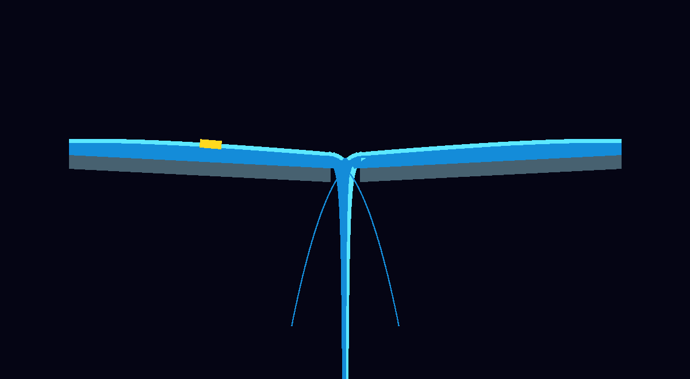
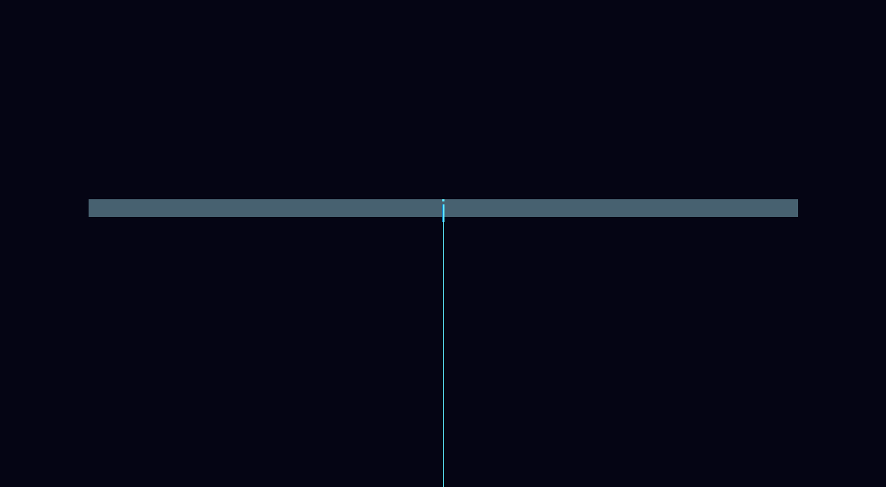
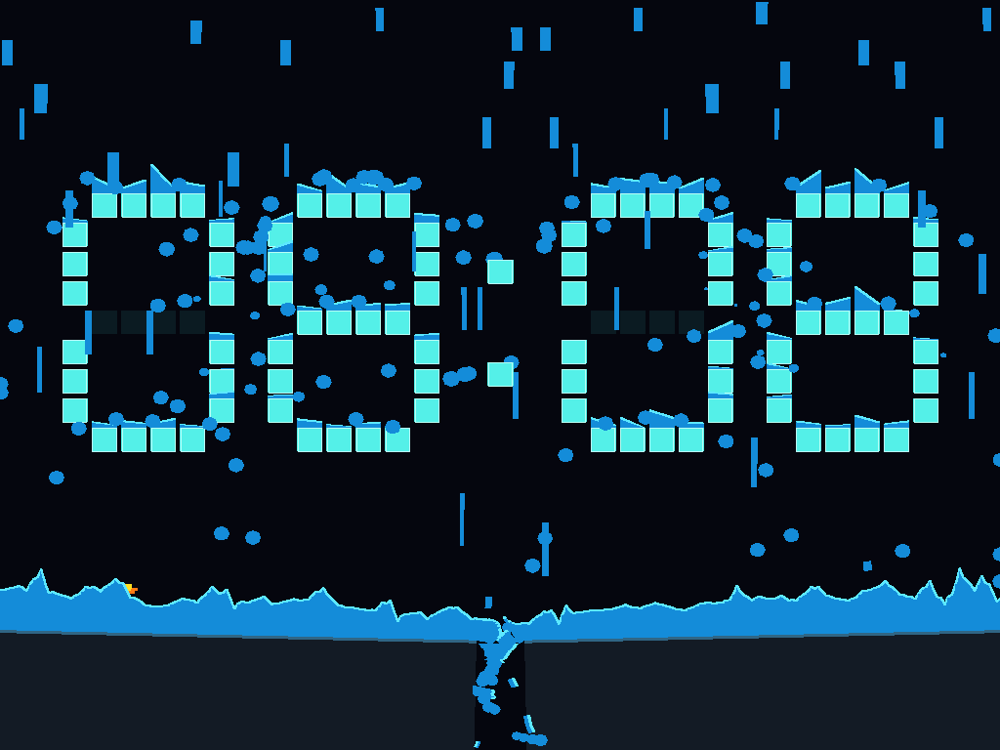
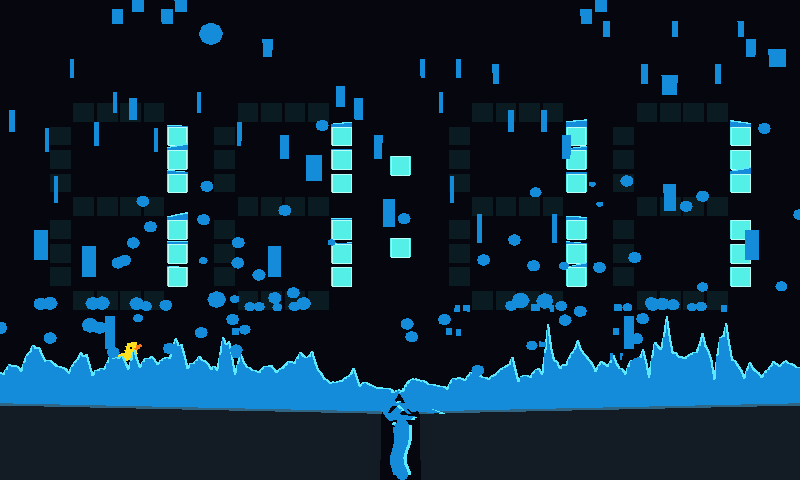
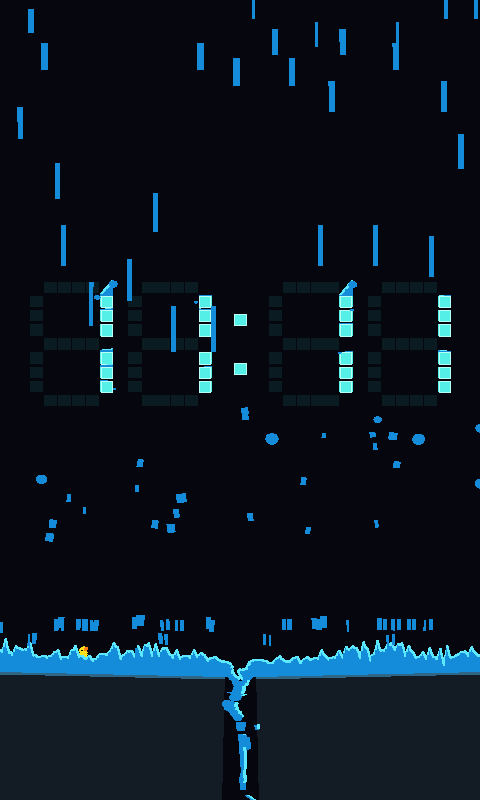
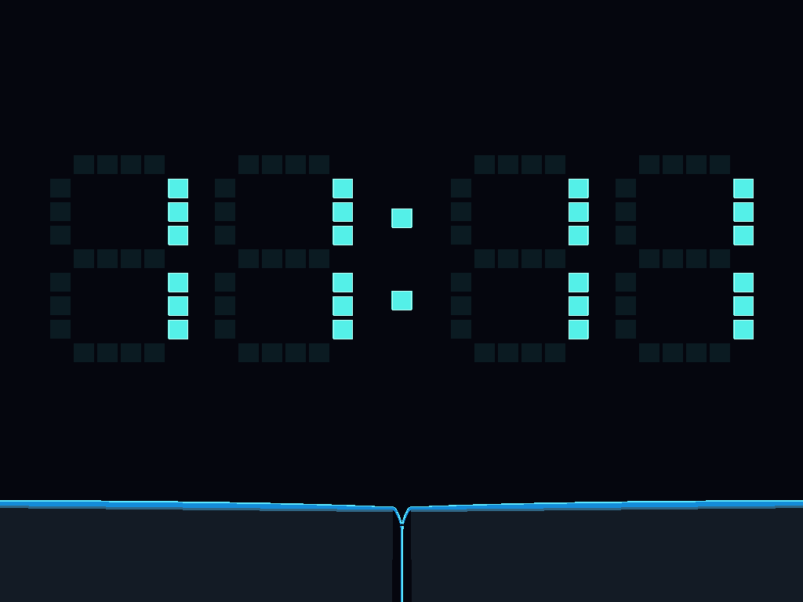
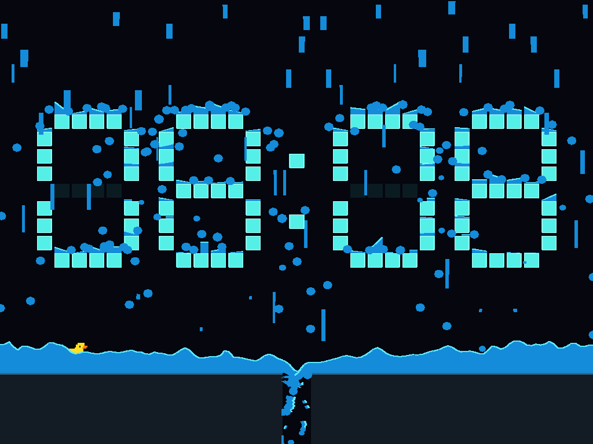
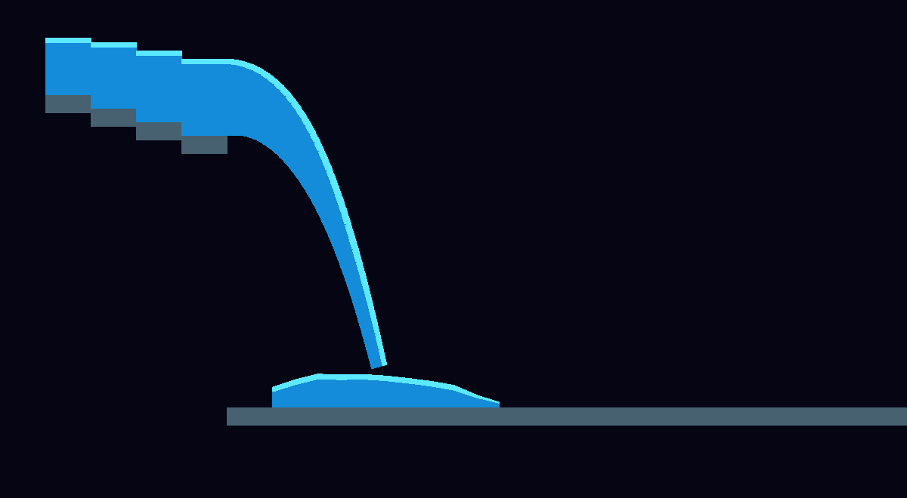
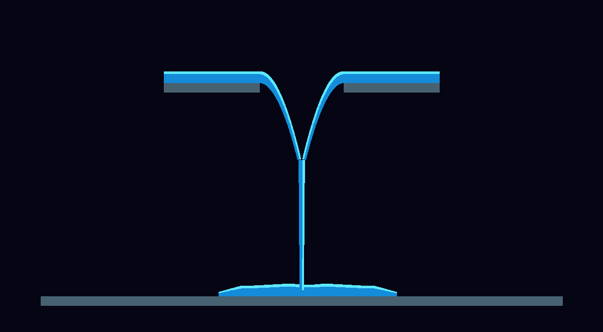

# Bounded pools and spills

First delivery for Clock water (#55): reusable water accounting and motion,
Meltdown integration, deterministic fixtures, visual preview, and benchmarks.
The second slice adds opt-in one-way Rapier buoyancy. The third adds a deliberately
narrow displacement experiment: a prescribed box entering/leaving a closed tank.
The fourth closes that feedback loop for a freely moving, rotation-locked box.
The fifth extends that same single-body feedback to a rotating box.
The sixth adds bounded, overlap-aware batches of boxes and circles.
The seventh lets those bodies displace water over a flat basin's spill lip,
with a collecting pool and changing-volume regressions.
The eighth returns to the normal Clock event: softening cells, surface-aware
conversion, area-preserving presentation and bottom-up recovery.
A subsequent impact pass replaces that source behavior with solid falling blocks
that become water and splash at floor contact, following the dirtsim reference.

## Model and boundaries

`engine-water` owns fixed-down, 2D unit-depth water. Volumes therefore have units
of world area; the Clock converts one melted square into its actual area.
It knows nothing about digits, event deadlines, rendering, or Rapier.
Clock's AM/PM pixels use this same path at their actual smaller area: 0.0324
full-size digit-cell volumes each. Clock reports both raw cell counts and
area-weighted initial/remaining-solid volume, so mixed-size material and
unmelted cleanup remain conserved without changing the engine-water model.

Each pool has regularly spaced columns with explicit bed elevations, water
amounts, and horizontal face velocities. Surface-level differences accelerate
flow; damping removes motion. Dry barriers prevent flow through higher beds.
Simultaneous donor limits keep transfers nonnegative and conservative. This is
a bounded height-column approximation, not a full shallow-water/Navier–Stokes
solver. Closed edges retain water; open edges have explicit spill lips.

Overflow becomes finite ballistic parcels. They accelerate downward, deposit
into the first pool surface crossed, or leave through the world lower boundary.
An upper pool can feed a separate lower pool. Opposing automatic outfalls mix
locally when their swept footprints collide (details below). Other parcels are
not colliding particles: there is no general pressure, breaking-wave, or impact
splash solver. A caller may inject upward-moving splash parcels. On capacity
exhaustion, outflow is held in the pool; it is never silently deleted.
Each parcel carries optional `horizontal_bounds` that stop horizontal motion at
vertical walls. Automatic spills default to `WaterConfig::spill_channel`;
`set_outlet_channel(pool, edge, bounds)` overrides a single edge for future
emissions (`None` means free flight). A channel must contain its outlet: it cannot
teleport newborn runoff across the world. Changing it detaches old ribbon history
without moving existing parcels or replacing their bounds. Explicit
`add_falling` sources must supply their own bounds (or `None` for free flight).
Normal Meltdown uses the central drain channel for outflow and the outer screen
walls for its impact spray; the open collecting-pool fixture is unconfined.
The channel is not a general solid
collision system. Independent rain/splash parcels still pass through one another.

The accounting contract is:

`injected = pooled + in-flight + drained + explicitly reclaimed`

Meltdown reclaims remaining water gradually during its 90-tick reform phase and
reports that separately from drainage. It must not claim that cleanup water
passed through the outlet. Unlike the old forced drain current, a flat basin
does not necessarily empty in the Clock's seven-second material window.

Pools reserve all column/face scratch storage at construction; stepping allocates
no additional buffers. Limits are 128 pools, 512 columns total, and at most
512 parcels (128 in Clock Meltdown; 512 in Rain, including release reserves).
Each caller step accepts `(0, 1/30]` seconds and is
split into substeps no larger than 1/240 second. Speeds and donor withdrawals
are limited; these are stability/work bounds, not an accuracy guarantee at
arbitrary depths or scales. Geometry and source inputs must be finite and within
the API bounds; rejected source additions leave accounting unchanged.
Without body displacement, pool work is linear in column count. Parcel collection
rejects pools outside the swept horizontal interval before scanning candidate
columns. Both pool and parcel counts are bounded.

`Pool::columns()` exposes the same bed, surface, liquid volume and separate body
occupancy used by simulation.
`WaterWorld::sample(point)` queries occupied water and its local velocity
(horizontal on flat beds; tangent-following on opt-in slopes). Closed boundaries
retain unlimited height (not finite-height walls).
Parcel deposition transfers volume. By default it does not impart impact
motion; the optional local surface-response approximation below is not full
momentum coupling. These remain explicit limitations for future body/wave work.

### Optional wet-surface impact response

`WaterConfig::impact_response` defaults to zero, preserving ordinary volume-only
collection. A value in `[0, 1]` redirects a fraction of a descending parcel's
speed into outward velocities on the receiving column's two interior faces.
The response scales by incoming volume relative to local receiving liquid. It
also caps each kick by `response * sqrt(gravity * wet_depth)`, so a large drop
cannot turn an almost-dry film into a fast jet. The existing substep speed and
donor-volume limits still control actual transport.

Only already-wet faces above their bed barrier participate. Dry landings still
deposit their volume normally. A single-column ledge has no interior face;
closed boundaries, spill laws, separate pools and dry/raised barriers receive
no synthetic current. Incoming parcels are collected once through the same
swept test, including birth-half-step outfalls. The response uses the arrival
step's downward velocity, not a new exact sub-tick impact solver. Birth-step
impulses affect the following pool step.

The waves move **existing liquid**, not an additional highlight/splash overlay.
There are no new parcels, temporary bodies, draw primitives, per-step buffers or
changes to the volume ledger. Existing non-flat surfaces can prevent the vector
adapter from batching flat rectangles, so unchanged source primitive counts do
not guarantee identical renderer cost. `WaterStats::impact_transfers` counts
collected parcels that actually changed a surface velocity, not attempted hits.

Clock Rain opts in at **0.12**; the shared engine default and Meltdown remain
unchanged. Clock's additive `surface_impacts` diagnostic reports that counter,
including through the CLI; old JSON payloads default it to zero. Paused reading
updates may release supports but do not apply impacts or advance the waves.

This is a cheap, damped surface disturbance, **not** vertical-pressure dynamics,
a spray generator or a momentum/energy-conserving fluid/body solver. Asymmetric
depths and walls can produce asymmetric horizontal motion. There is no new
attraction toward the drain or moving drain geometry; those remain separate
work under #102. Exaggerated splash art can later use an explicit bounded
effect without pretending it is extra water.

`water_fixture::ImpactFixture` compares the same tank, volume and falling drop
at response 0 and 0.25. These production-renderer captures show the same instant
after impact. The control has the deposition mound; the response sends two
small waves outward. The fixture deliberately uses a stronger response than
the live Rain setting to make the difference easy to inspect.


Regression coverage includes conservation/nonnegative volumes, symmetric replay,
arrival-speed/strength scaling, the shallow-film cap, dry and blocked neighbors,
closed/single-column boundaries, birth-step collection, 300 repeated large
impacts and retained storage. Raster/vector checks require a visible difference,
bounded source primitive counts and approximately equal rasterized water area.
The live Rain delivery/duck/cleanup suite and existing two-frame maximum outfall
fallback bound remain unchanged. The first uncapped live experiment exceeded
that continuity bound; the depth-aware cap addresses it without weakening the
test.

Release measurements on this workstation (Rust 1.89, simulation only), after
the concurrent builds/tests finished:

- Two impacts per step, 6,000 measured steps after 600 warmup steps: response
  off/on medians were 0.52/0.54 µs at 32 columns, 2.34/2.31 µs at 128, and
  9.97/10.08 µs at 512. The small differences are near run-to-run noise, not a
  speedup claim. The worst absolute accounting error was below `1.6e-11` area
  units; all 13,200 impacts per enabled run were recorded.
- Heavy live Rain at fixed `12:34`, seeds 0/7/19: 28.0–28.3 µs median,
  32.3–32.6 µs p95, 191–199 peak parcels, no source/outlet stalls, and
  4,145–4,279 recorded wet-surface impacts over the 20-second rain phase.
- Wet `08:08` → `11:11` across Picade, HyperPixel and portrait: 23–27 µs median,
  37–43 µs p95, 315–331 peak parcels. Changes applied immediately, with 0–8
  denied source attempts / 0–4 outlet-limited ticks after the change, no support
  deferrals, and at most 5.6 cell areas pending. Every run delivered 100% of
  scheduled rain by its deadline.

The full local workspace all-target test run passed **1,634 tests** with 46
existing ignored cases (real-client UI tests remain a separate CI step).
The 72 live Rain lifecycles still deliver all scheduled volume, keep all 24
Light cases duck-free, and record real duck exits in all 48 Medium/Heavy cases.
Formatting and strict scoped Clippy passed. Impact response was subsequently
deployed to `sw-picade-2`: a Heavy Rain sample reported 60 FPS/UPS, 427 actual
surface impulses after six seconds and no source/outlet stalls. The passive
duck exited the drain. Volume remained 5%, and the other units were untouched.
Those observations precede the separate slope/floor lab below.

```sh
cargo test --locked -p engine-water impact::
SPACEWARS_WATER_EDGE_ARTIFACTS=/tmp/clock-water-impact \
  cargo test --locked -p engine-client --bin engine-client water_impact_response
cargo run --locked --release -p engine-water --example impact_benchmark
cargo run --locked --release -p scenario-clock --example rain_benchmark -- --live-only
```

### Continuous slopes and load-responsive floor lab

The slope and moving-floor paths were first proved in the test bed and are now
used by **normal Clock Rain** (integration below). Meltdown and existing
flat/stepped pools keep their original interior-flux path. No new launcher
scenario is introduced. The responsive-floor work was verified on `sw-picade-2`
on 2026-09-19; see the device checkpoint below, including its USB/storage caveat.

`configure_sloped_bed(pool, endpoints)` opts a dry, unstepped pool into straight
bed segments on its existing column grid. Each cell has left/right bed heights;
adjacent unequal endpoints remain real cliffs. Surface level is obtained from
the exact area above that segment, including partly wet triangular columns.
Transfers use the actual shared-face barrier, so a horizontal lake stays at
rest over an incline while shallow runoff can drain downhill. Sampling, swept
arrival and one-way hull immersion clip against the same inclined bed. Outfall
velocity follows the terminal bed tangent before ballistic gravity takes over.
Body-displacement feedback still deliberately supports flat basins only.

Rendering reconstructs connected faces over fully wet continuous bed segments,
using a cell-local midpoint to preserve each column's area. Partly wet cells
keep their actual triangular footprint. It does not smooth across dry regions
or real cliffs. This is still a finite-resolution height-column approximation,
not arbitrary wall/ceiling flow or a pressure solver.

`move_sloped_pools` accepts an atomic batch of new spans, segment heights and
outlet states. It remaps retained liquid by the old occupied cross-section;
strips exposed by a widening gap become free parcels. They are neither new rain
nor silently drained/reclaimed water. Validation and parcel-capacity checks
precede every mutation. A rejected batch leaves all old floor/water geometry
intact for the caller to retain and retry. Geometry scratch is allocated during
configuration and reused; column/parcel budgets do not grow. Identical snapshots
are no-ops. Existing horizontal flow is interpolated, not replaced by a current
pointing at the drain.

This moving-bed model is intentionally **slow and quasi-static**. Liquid stays
in contact with the gently moving supporting bed; displacement at retained
coordinates is bounded by `gravity * dt² / 2` per update. It is not suitable for
a rapidly falling/rotating platform, pressure-driven hinge physics, or energy-
conserving solid/fluid coupling. Horizontal remapping is conservative in volume,
not a full momentum solver. Call once per simulation step, never while paused.

`ResponsiveFloorFixture` shares Rain's actuator and geometry code, with two
32-column panels and two persistent Rapier kinematic cuboids:

- Measured floor-water amount drives a filtered load signal. More water tilts
  and retracts the panels farther; closing is slower than opening.
- Nearby airborne runoff delays closing rather than counting as floor weight.
- An occupied passage holds a safe opening until the passive hull clears it.
- A deterministic floor source isolates this response from random rain and digit
  changes. The yellow rectangle is the duck's actual passive buoyant hull, not
  the final duck artwork. It has no navigation or steering force.
- Visible panel tops, water beds and moving rigid colliders agree. Bodies and
  collider shapes are not recreated per tick. Once empty, the panels return
  toward a flat, closed floor without reclaiming liquid to force the result.

Production-renderer lab captures:






The original opening capture exposed a short break farther down the merged jet.
Continuous source slices sometimes collide a frame apart rather than on
consecutive frames. Merged ribbons now link by contiguous original emission
sequences from both parents, with the existing spatial bound, not by collision
frame alone. A genuine source interruption remains separate. This changes
presentation history, not parcel volume, momentum or the collision response.
The updated capture and an actual raster-row regression cover the formerly
broken jet. Thin side streams still represent liquid exposed by panel retraction.

Regression coverage includes partly dry equilibrium, thin/deep mirrored runoff,
raised-lip retention, inclined sampling/immersion, dry-slope arrivals, tangent
outfalls, conservative remapping/release, atomic capacity failures, retained
scratch, changing load, closing interlocks, collider alignment and an actual
passive-hull exit. PNG/SVG tests use the production raster/vector adapters.

The full local workspace all-target run passed **1,655 tests**, with 46 existing
ignored tests and no failures. Formatting, whitespace checks and strict scoped
Clippy for `engine-water`, `scenario-clock` and `spacewars-control` also passed.

Release measurements on the workstation (simulation only): 128-column
level pools took about 1.5 µs/step for flat beds and 3.4 µs for slopes; 512-column
cases were about 5.9/13.4 µs. The 64-column responsive-floor lab, including the
kinematic mechanics and optional hull, was about 9 µs median / 12 µs p95, peaking
at 120 parcels with no floor-update deferrals. These are not Pi frame timings.

#### Normal Rain integration

Rain acquires an `event-owned` floor and starts flat/closed. Its two existing
64-column floor pools opt into slopes; collecting digit pixels remain ordinary
ledges. Average floor-water depth drives a 0.35-second filtered load signal and
a square-root opening curve. Maximum drop is 0.35 digit pitches, capped at 12
world units; opening is limited to 0.16/second, closing to 0.06/second, both also
bounded by the engine's quasi-static displacement limit. A steeper first trial
drained a portrait entrance too quickly: the gentler slope preserves the
existing 0.65-pitch, half-second duck launch requirement.

Nearby incoming runoff delays closing for half a second; it does not count as
floor weight. The floor's own outfalls are excluded, and nearby volume must
exceed 0.02 square digit-pitches so vanishing digit films cannot latch the hatch
at its peak opening. A duck occupying the passage holds sufficient clearance
until its whole hull clears the panels. Unsupported water is released as
parcels, never silently reclaimed to make the mechanism close.

The rigid world exists only during the duck's visit: one dynamic hull, two
persistent kinematic panels, and a fixed body holding both side walls (four
bodies/five colliders). The same panel transform supplies visible floor polygons
and collider poses; the water bed agrees with their inclined top faces. The door
samples both actual local depth and surface elevation, not the old flat-floor
offset. No attraction, duck steering or water-displacement coupling is added.

Capacity deferral keeps the old panel/water geometry together. Pausing cannot
advance the actuator. Replacement, resize, restart and normal completion drop
all event resources and restore the ordinary floor; Falling, Meltdown and the
walking-duck course retain their prior geometry. During the existing final
two-second cleanup, residual liquid is explicitly reclaimed and any remaining
opening blends back to the closed floor. Cleanup is still not a duck exit.

`clock state` now includes default-compatible `floor_open_milli`,
`floor_load_milli`, `floor_motion_deferrals` and `floor_clearance_holds`. See
[Clock](../clock.md#rain-and-the-rubber-duck) for units and lifecycle semantics.

The 72-case amount/aspect/seed sweep preserves all 48 physical Medium/Heavy
duck exits and 24 Light no-spawn outcomes, full scheduled delivery, conservation,
bounded parcels and zero floor-update deferrals. It now verifies persistent
collider alignment and load-dependent opening/closure too. A forced-capacity
test checks atomic deferral; existing pause/replay/resize/replacement checks
cover the new state. Production raster/vector captures cover all three device
aspects and final cleanup. Transient lip reconstruction fallback stays bounded
to two ticks (33 ms); true source gaps are not cosmetically filled.

Release timings on the workstation, seeds 0/7/19 (simulation only):

| Heavy Rain | Peak parcels | Step median | Step p95 |
| --- | --- | --- | --- |
| Fixed 12:34, Picade aspect | 254–263 | 34–35 µs | 44–46 µs |
| Wet 08:08 → 11:11, all three aspects | 319–391 | 27–29 µs | 56–60 µs |

All requested rain arrived by the 20-second source deadline. Neither case had
floor-motion or digit-change deferrals. Fixed-face runs had no source/outlet
stalls; the large wet correction caused 2–12 source-limited attempts and 0–24
outlet-limited ticks, with no pre-change stalls and at most 10.8 cell areas of
pending source volume. This is the existing bounded backpressure path, not
deleted liquid or an expanded parcel budget. These measurements exclude draw
list generation, rasterization and display submission, and are not Pi timings.









These are headless production-renderer captures, not Pi screenshots. The real
windowed Rain workflow's ownership expectations have been updated and compiled,
but that optional display test has not been rerun in this slice.

On 2026-09-19 the release client/CLI pair was installed on `sw-picade-2` and
verified after a user reboot. A Heavy Rain preview showed the new floor opening,
one actual duck exit, no floor-motion deferrals or source/outlet stalls, then a
closed, body-free arena. An active sample reported about 60 FPS/UPS and a
0.358 ms mean / 0.420 ms p95 host step at 1024×768, raster scale 2.0; an actual
device screenshot was inspected. Settings remained byte-identical. These are
short live samples, not a hardware reliability or performance guarantee.

The installer hit a device-side I/O error while retaining the previous binary
pair, after initial application health checks passed. The rebooted device's
binary hashes match the new build, but that boot also logged USB over-current
events, a USB disk reset and a read error. A subsequent boot with the LCD powered
independently ran the displayed Clock at 60 FPS/UPS, completed Heavy Rain, and
continued mixed events for over 20 minutes without USB errors or service
restarts. This points to the shared USB power path, not a confirmed component
failure; the filesystem warning still needs an offline check. See the actual Pi
captures and details in [the device checkpoint](../clock.md#responsive-floor-device-validation-2026-09-19).

```sh
cargo test --locked -p engine-water slopes::
cargo test --locked -p engine-water moving_bed::
cargo test --locked -p scenario-clock responsive
SPACEWARS_WATER_EDGE_ARTIFACTS=/tmp/clock-water-slopes \
  cargo test --locked -p engine-client --bin engine-client water_visual_tests
cargo run --locked --release -p scenario-clock --example slope_benchmark
```

### Irregular rain and live digit surfaces

Normal Clock Rain now shuffles a bag of 32 horizontal bands each cycle, with
fresh jitter inside each band. It emits batches of 1–3 parcels separated by
1–3 ticks instead of advancing a fixed modular stride every two ticks. The
average rate remains about 60 parcels/second at 60 Hz. Position and timing use
the event's seeded RNG; replay remains deterministic. This changes the visible
pattern, not the Light/Medium/Heavy scheduled volume or its smooth envelope.
Backpressure still leaves undelivered volume scheduled, not counted as liquid;
the deadline attempts a final batch even between scheduled showers. A live rain
parcel is at most one digit-cell area: backlog catches up over ordinary batches
instead of suddenly appearing as an enormous drop. Scheduled but undelivered
rain remains visible in diagnostics, not counted as missing liquid.

`water_fixture::DigitRainFixture` remains the isolated **headless test bed**.
It uses the real seven-segment cell layout and 0.8-pitch squares,
with two catching columns per cell and the actual gaps between cells. A full
digit needs 24 preallocated cell pools plus two floor halves (92 columns total).
Inactive pixels remain faint visual guides, not water-catching surfaces.
The fixture can change digits while wet; tests cover a top row disappearing
and its water landing on the middle row, then spilling down to the floor.
Production raster/vector captures cover rain and an `8` → `1` transition.
The four-digit row uses 98 pools / 320 columns, four times the source volume and
drop rate, and the same 512-parcel hard ceiling. Its simultaneous `8888` → `1111`
change stresses wet-support retirement independently of the live Clock layout.

The actual Rain event now builds these collecting surfaces from `Layout` and
the current lit digit mask. It preallocates 96 cell pools plus the two floor
halves (98 pools, 320 columns). Only lit digit cells collect rain. Dim guides,
the blinking colon and AM/PM are presentation-only: no per-second support churn,
and no hidden collector spanning a glyph or the gaps between cells.

Digit outfalls use the outer viewport bounds; only the two floor outfalls use
the narrow central drain channel. Removing a support releases its water freely
with the column's horizontal velocity, not a sideways kick into the drain.
The passive duck tests depth in the floor pools only, so a dry ledge overhead
cannot prevent its launch. Water renders over the face's dim guides; the clock
remains readable, with colon and AM/PM drawn afterwards.

The reusable engine addition is `WaterWorld::set_pool_supports(&[bool])`:

- Pool indices/geometry remain stable. Disabled pools do not catch, flow,
  render water columns, or accept source/displacement submissions.
- Each removed wet column transfers its liquid into a falling parcel, without
  changing injected/drained/reclaimed totals. Old attached outfalls detach.
- The whole update is validated first. Insufficient capacity returns `Capacity`
  without changing any support, parcel, or accounting. Callers must retain the
  old visible supports and retry; they must not silently discard the water.
- `WaterConfig::reserved_release_parcels` can withhold slots from ordinary
  sources/outlets for removal (default zero). These slots are **inside** the
  existing hard parcel budget. The single-digit fixture reserves 48 of 512 slots,
  and the four-digit row/live event reserve 192, enough for all cell columns.
  Repeated changes can still exhaust this reserve.
- Re-enabled supports start dry, with no old velocity or body occupancy. Scratch
  storage is retained. Per-step spill scratch now scales with actual pool count,
  so increasing the pool ceiling does not initialize 128 entries in a two-pool
  Meltdown event. Column and engine parcel ceilings are unchanged.

Live reading/format updates switch physical and visible digit masks together.
Wet disappearing cells release their water even during a paused control update;
simulation time, source RNG, existing motion and injection/drainage/reclamation
do not advance. Shared lit supports keep their water. A normal wet change fits
the reserved slots. Repeated corrections before water can fall can exhaust that
reserve: the old visible/physical digits stay together and the next simulation
tick retries the **latest** reading, not a queue of stale readings. Clock status
reports `surface_digits`, `surface_change_pending`, `surface_change_deferrals`,
`surface_water_microunits` and `drip_parcels_emitted`. Normal time corrections,
12/24-hour changes, noon/midnight, pause, resize and event replacement are tested.

This is intentionally a collection-surface model, not solid collision: blocks
do not deflect sideways/upward-moving parcels, contain pressure, or displace
surrounding water on appearance. No invisible walls bridge the pixel gaps.

The initial prototype exposed a parcel bottleneck: every tiny positive outfall
created another slice, so nearly dry ledges competed with actual rainfall for
slots. Optional `WaterWorld::set_drip_config(pool, Some(DripConfig { ... }))`
now batches small outflows **in time**, separately for each outlet:

- Waiting water remains in the pool columns: visible, sampleable, and counted
  as pooled volume. The two inline credits request future outflow; they are not
  extra liquid or a hidden detached-water reservoir.
- Accumulate the normal requested outflow until `target_volume` or `max_delay`.
  The lab uses 3 area units (about 3.3% of a pixel's area) and 0.6 simulated
  seconds. The deadline permits smaller drips, so there is no minimum-volume
  cutoff silently deleting residual water.
  Live rain uses a quarter of a digit-cell area and a 1.2-second deadline.
  The larger drop target handles heavy throughput; the longer wait prevents
  light-rain residual films from flooding the queue with tiny parcels. Both
  keep tiny ledges within the ordinary 320-parcel budget while 192 release
  slots remain reserved.
- Requests stay capped to actual above-lip liquid, and all simultaneous donor
  withdrawals remain bounded. A one-column pool shares retained water correctly
  between two outlets, including raised lips. Capacity exhaustion keeps liquid
  upstream; it does not create unlimited flow debt or raise launch-speed caps.
- A substep with enough flow can still emit an ordinary connected outfall.
  Batched `SpillSource::Drip` parcels use the existing area-preserving detached
  renderer and swept collection, not a ribbon stretching back to the lip. Like
  independent rain drops, they do not participate in opposing-stream mixing.
- Configuration defaults to `None`; existing floor/drain pools use continuous
  outflow. Only digit-cell pools opt in. This is a timing approximation,
  **not** surface tension, pressure, or a general particle collision model.
- Reclaim/support removal clears stale requests without adding/releasing liquid
  twice. No additional allocations occur during stepping. Parcel slots are
  reserved when an outlet is due, so a waiting left edge cannot reserve the only
  slot needed by its right neighbor. `capacity_limited_ticks` counts blocked
  outflow requests, not normal batching waits; `drip_parcels_emitted` counts
  released batched parcels (including ones collected during their birth step).

Initial prototype release A/B results on this workstation, **before the swept
pool rejection optimization**, seeds 0/7/19, 1,200 ticks each (rain
through tick 900, digit change at 600, first 120 timing samples excluded):

| Fixture | Peak parcels | Delivered rain | Step median | Step p95 |
| --- | --- | --- | --- | --- |
| One digit, continuous control | 486–490 | 81–95% | 64–65 µs | 114–115 µs |
| One digit, batched drips | 135–138 | 100% | 9.5–10 µs | 29–30 µs |
| Four digits, continuous control | 402–407 | 3–78% | 90–93 µs | 254–256 µs |
| Four digits, batched drips | 403–425 | 100% | 58–66 µs | 247–252 µs |

The single-digit batched case had no source/outlet capacity stalls. Four digits
still had 25–37 denied source attempts and 17–18 outlet-limited ticks, largely
around simultaneous wet-support retirement; the largest pending budget was
152–200 units (0.32–0.42 seconds' scheduled rainfall). The four-digit control's
lower peak is **not** better throughput: it is severely starving the source.
Every tested digit change succeeded immediately and injected water remained
conserved; undelivered scheduled rain is not counted as missing liquid.
Delayed source volume is admitted in a later batch, so larger catch-up drops
remain visible briefly after the four-digit change. This tradeoff is measured,
not hidden by reclaiming liquid or calling deferred sources injected water.

These are simulation-only timings, not Pi FPS. The former floor-only Clock workload
measured about 7.8–7.9 µs median / 9.0–9.1 µs p95 in the same run; it is not an identical
workload. The benchmark prints counters, pending source volume and pre-change
pressure separately, with no wall-clock pass/fail assertions. Normal CI tests
conservation, deterministic replay, delivery and bounded transient backpressure.

An ordinary-water baseline check caught a code-generation regression in the
first batching implementation. The hot column/donor passes now traverse adjacent
slices directly, rather than repeatedly indexing every vector. The equations
and simultaneous-withdrawal limiter are unchanged. With batching disabled,
`engine-water`'s existing `water_benchmark` compared against main `b0b16b0`:
512-column closed pools improved from 11.3 to 7.7 µs median; 128-column opposed
mixed streams from 5.0/5.3 to 4.6/4.8 µs at depths 5/15. Peak parcels, merge
counts and reported volume errors matched the control. No timing thresholds
are added to CI.

Live integration results (Rust 1.89 release, workstation, seeds 0/7/19):

| Heavy live Rain | Peak parcels | Delivered rain | Step median | Step p95 |
| --- | --- | --- | --- | --- |
| Fixed 12:34, Picade aspect | 190–198 | 100% | 27–28 µs | 31–32 µs |
| Wet 08:08 → 11:11, Picade/HyperPixel/portrait | 310–341 | 100% | 24–25 µs | 37–43 µs |

The fixed-face cases had no source/outlet stalls. The deliberately large wet
correction completed immediately in every case, with 0–11 denied source
attempts and 0–15 outlet-limited ticks (none before the change). Peak pending rain
was 1.1–9.6 cell areas (less than one second's peak scheduled rate); all arrived
by the 20-second rain deadline. No liquid was deleted to make room. The 72-case
amount/aspect/seed lifecycle sweep verifies full scheduled-rain delivery at every
amount, physical duck exits for medium/heavy storms, and no duck launch for light
rain. These are simulation-only measurements, **not** Pi timings or
whole-frame/rendering costs.

The first live pass spent roughly 130 µs per heavy-rain step testing unrelated
ledges. Rejecting disjoint horizontal pool intervals before the exact swept
intersection brought that down to roughly 36 µs with the same batching. The
final coarser live drip setting brings it to the figures above. Thin crossed
ledges, exact-edge hits, support changes, conservation and replay remain tested.

#### Visual and device checkpoint

These deterministic headless captures use the live Clock event and production
raster adapter, not an illustrative mockup. The first is a wet `08:08` face at
1024×768. The second is immediately after a forced `08:08` → `11:11` correction
at 800×480: water above the retired cells is now falling freely, not still held
by the dim guides. The capture suite also checks later runoff and portrait.




The release application was deployed and manually playtested on `sw-picade-2`
(Pi 4, 1024×768, raster scale 2). One 120-sample heavy-rain window reported
60 FPS / 60 UPS, host simulation step 0.441 ms average / 0.497 ms p95,
scene construction 0.331 ms average, and frame preparation 7.866 ms average.
At that checkpoint there were 162 parcels, no source/outlet capacity stalls,
no deferred support changes and a floating duck. These host costs include more
than the isolated water benchmark. A later spot check around 50 minutes after
deployment found the same process and zero service restarts; this is not a
formally monitored soak or a performance guarantee. Other Pi units were not
updated as part of this checkpoint.

```sh
cargo test --locked -p engine-water supports::
cargo test --locked -p engine-water drips::
cargo test --locked -p scenario-clock rain::
cargo test --locked -p scenario-clock water_fixture::digit_rain
SPACEWARS_WATER_EDGE_ARTIFACTS=/tmp/clock-rain-drips \
  cargo test --locked -p engine-client --bin engine-client water_visual_tests::
cargo run --locked --release -p scenario-clock --example rain_benchmark
cargo run --locked --release -p scenario-clock --example rain_benchmark -- --live-only
```

The capture command writes `digit-rain-tick-*.png`, `four-digit-rain-tick-*.png`
and matching SVGs alongside the existing edge gallery. Live captures named
`clock-digit-rain-WxH-tick-N` include a wet time correction at 1024×768, 800×480
and 480×800. Their same-reading dry controls exclude cyan digits from the water
pixel check. All pixel assertions run
even when no artifact directory is requested. A separate no-rain probe verifies
visible runoff from a wetted block; dry controls exclude the cyan digit itself.
Source tests verify
coverage, non-striding order, cadence variation, deterministic replay and bounded
batch size; existing rain tests retain conservation, duck exits, and lip continuity.

## Integration and verification

### Connected outfalls and the edge test bed

Surface columns and ballistic water still have different simulation roles, but
automatic outfalls now retain shared material cross-sections. Consecutive
emissions from the **same pool edge on consecutive steps** share a face. A dry
interval, expired/collected parcel, or unrelated rain/splash source cannot create
a connection. The newest face spans the lip to the current pool surface. Face
width is flow divided by speed, so an accelerating stream narrows downstream.

`WaterWorld::spill_ribbon(index)` exposes two convex pieces for an attached
parcel. The faces remain shared; the interior width is solved so the pieces'
combined area equals that parcel's transported volume, before channel clipping.
Normalizing each entire polygon independently would reopen seams. Degenerate,
folded, or abruptly compressed slices fall back to the detached representation
instead of inventing negative widths or non-convex renderer input. Channel
clipping and subpixel raster coverage remain presentation approximations, not
changes to the volume ledger.

Changing source depth also moves the section centers vertically; that motion is
not the material's flow direction. The midpoint now interpolates the material
face normals instead of using the center-to-center chord. This fixes the standing
gap reproduced by `steps-right-depth-15-tick-60`, whose youngest slices previously
folded through the lip and fell back to drops. The regression checks every slice
through the rising-head interval in both directions. Heavy-rain regressions cover
three aspect ratios and three seeds: the original floor-only regression retains
its one-frame fallback bound; larger batched digit impacts may use a detached
fallback for at most two frames (33 ms). Persistent lip gaps are rejected.

The emitted parcel center starts halfway through its represented time interval;
that birth motion is swept for collection just like subsequent movement. Its
youngest material face starts at the exact lip, not slightly outside it. The
outfall speed law and donor-limited column fluxes are unchanged. Presentation
history is preallocated alongside the existing parcel budget, maintained in a
linear pass, and removed/reclaimed with the parcel. This presentation history
needs no sorting, unbounded history, additional particles, or per-step allocations.

Clock uses the connected geometry for both Rain and Meltdown. Its surface
highlight continues down the stream, covering at most 24% of its thickness so a
thin jet does not turn entirely into the brighter highlight color. Independent
splashes retain their compact-drop/ribbon rendering.

The deterministic `scenario_clock::water_fixture` lab bypasses event timing and
uses a fed upper reservoir over a lower collector. It provides left/right
outfalls, depths 1/5/15, a flat ledge, steps, and a sampled ramp. Opposing fixtures
add equal/unequal streams and a stopping source, with a no-mixing A/B control.
The gallery also captures the actual heavy-rain event at Picade and HyperPixel
aspect ratios. The renderer checks require neither a display nor a new launcher
scenario:

```sh
# Geometry/volume regressions at 30, 60 and 120 simulation steps per second.
cargo test --locked -p scenario-clock water_edge_lab -- --nocapture
cargo test --locked -p engine-water spill::tests
cargo test --locked -p engine-water mixing::tests
cargo test --locked -p scenario-clock opposed_outfalls
cargo test --locked -p scenario-clock heavy_rain_has

# Inexpensive pixel checks: connected equal/deflected jets, plus pass-through
# negative controls. These also run in ordinary CI without artifact export.
cargo test --locked -p engine-client --bin engine-client water_visual_tests:: \
  -- --skip water_edge_lab_captures_production_renderers

# Production raster PNGs, vector SVG paths, and a browsable index.html.
SPACEWARS_WATER_EDGE_ARTIFACTS=/tmp/spacewars-water-edge \
  cargo test --locked -p engine-client --bin engine-client water_edge_lab

# Physics-only timing, not displayed FPS or rendering cost.
cargo run --locked --release -p engine-water --example water_benchmark
```

The original renderer reproduced the reported apparent-volume loss: for a
five-unit reservoir, a vertical probe just outside the lip found water over
56.9% / 37.9% / 24.7% of its depth at 30 / 60 / 120 Hz, despite a balanced volume
ledger. Compact parcels overlapped near the source, then changed shape as they
accelerated. The connected version covers 100% in these fixtures (regression
minimum 99%); transported polygon area is checked within 0.02%. Shared-face,
mirror, non-default-gravity, stopped/restarted-flow, independent-drop, reclamation,
storage reuse, speed-bound, and birth-collection checks cover the engine contract.

### Local opposing-stream mixing

`WaterConfig::mix_spills` defaults to true; false provides the ballistic A/B
control. `SpillSource` distinguishes automatic pool edges, mixed junctions, and
independent sources (no attached source). Only approaching outfalls from different
edges, with opposite horizontal velocities and identical channel bounds, mix.
Their finite footprints preserve slice area; swept oriented-rectangle tests catch
crossings within a timestep, rather than only overlapping end positions.

Colliding slices become a local inelastic volume: volume, center of mass, and
momentum are preserved, while relative kinetic energy is dissipated. Equal jets
fall downward; unequal jets retain the stronger flow's horizontal momentum.
Groups require a shared contact patch, so remote intersections cannot teleport
together. Mixed output can share a material face with the preceding nearby
junction slice; it never links back to an incoming lip. Junction presentation
spaces joined faces by volume throughput rather than collision-sampling jitter;
the actual parcel center and momentum are not moved by this presentation step.
Compressed junction geometry falls back to a compact area-preserving parcel
instead of a wide spike.

Scratch storage is preallocated within the existing parcel limit. A deterministic
swept-AABB sort and vertical sweep prune candidates; dense overlap can still be
quadratic, bounded by 512 parcels (128 in Clock Meltdown). Consumed inputs are compacted
with their metadata; mixing only decreases parcel count. `WaterStats` records
`spill_merges`, `mixed_volume`, and `mixing_pair_checks` for measurement.

This is deliberately not general particle fluid simulation: independent rain,
spray, and already-mixed jets do not collide. Contact orientations are frozen at
mid-step and the center-of-mass replacement happens before ballistic advancement,
so contact can resolve up to one timestep early. Startup/transient jets can break
into compact parcels, and strong direction changes or wall compression can still
produce irregular downstream geometry. There is no pressure or turbulence solver,
and pool impacts still deposit whole parcels without transferring their momentum.

On a development workstation with Rust 1.89 release, the 128-column opposed
fixture measured roughly 5.0–5.3 microseconds/step with mixing, versus 4.9–5.2
without (12,000 measured steps after warm-up, depths 5/15). Mixing reduced peak
parcels from 128 to 92/88 and avoided capacity backpressure in those fixtures.
These are physics-only local A/B timings, not Pi measurements or renderer FPS;
different trajectories and parcel counts are part of the comparison.

Production-renderer snapshots from the deterministic lab:

| Rising stepped outfall (depth 15, tick 60) | Opposing streams (depth 5, tick 90) |
| --- | --- |
|  |  |

**Boundary of this earlier outfall pass:** bed changes were still steps, and
surface smoothing stopped at them. The opt-in continuous-slope pass above now
extends the ramp fixture; actual steps still keep their cliffs. Whole parcels
still deposit on center-path collection without an impact-pressure or splash
solver (the optional wet-surface impulse is an approximation). Vector backends
may antialias separately drawn shared faces;
the production raster capture checks geometry without relying on SVG rasterizer
antialiasing behavior.

### General integration checks

- Render pool surfaces from the same geometry used for flow/deposition.
- Render falling parcels as short ribbons: increased falling speed lengthens
  them and reduces their cross-section for the same transported amount.
  Clip the visible ribbon against Clock's channel walls too; physics tracks its
  center and volume, not a finite-width collision shape.
- Keep the ordinary Meltdown lifecycle, time recovery, and controls.
- Provide an environment-only collecting-pool preview, not a launcher scenario.
- Test closed-pool equilibrium, unequal beds, spill flight/collection, capacity
  backpressure, invalid inputs, replay, cleanup, and volume conservation.
- Benchmark water stepping separately from full Meltdown stepping and draw-list
  construction. Hardware performance claims require device measurements.

### Running the fixtures

```sh
cargo test --locked -p engine-water -p scenario-clock
cargo run --locked --release -p engine-water --example water_benchmark
cargo run --locked --release -p scenario-clock --example meltdown_benchmark
SPACEWARS_CLOCK_ARTIFACTS=/tmp/clock-water-captures \
  cargo test --locked -p engine-client --bin engine-client meltdown_
SPACEWARS_CLOCK_WATER_LAB=1 cargo run --release -p engine-client -- --scenario clock
```

For the last command, choose **Clock Controls → Preview Event: Meltdown → Preview**.
The test renderer produces normal and collecting-pool PNGs at 800×480, 480×800,
1024×768 and 1280×720. The simulation fixture verifies an upper stepped bed,
observable in-flight water, collection without loss, pause, cleanup and resize.
Normal Meltdown also retains its real-client menu/preview/restart regression.
Tests assert accounting, bounded resources and outcomes, never wall-clock timing.

### Desktop measurements (2026-09-11, Rust 1.89 release)

The water-only workload warms up for 600 ticks, then measures 12,000 steps per
case, adding a small source each tick. Source insertion and statistics are outside
the timer. The cascade has two pools and continuously active spills.

| Total columns | Closed pool step p95 | Two-pool cascade step p95 |
| --- | ---: | ---: |
| 32 | 0.65 µs | 2.39 µs |
| 128 | 3.54 µs | 3.94 µs |
| 512 | 12.92 µs | 10.42 µs |

Peak cascade usage was 103 parcels with no capacity-limited ticks. Maximum
accounting error across the runs was 1.12e-11 world-area units. These fixtures
have different column widths/motion; rows are workload samples, not accuracy
or monotonic scaling guarantees. Scheduler outliers are reported by the tool.

The full Meltdown benchmark runs 24 dense `08:08` events at each of three sizes
(800×480, 480×800, 1280×720). Before this change, step p95 was 0.9 µs and draw-list
p95 4.4 µs. With pools/spills and gradual reform, step p95 was 4.4–4.5 µs and
draw-list p95 6.3–6.5 µs. Peak primitives grew from 416 to 527, with 85 spill parcels
maximum. Up to 29.28–51.71 of the original 88 cell-volumes were reclaimed during
reform rather than drained; this change is intentional and visible in telemetry.

These are local desktop microbenchmarks, not rasterization/presentation timings,
device FPS or Pi CPU measurements. No Pi deployment is part of this slice.

First-slice local checks passed: 13 water tests, 78 Clock tests (three existing extended
Duck sweeps ignored), 51 common/control/CLI tests, and the client unit suite
(295 tests, one ignored). Both Meltdown render fixtures and the real-client
Meltdown workflow were rerun after channel-wall/edge handling was finalized.
Strict scoped Clippy, formatting and a host `pi-kiosk` feature check also passed.
The feature check is not an ARM cross-build or device test.

## One-way buoyancy

`engine-water::immersion::WaterHull` clips a body hull against the occupied water
columns and integrates submerged area, first moments, polar moment, and local
flow. Boxes use exact polygon clipping. Circles use 32 sides with weights
normalized to the circle's true area; partial immersion and rotational drag
remain approximations. It scans only horizontally overlapping columns and
uses fixed stack buffers, with no per-step geometry allocations or Rapier types.
Immersion integrates hypothetical water up to the column surface; it does not
subtract a displacer or compute a union of overlapping solid hulls.

`engine-rapier::buoyancy::BuoyantBody` builds a dynamic box/circle collider and its
matching water hull together. It reads authoritative pose, mass, COM and inertia
from `PhysicsWorld`; callers must not replace the geometry behind the adapter.
This first binding is deliberately one centered shape, not arbitrary compound
colliders or a hidden global registry. Scenarios opt bodies in explicitly.

Lift is `fluid density × downward gravity magnitude × submerged area`, applied
at the submerged area's centroid. Its lever about the COM generates torque.
Distributed drag resists velocity relative to local water flow, including spin.
A mass/inertia-dependent bound limits drag's per-tick dissipative response for
light bodies and supported timesteps. This is not an unconditional stability
guarantee for arbitrarily small bodies and large gravity/timesteps.

The adapter adds **forces and torque**, so gravity and buoyancy act during the
same Rapier integration. A once-per-frame lift impulse initially produced a
small residual velocity at apparent rest; the settling regression caught it.
Callers use the ordinary force lifecycle:

```rust
water.step(dt)?;
physics.clear_forces();
// Add other external forces here too; buoyancy does not clear them.
for body in &floating_bodies {
    body.apply_forces(&mut physics, &water, buoyancy_config, dt).unwrap();
}
physics.step(dt as f32);
```

The return report contains submerged fraction, center of buoyancy, force and
torque. A dry body receives no water force. Water is borrowed immutably: bodies
do not move its surface, displace volume, obstruct flow or generate splashes.
Spill parcels do not push bodies. Solid beds/walls are ordinary Rapier colliders;
the water surface is **not** a collider. Sleeping is not optimized here: wet
bodies receiving forces may remain awake.

Supported setups use downward gravity, unit gravity scale, and non-overlapping
occupied pool regions. Obvious over-counting is rejected, but the adapter does
not solve a union of overlapping basins. Geometry changes, nonuniform/planetary
gravity, moving containers and feedback waves require further work.

### Preview and measurements

The existing `SPACEWARS_CLOCK_WATER_LAB=1` Meltdown preview now adds:

- an orange box at density 0.35 that floats and can ride off the upper ledge;
- a yellow ball at density 0.55 that floats in the collecting pool;
- a red box at density 1.8 that sinks to the solid bed.

Water density is 1.0. The preview uses exactly three dynamic bodies plus one
fixed support body, with ten colliders total. Support rectangles are shared by
rendering and physics. Pause freezes the simulation; event completion, replacement,
resize and restart release the lab. Normal Meltdown still has **zero bodies**.

```sh
cargo test --locked -p engine-water -p engine-rapier -p scenario-clock
cargo run --locked --release -p engine-rapier --example buoyancy_benchmark
cargo run --locked --release -p scenario-clock --example meltdown_benchmark -- --water-lab
```

Desktop Rust 1.89 release, 600 measured ticks after warm-up, mixed fully submerged
boxes/circles spaced apart in a uniform pool:

| Bodies | Coupling p95 | Mechanics p95 |
| --- | ---: | ---: |
| 3 | 4.03 µs | 1.65 µs |
| 100 | 26.94 µs | 8.13 µs |
| 1,000 | 239.35 µs | 62.05 µs |

These are active, non-contact bodies; water stepping/rendering are excluded.
Column width changes with tank width, so this is not a fixed-resolution scaling
study or a dense-collision benchmark. It does not establish Pi performance.

The complete Clock buoyancy preview (24 events at each of three sizes) measured
step p95 7.9–8.6 µs and draw-list p95 4.9 µs, peaking at 398 primitives. The normal
Meltdown recheck remained at 4.5–5.0 µs step p95 and zero physics bodies.

Tests cover area/centroid/moment accuracy, current integration, float density
ratios, sinking, tilt recovery, mass/inertia response, drag energy dissipation,
invalid inputs, dry-body force removal and preserving other force fields.
Settling is checked at 30/60/120 Hz. Clock tests replay the bodies, compare water
against an identical body-free run, and check preview/pause/cleanup across device
aspects. The renderer fixtures capture both paths at all four existing sizes.

Second-slice validation: 18 water tests, 59 mechanics tests, 79 Clock tests and
295 client tests passed. Both normal and buoyancy-lab real-client workflows pass
under Xvfb, including pause, preview, recovery, restart and launcher return. The
host `pi-kiosk` feature check passes; no device deployment was performed.
Clippy passes with only the pre-existing `collapsible_else_if` lint in
`engine-rapier/src/spaceling.rs` allowed; that unrelated source was not modified.

## Closed-tank displacement experiment

`WaterWorld::set_displacer(pool, Some(DisplacementBox { center, half_extents }))`
opts a pool into displacement. `None` removes the occupancy input, preserving
the liquid. The initial experiment used **one axis-aligned box per closed, flat
basin**. The current API also accepts an `angle`, as described under
[rotating box feedback](#rotating-box-feedback). The box's diagonal must fit
within 75% of basin width. Box/tank intersections are clipped to basin width
and bed. The later [multiple-body slice](#multiple-body-displacement) adds batches
of boxes/circles. The [spilling slice](#displacement-driven-spills) admits open
edges; uneven beds still reject displacement inputs.
Invalid submissions leave the existing input unchanged.

For basin width `W`, bed `z`, liquid area `V`, and box area below a candidate level
`A(h)`, the reference level solves `W * (h - z) - A(h) = V`. The axis-aligned box
makes this a cheap piecewise-linear inversion. Its reference submerged area is
distributed over the overlapping columns. A column's pressure head is then
`bed + (liquid area + occupied area) / column width`. Existing conservative fluxes
spread the disturbance; moving or removing the box produces entry/exit ripples.
In equilibrium, a fully submerged box raises the level by its area divided by
the tank width. Removing it restores the original mean level.

**Occupied area is not water.** It is exposed separately as `Column::displaced`
and `WaterStats::displaced`, and never enters the liquid ledger. Sources,
deposition and reform cleanup refresh occupancy when liquid volume changes.
Empty/reclaimed tanks have no occupied-water height. Buffers are preallocated;
occupancy updates are linear in column count with no per-step allocations.
Without a displacer, the reference-level work is skipped.

This is a **hydrostatic-reference approximation**, not exact instantaneous
submersion against each rippling column. Occupancy changes pressure heads but
does not block fluxes: the box is not a watertight wall, piston seal or dam.
`sample(point)` excludes points inside the box, while hull immersion still
uses hypothetical column water. The model does not conserve coupled body/water
momentum or energy and does not simulate impact splashes or breaking waves.

### Matching visual fixtures

```sh
SPACEWARS_CLOCK_WATER_LAB=displacement cargo run --release -p engine-client -- --scenario clock
SPACEWARS_CLOCK_WATER_LAB=displacement-control cargo run --release -p engine-client -- --scenario clock
```

Select **Clock Controls → Preview Event: Meltdown → Preview**. Both modes show
the same closed tank, orange box, yellow floating ball and dashed initial-level
line. The box is **kinematically controlled**, not falling freely: it waits one
second, lowers over 1.5 seconds, holds for 1.5 seconds, then withdraws over 1.5
seconds. The actuator supplies its motion/work. The yellow ball responds through
one-way buoyancy; it is an observer and does not itself displace water. The
`displacement-control` mode disables only the orange box's occupancy feedback.
This separates the new effect from changes in geometry or other tuning.

The tank starts with 24 cell-volumes and uses 128 columns, zero spill parcels,
one kinematic box, one dynamic ball and one fixed support body (five colliders).
At full insertion, the box occupies 3.36 cell-equivalent areas, giving a 14%
mean-level rise. The last 1.5 seconds still reclaim water for Meltdown's normal
cleanup. Pause, resize, replacement, restart and completion retain the existing
lifecycle. Normal Meltdown stays body-free, and `SPACEWARS_CLOCK_WATER_LAB=1`
(or `cascade`) retains the original one-way collecting-pool fixture.

`clock state` reports `displaced_microunits` separately and labels it as body
space, not water. Older payloads default the new field to zero.

```sh
cargo test --locked -p engine-water -p engine-rapier -p scenario-clock
cargo run --locked --release -p engine-water --example displacement_benchmark
cargo run --locked --release -p scenario-clock --example meltdown_benchmark -- --displacement
cargo run --locked --release -p scenario-clock --example meltdown_benchmark -- --displacement-control
```

Regressions cover full/partial submersion, partial basin overlap, exact settled
levels, source/reclaim changes, invalid-input atomicity, zero-water cleanup and
repeated entry/exit plus horizontal motion at 30/60/120 Hz. They check bounded
ripples, nonnegative liquid, conservation, deterministic replay and reused
occupancy storage. Clock compares the same tank with feedback on/off, checks
observer response, mean levels, pause/replay and lifecycle cleanup at device
aspects. Render fixtures cover both tank modes through both rendering paths.

The water-only benchmark measures occupancy submission **plus** water stepping
for matched tanks, after 600 warm-up ticks, over 12,000 measured ticks. The
prescribed box moves in four-second entry/exit/sideways cycles. Motion generation,
diagnostics, Rapier and rendering are outside the timer. Clock's benchmark
includes the lab physics and reports draw-list construction separately.

### Third-slice desktop results (2026-09-11, Rust 1.89 release)

| Columns | Control submit + step p95 | Displacement submit + step p95 |
| --- | ---: | ---: |
| 32 | 0.65 µs | 0.83 µs |
| 128 | 3.72 µs | 3.74 µs |
| 512 | 10.80 µs | 10.77 µs |

These short timings include scheduler/frequency noise and different fluid motion;
near-equal values do not establish zero displacement cost. The largest absolute
water-accounting error was 5.46e-12 area units on 2,000 initial units.

The complete Clock tank preview measured **5.9 µs step p95**, versus **5.0–5.1 µs**
with displacement off, across the three benchmark sizes. Draw-list p95 was
4.5–4.7 µs; both modes peaked at 384 primitives and three bodies/five colliders.
Normal Meltdown remained at 4.6 µs step p95, 6.2–6.4 µs draw-list p95, and zero
bodies. These are desktop simulation/draw-list timings, not raster/presentation
cost, Pi CPU usage or device FPS.

Validation passed: 23 water tests, 59 Rapier tests, 81 Clock tests, 51
common/control/CLI tests, and 297 client tests. Three existing extended Duck
sweeps and one existing client test remain ignored. The real-client Meltdown
workflow passes under Xvfb in all four modes, including pause, preview, recovery,
restart and launcher return. Portrait/landscape captures were visually inspected.
Formatting, scoped Clippy (with the previously noted unrelated lint allowed),
and the host `pi-kiosk` feature check pass. No Pi deployment or ARM build was
performed for this slice.

## Dynamic box feedback

`BuoyantBody::sync_displacement(&physics, &mut water, pool)` submits the existing
body's authoritative Rapier pose and matching box dimensions to the water model.
The initial binding accepted only a dynamic, rotation-locked box at zero angle;
the rotating extension below removes that pose restriction. The multiple-body
extension also admits circles; removed bodies and unsupported pools still fail
without changing occupancy.
There is no automatic registry or second body representation. One
caller owns each pool's sole occupancy input and clears it explicitly with
`set_displacer(pool, None)` when removing the body or disabling feedback.

`BodySpec::lock_rotation` maps to a Rapier solver constraint and defaults to false.
It leaves translation free: the Clock does not reset the body's angle, position
or velocity each frame. The constraint is included in ordinary physics snapshots.

The frame order is explicit:

```rust
body.sync_displacement(&physics, &mut water, 0)?;
water.step(dt)?;
physics.clear_forces();
// Other external forces can accumulate here.
body.apply_forces(&mut physics, &water, buoyancy_config, dt).unwrap();
physics.step(dt as f32);
body.sync_displacement(&physics, &mut water, 0)?;
```

The last submission aligns the rendered water occupancy with the final collider
pose. It does not step the water again or add liquid. Forces for an interval use
the pre-integration body pose and newly stepped water. This is an explicit,
split-step approximation, **not** a coupled pressure/contact solve or a guarantee
of momentum/energy conservation. Existing lift and drag formulas are unchanged.
The same closed/flat tank, single-box and permeable-flow limits still apply.

For a freely floating box, settled displaced area should equal `mass / fluid
density`, and the mean level rises by that area divided by tank width. A body
denser than water sinks until solid contact supports the remaining weight.
Contact penetration is clipped against the bed when computing occupancy.

### Visual fixtures and checks

```sh
SPACEWARS_CLOCK_WATER_LAB=floating cargo run --release -p engine-client -- --scenario clock
SPACEWARS_CLOCK_WATER_LAB=floating-control cargo run --release -p engine-client -- --scenario clock
SPACEWARS_CLOCK_WATER_LAB=sinking cargo run --release -p engine-client -- --scenario clock
```

Use **Clock Controls → Preview Event: Meltdown → Preview** as before. `floating`
drops an orange box of density 0.55; `floating-control` repeats the same setup
without its displacement feedback. `sinking` uses a red box of density 1.8.
Fluid density is 1.0. The yellow observer ball still responds through one-way
buoyancy only. All three modes use the same tank/box dimensions as the prescribed
preview and exactly two dynamic bodies plus one fixed support body/five colliders.
The dashed line is the initial water level. The floating box's expected settled
occupancy is 1.848 cell-equivalent areas, raising mean depth by 7.7%; sinking
occupancy approaches 3.36 areas, subject to floor contact tolerance. Impact peaks
are not settled values. Normal Meltdown and all earlier previews remain available.

```sh
cargo test --locked -p engine-rapier displacement_ -- --nocapture
cargo test --locked -p scenario-clock dynamic_tank
cargo run --locked --release -p scenario-clock --example meltdown_benchmark -- --floating
cargo run --locked --release -p scenario-clock --example meltdown_benchmark -- --floating-control
cargo run --locked --release -p scenario-clock --example meltdown_benchmark -- --sinking
```

The engine fixture runs 60 simulated seconds per case. It drops boxes of density
0.35, 0.75 and 1.8 into a 100-wide, initially 20-deep tank. Tests cover 30/60/120 Hz
at gravity 40 and 400, plus 32/128/512-column resolution checks at gravity 40.
They verify conserved liquid, bounded positions/surfaces, tight final levels and
immersion ratios, low final speed, and much smaller late oscillations than the
initial drop. Other tests compare feedback against the one-way control, replay
exactly, check invalid-input atomicity/removal, and verify torque resistance,
free translation and physics snapshot restoration of the rotation lock.

**Fast floor impacts still allow transient overlap.** At gravity 400, the dense
box's maximum floor penetration in this fixture was approximately 2.72, 1.68 and
0.36 units at 30, 60 and 120 Hz respectively, for a 10-high box. Rapier corrected
the overlap and settled within 0.016 units of the expected supported center.
The tests bound containment and final contact position, not exact non-penetration
at every tick. This slice does not retune CCD/contact handling, and stable
buoyancy must not be read as a claim of perfect fast-impact collision accuracy.

### Fourth-slice measurements and validation (2026-09-12)

Desktop Rust 1.89 release, three runs per mode, each running 24 complete events
at 800×480, 480×800 and 1280×720. The table takes the median of the three per-run
p95 values at each size, then reports the range across sizes:

| Mode | Step p95 | Draw-list p95 |
| --- | ---: | ---: |
| Floating, feedback off | 7.9–8.3 µs | 4.5–4.9 µs |
| Floating, feedback on | 9.2–9.6 µs | 4.7–4.8 µs |
| Sinking, feedback on | 9.1–9.5 µs | 4.7–4.8 µs |
| Normal Meltdown | 4.8 µs | 6.2–6.4 µs |

Across **all** runs/sizes, floating step p95 ranged 9.2–10.8 µs and its control
7.9–9.9 µs; sinking ranged 9.1–12.1 µs and normal 4.7–5.8 µs. These small desktop
workloads have measurable run-to-run noise. Draw-list timings exclude raster,
presentation and device CPU cost. Both dynamic tank variants stay at 384 peak
primitives, three bodies and five colliders; normal remains body-free.

Validation passed: 63 Rapier tests, 23 water tests, 82 Clock tests, 51
common/control/CLI tests and 298 client tests. The expanded gravity/timestep
matrix was rerun after the full suite. Three existing extended Duck sweeps and
one existing client test remain ignored. Real-client workflows pass under Xvfb
for floating, floating-control, sinking and normal Meltdown, including pause,
preview, recovery, restart and launcher return. Both render paths are covered;
portrait/landscape captures and the real-client floating preview were inspected.
Workspace/all-target compile, host `pi-kiosk` feature check, formatting and scoped
Clippy pass (the same unrelated `collapsible_else_if` lint remains allowed).
This is not an ARM build or Pi deployment.

Subsequently, revision `71ecb0e` was ARM release-built and deployed to
`sw-picade-2`. A `floating` preview was visually inspected and telemetry showed
three bodies, five colliders, nonzero displacement, and 60 FPS/UPS. This was a
small-scene check, not a Pi scaling benchmark. The environment override is a
temporary same-user session; reboot restores normal managed startup.

## Rotating box feedback

`DisplacementBox::angle` carries the same counterclockwise-radian pose used by
Rapier and rendering. `BuoyantBody::sync_displacement` now accepts an unlocked
dynamic box as well as the previous locked box. No pose is prescribed after
spawning: buoyancy torque, drag, gravity and contacts determine its motion.
The integration order and one-displacer-per-pool ownership contract are unchanged.

The rotated rectangle is clipped against the basin sides and bed. Its area
below a candidate reference level supplies `A(h)` in the same capacity equation
`W * (h - bed) - A(h) = liquid`. Forty bounded bisection iterations solve that
monotone equation, then clipping the submerged polygon against each overlapping
column distributes occupied area. Geometry uses body-relative `f64` coordinates
and fixed stack buffers; stepping still allocates no geometry storage.
Exactly zero angle retains the original analytic path. Water point queries
exclude the actual oriented box, not its axis-aligned bounding rectangle.

The admission bound is now **box diagonal <= 75% of basin width**, rather than
only its current horizontal width. This guarantees positive free capacity at
every orientation and prevents a successfully admitted hull from becoming
unsupported just because it rotates. This is a deliberately conservative size
limit, not a new obstacle/contact solver. Closed flat basins, one box, permeable
flow and hydrostatic-reference occupancy remain the model's limits. In
particular, rotation does not add conserved water/body momentum, sealed hull
interiors, impact splashes or breaking waves.

### Preview and verification

```sh
SPACEWARS_CLOCK_WATER_LAB=rotating cargo run --release -p engine-client -- --scenario clock
SPACEWARS_CLOCK_WATER_LAB=rotating-control cargo run --release -p engine-client -- --scenario clock
cargo test --locked -p engine-water -p engine-rapier -p scenario-clock
cargo run --locked --release -p engine-water --example displacement_benchmark -- --rotating
cargo run --locked --release -p scenario-clock --example meltdown_benchmark -- --rotating
cargo run --locked --release -p scenario-clock --example meltdown_benchmark -- --rotating-control
```

Choose **Clock Controls → Preview Event: Meltdown → Preview & Resume**. The
orange box starts tilted 0.65 radians with angular velocity -0.8 radians/second,
off-center above the existing tank. Density, geometry, drag and gravity match
the locked floating fixture. `rotating-control` disables only displacement
feedback; it has exactly the same initial tilt/spin and remains free to rotate.
The yellow ball remains a one-way observer. All earlier modes remain available,
normal Meltdown is unchanged, and the new previews retain three bodies/five
colliders and the existing event/pause/resize/cleanup lifecycle.

Geometry regressions cover known full/half/quarter areas, partial immersion,
bed/wall clipping, near-axis angles, rotated point queries, translation to large
coordinates, source/reclaim updates, invalid-input atomicity, deterministic
entry/exit/rotation and reused occupancy storage. The mechanics fixture tests
two floating densities at 30/60/120 Hz with gravity 40 and 400, and 32/128/512
columns at gravity 40. It checks settling, liquid conservation, correct final
water levels and decaying tilt/spin after both the initial drop and a later
off-center impulse. A matched one-way control and exact replay remain separate
checks; the original locked/sinking tests still run.

Clock's seven-second material phase may end with small residual rocking. At six
seconds the portrait fixture had about 0.12 rad/s angular speed despite being
almost level. A separate 60-second fixture retains the Clock's actual scale,
gravity, damping and observer ball without event cleanup: across portrait and
landscape layouts, late spin falls below 0.02 rad/s and tilt below 0.01 radians.
The short preview is not evidence of instantaneous equilibrium.

### Fifth-slice measurements and validation (2026-09-12)

Desktop Rust 1.94.1 release, three runs of 24 events at each of 800×480, 480×800
and 1280×720. As above, ranges are the median per-run p95 at each size:

| Mode | Step p95 | Draw-list p95 |
| --- | ---: | ---: |
| Rotating, feedback on | 17.2–17.5 µs | 5.7–6.1 µs |
| Rotating, feedback off | 8.0–8.2 µs | 5.2–5.5 µs |
| Locked floating, feedback on | 9.2–9.5 µs | 5.3–5.6 µs |
| Normal Meltdown | 4.7–4.8 µs | 6.2–6.7 µs |

All individual rotating step p95s ranged 17.0–18.9 µs. These are desktop
simulation/draw-list costs, not raster/presentation, Pi CPU or scaling claims.
The rotated clipping/reference solve adds measurable cost; the zero-angle and
normal paths retain their existing costs. The new previews remain bounded at
384 primitives, three bodies and five colliders.

The prescribed rotating water-only workload (12,000 measured ticks after 600
warm-up ticks) measured submit-plus-step p95 of 3.34/6.40/17.95 µs at 32/128/512
columns, versus 0.54/1.83/7.29 µs for the no-occupancy controls. Largest liquid
accounting error was 9.33e-12 on 2,000 initial area units. These single-run values
exclude body physics and drawing; unlike the Clock runs, the prescribed shape
continues rotating and moving throughout the benchmark.

Validation: 27 water tests, 65 Rapier tests, 83 Clock tests and 298 client tests
pass (three existing extended Duck sweeps and one existing client test remain
ignored). Both rendering paths pass at four device aspects; portrait/landscape
captures were inspected. Real-client Meltdown workflows under Xvfb cover
rotating, rotating-control and normal Meltdown, including preview, pause,
recovery, restart and launcher return. Workspace/all-target check, Rust 1.89
core/scenario all-target check, formatting and scoped Clippy pass, with the existing unrelated
`collapsible_else_if` lint still allowed. A host `pi-kiosk` feature check could
not finish because the host lacks `libseat.pc`; the subsequent Yocto ARM release
build passed with its target dependencies.

The rotating extension was then fast-deployed to `sw-picade-2` (client SHA-256
`685c93b48201531ea860c50d1d7ebfb1747183157036bc2fc81cb82487ea383b`). The
restricted updater verified the installed binaries and managed kiosk startup.
Clock was relaunched with `SPACEWARS_CLOCK_WATER_LAB=rotating`; the environment,
tilted-box screenshot, nonzero displacement and three-body/five-collider counts
were checked. During the sampled preview, telemetry reported 60 FPS/UPS,
0.222 ms mean simulation step, 0.260 ms step p95 and no display-flip read errors.
These are short device samples, not scaling or long-run performance guarantees.
Manual device testing was also approved. The override runs in a temporary
same-user session; reboot restores normal managed startup. Other devices were
not changed.

## Multiple-body displacement

`WaterWorld::set_displacers(pool, &[DisplacementBody { center, angle, shape }, ...])`
replaces the pool's **complete** occupancy snapshot atomically. Empty clears it;
omitted bodies are removed. It never accumulates last frame's input or adds a
solid's area to the liquid ledger. `set_displacer` remains a one-box convenience;
existing analytic/rotated single-box paths are retained.

This slice initially admitted at most **eight** centered boxes/circles per closed,
flat basin; the spilling extension below keeps the same limits for open basins.
The **sum** of box diagonals and circle diameters must be <=75% of basin width,
even for dry/outside bodies. This conservative orientation-independent budget
keeps free reference capacity monotone as all the bodies move. It is not a claim
to handle thousands of mutually displacing bodies or densely packed full tanks.
The same eight-body input and collective-width checks apply before mutation;
invalid geometry, nonfinite poses or over-capacity batches leave occupancy intact.

Occupancy is the **union**, not the sum, of the submitted outlines. A small
Rapier contact overlap, a duplicate input, or a body contained in another cannot
invent extra displaced space. Each convex outline is clipped against the common
tank sides/bed. Exposed edge segments are retained after subtracting intervals
covered by other polygons; coincident edges have one deterministic owner. Area
below a level follows a boundary integral. The same cached edges provide the
40-iteration capacity solve and per-column occupancy without rebuilding the union.
An unoccupied hole stays unoccupied, but is not a sealed or air-filled cavity.

Boxes are exact polygons. Circles share immersion's inscribed 32-gon geometry,
but **do not** apply its per-hull area normalization to the union: weighting
overlapping polygons independently would reintroduce double counting. A fully
submerged circle underestimates its true area by <0.65%; partial immersion and
body-union overlap remain polygon approximations. Buoyancy still uses normalized
individual hull area, so the mixed equilibrium tests allow this small difference.
Point sampling excludes each actual box/circle. Buoyancy integrates each body's
own immersion independently; this is not a shared pressure/contact-force solve.

Union work is bounded by O(body² × vertices²) for outline construction, with
bounding-box rejection for separated bodies. Reference solving scans retained
segments; column accumulation visits their overlapping columns only. One batch
allocates at most 2,304 segments (72 KiB) on first general-union use and reuses
that capacity thereafter. Normal pools and single-box fixtures do not allocate
that union buffer. Unchanged pose submissions reuse the cached outline. There
is no per-step geometry allocation or unbounded inclusion/exclusion recursion.

`BuoyantBody::displacement(&physics)` returns one authoritative box/circle input
without mutating water. Collect all opted-in bodies into one pool submission:

```rust
let inputs = [a.displacement(&physics)?, b.displacement(&physics)?];
water.set_displacers(0, &inputs)?;
water.step(dt)?;
physics.clear_forces();
for body in [&a, &b] {
    body.apply_forces(&mut physics, &water, config, dt).unwrap();
}
physics.step(dt as f32);
water.set_displacers(0, &[a.displacement(&physics)?, b.displacement(&physics)?])?;
```

Calling `sync_displacement` separately for several bodies would replace the
previous submission: that convenience method explicitly owns the **sole** input.
Caller-owned membership avoids a hidden registry or stale body handles; omit a
removed body from the next snapshot. No implicit solid-to-liquid conversion occurs.

### Preview and verification

```sh
SPACEWARS_CLOCK_WATER_LAB=multiple cargo run --release -p engine-client -- --scenario clock
SPACEWARS_CLOCK_WATER_LAB=multiple-control cargo run --release -p engine-client -- --scenario clock
cargo run --locked --release -p engine-water --example multi_displacement_benchmark
cargo run --locked --release -p scenario-clock --example meltdown_benchmark -- --multiple
cargo run --locked --release -p scenario-clock --example meltdown_benchmark -- --multiple-control
```

Choose **Clock Controls → Preview Event: Meltdown → Preview & Resume**. The
orange density-0.55 box and yellow density-0.55 ball float; the red density-1.8
box drops onto the orange one and sinks. All three contribute displacement in
`multiple`; `multiple-control` keeps identical geometry and initial motion but
turns feedback off. Each has four bodies/six colliders including the tank, 128
columns, a dashed initial-level guide and the existing bounded event lifecycle.
They are environment-only previews, not new launcher scenarios or saved settings.
Normal digit-fed Meltdown remains unchanged and body-free.

### Sixth-slice measurements and validation (2026-09-12)

Desktop Rust 1.94.1 release, three runs of 24 events at each of 800×480, 480×800
and 1280×720. Ranges are the median per-run p95 at each size:

| Mode | Step p95 | Draw-list p95 |
| --- | ---: | ---: |
| Mixed bodies, feedback on | 19.1–19.3 µs | 4.7–4.8 µs |
| Mixed bodies, feedback off | 9.8–9.9 µs | 4.7–4.8 µs |
| Original rotating-box feedback | 16.7–16.9 µs | 4.7 µs |
| Normal Meltdown | 4.5 µs | 6.0–6.3 µs |

All individual mixed-feedback step p95s ranged 19.0–22.5 µs. The preview peaks
at 385 primitives, four bodies/six colliders and 128 columns. Those figures
exclude rasterization/presentation and do not establish Pi performance.

The water-only benchmark keeps a 100-unit-wide tank, 2,000 liquid area units
and fixed body sizes while increasing the submitted count. It measures pose
submission plus water stepping for 6,000 ticks after 600 warm-up ticks. Three-run
median p95s below include moving/rotating hulls; crowded cases repeatedly overlap:

| Bodies | Separated, 128 columns | Crowded, 128 columns | Crowded, 512 columns |
| --- | ---: | ---: | ---: |
| 1 | 5.50 µs | 5.69 µs | 14.97 µs |
| 2 | 6.90 µs | 7.81 µs | 15.70 µs |
| 4 | 10.41 µs | 24.14 µs | 31.61 µs |
| 8 | 16.80 µs | 62.24 µs | 69.42 µs |

Empty-input controls stayed around 1.9 µs at 128 columns and 7.3 µs at 512.
At eight crowded bodies/512 columns, submission alone had a median p95 of
58.43 µs, versus 14.00 µs for stepping. These component percentiles need not
sum to the combined percentile. The cost of rebuilding overlapping outlines
dominates at the admission limit, rather than column flow. Largest accounting
error across these runs was 4.55e-12 on the 2,000 initial area units. The fixture
does not include Rapier, rendering or a worst-case guarantee for every arrangement.

Validation: 35 water tests, 67 Rapier tests, 84 Clock tests and 298 client tests
pass (four existing ignored tests remain ignored). The geometry tests include
known areas, touching/nested/duplicate/triple overlaps, holes, circles, bed/wall
clipping, order-insensitive occupancy, large-coordinate translation and an
independent inclusion/exclusion oracle across 80 seeded four-body cases. Every
column is compared, including partial immersion; the oracle is test-only and
not used in production. Repeated eight-body entry/exit/removal checks exact
replay, conservation and reuse of the bounded input/outline buffers.

Rapier regressions verify combined float levels versus a matched control at
30/60/120 Hz, contact resolution after initial overlap, authoritative input
poses and removal. Clock tests exercise actual body-body contacts, pause, event
replacement, resize, recovery and cleanup at portrait/landscape aspects. Both
render paths pass at four device sizes, and generated plus real-client captures
were inspected. Real-client workflows under private Xvfb pass for `multiple`,
`multiple-control` and normal Meltdown. Workspace/all-target check, Rust 1.89
core/scenario all-target check, formatting and scoped strict Clippy pass (with
the previously noted unrelated `collapsible_else_if` lint allowed).
The subsequent Yocto ARM release build passed and was fast-deployed to
`sw-picade-2` (client SHA-256
`2c6cc87c066e940ac6ba07107827bff13f31f59aaa03393f9a3254c709e11fd0`). The
restricted updater verified the installed pair and managed kiosk startup. Clock
was then relaunched with `SPACEWARS_CLOCK_WATER_LAB=multiple`; the environment,
mixed-body screenshot, four-body/six-collider counts and conserved 24-cell liquid
volume were checked. During the sampled preview, telemetry reported 60 FPS/UPS,
0.282 ms mean simulation step, 0.338 ms step p95 and no display-flip read errors.
These are short device samples, not scaling or long-run performance guarantees.
Saved settings/data and other devices were not changed. As with the preceding
lab previews, the environment override is a temporary same-user session; reboot
restores normal managed startup.

## Displacement-driven spills

Flat basins now accept the same complete displacement snapshot with either
closed edges or explicit spill lips. Body count, collective-width limits,
polygon union, caller-owned membership and approximate buoyancy contracts are
unchanged. Uneven beds still return `InvalidGeometry`, without altering the
previous input. This is not support for watertight moving barriers or containers.

The reference capacity must use **remaining liquid**, not the amount initially
injected. A pool refreshes occupancy after each substep that emits water,
including the final substep, before another flux calculation or an external
query. The cached hull union is reused; only the level solve and per-column
areas are refreshed. Closed pools retain their existing step path, and ordinary
body-free spilling pools skip the occupancy solve. Existing source/deposition
and reclaim paths also refresh it.

Body motion changes occupied space, but only liquid is emitted. Removing a body
lowers the surface without refilling the pool; water already in flight, collected
below, drained or explicitly reclaimed remains in its corresponding ledger.
If parcel capacity is exhausted, liquid stays upstream until capacity is free.
Each pool clips its own submitted shapes against its sides/bed and water level.
A caller can submit the same bodies to vertically separated basins, without
giving an empty lower basin phantom water or displaced area.

The regression was written before the outflow refresh: admitting open basins
alone left 50 units of displaced area after the first step, while the remaining
liquid required about 49.983. Both the single-box and cached multi-body paths
now satisfy the independent capacity equation at 30/60/120 Hz. For a 100-wide
basin, lip at 20 and a 20-wide box with its bottom at 18:

`remaining liquid = 100 * level - 20 * (level - 18)`

Tests check that relation after every emitting step, asymptotic settling,
withdrawal without refilling, and removal of all ghost occupancy on reclaim.
A separate slowly inserted, fully submerged 200-area box approaches a source
capacity of 1,800 (from 2,000), with every lost unit accounted for in flight or
in the collector. It exercises left and right outlets at 30/60/120 Hz and
32/128/512 total columns. Free outfall decays with head to the 3/2 power; after
240 simulated seconds, retained amounts are 1,802.59–1,802.69, not exactly the
asymptotic limit. Those are deterministic simulation results, not wall timing.
Mixed overlapping/rotating inputs also replay exactly through spill, collection
and partial reclaim. A full parcel queue tests backpressure and later resumption.

### Spilling preview and benchmarks

```sh
SPACEWARS_CLOCK_WATER_LAB=spilling cargo run --release -p engine-client -- --scenario clock
SPACEWARS_CLOCK_WATER_LAB=spilling-control cargo run --release -p engine-client -- --scenario clock
cargo test --locked -p engine-water spill_tests
cargo test --locked -p scenario-clock spilling
cargo run --locked --release -p engine-water --example spilling_displacement_benchmark
cargo run --locked --release -p scenario-clock --example meltdown_benchmark -- --spilling
cargo run --locked --release -p scenario-clock --example meltdown_benchmark -- --spilling-control
```

Choose **Clock Controls → Preview Event: Meltdown → Preview & Resume**. The
upper basin starts exactly at its right-hand lip; the collector starts empty.
An orange floating box, yellow floating ball and red sinking box all move through
Rapier, with no prescribed piston motion. Their complete poses are submitted to
both pools. Raised spill rims and floors share drawing/collider geometry.
The dashed guide marks the initial water level. `spilling-control` disables only
occupancy feedback, keeping the same geometry, density and initial motion.

The fixture uses four bodies/nine colliders, two flat pools/128 columns and the
existing 128-parcel cap. It fits below the readable face at both device aspects;
lab cell-equivalent area is capped on wide layouts to keep this two-level rig
inside the viewport. Normal digit melting still uses the actual pixel-cell area
and remains body-free. Both previews use the existing event, pause, replacement,
resize and cleanup lifecycle, with no extra scenario or persistent setting.

At six seconds, the collector contains about 8–10% of the original upper liquid
across the tested aspect ratios, with another 0.25–0.40% still in flight. The
matched control retains everything in the upper basin. Tests verify the full
ledger, genuine body-body contacts, finite motion, exact replay, paused frames
and zero bodies/water state after cleanup. Small residual outflow is expected
in this short preview; it does not establish steady-state settling.

The water-only benchmark separates pose submission from stepping for matched
open/closed and feedback/no-feedback fixtures. It uses 1/4/8 separated moving
box/circle inputs and 32/128/512 total columns. Each ten-second cycle starts with
a newly filled upper basin and an empty collector, outside the timer, so the
measured workload continues exercising outflow rather than eventually drying
below all hulls. One cycle warms up; ten cycles (6,000 ticks) are measured.
Statistics and motion generation are outside the timer. Output includes emitting
ticks, collected volume, parcel count and accounting error; the benchmark asserts
these correctness properties, never timing thresholds. It is not a crowded-union
stress test or a general fluid-accuracy benchmark.

### Seventh-slice measurements and validation (2026-09-12)

Desktop Rust 1.94.1 release, three serial runs of 24 events at each of 800×480,
480×800 and 1280×720. Ranges are the median per-run p95 at each size:

| Mode | Step p95 | Draw-list p95 |
| --- | ---: | ---: |
| Spilling, feedback on | 28.0–29.0 µs | 4.8–5.0 µs |
| Spilling, feedback off | 7.9–8.0 µs | 3.4 µs |
| Closed mixed-body feedback | 19.3–19.8 µs | 4.8 µs |
| Normal Meltdown | 4.6 µs | 6.4–6.5 µs |

All individual spilling-feedback step p95s ranged 27.8–29.5 µs, with a peak of
405 draw primitives. The new control has no stream or lower water surface to
draw, so its draw-list cost is lower too. These are simulation and draw-list
measurements, not raster/presentation or Pi CPU measurements.

The water-only fixture's three-run median submit-plus-step p95s were:

| Bodies | Closed, 128 columns | Spilling, 128 columns | Spilling, 512 columns |
| --- | ---: | ---: | ---: |
| 1 | 5.11 µs | 12.64 µs | 20.67 µs |
| 4 | 11.69 µs | 28.54 µs | 36.97 µs |
| 8 | 21.11 µs | 51.53 µs | 62.13 µs |

At 128 columns, 63–80% of measured ticks emitted water; at 512, 60–75% did.
Those figures matter: this is an active-outflow workload, not only the closed
basin code with an unused outlet. It includes parcel movement/collection and
per-emitting-substep reference solves. Empty-input controls stayed about 1.94 µs
at 128 columns and 7.44 µs at 512. Largest accounting error across all runs was
3.18e-12 on 2,000 initial area units. No liquid drained out of the fixture and
no parcel-capacity stalls occurred; the peak was 135 of the benchmark's 512
available parcels. The Clock preview retains its separate 128-parcel limit.

Validation: 40 water tests, 67 Rapier tests, 85 Clock tests and 298 client tests
pass (four pre-existing ignored tests remain ignored). Both render paths pass
at four device sizes; portrait/landscape and real-client captures were inspected.
Real-client workflows under private Xvfb pass for `spilling`, `spilling-control`
and normal Meltdown, including preview, pause, recovery, restart and launcher
return. Workspace/all-target check, Rust 1.89 core/scenario all-target check,
formatting and scoped strict Clippy pass (with the previously documented
unrelated `collapsible_else_if` lint allowed). This spilling slice has not yet
been deployed to a Pi; the device remains on the multiple-body preview above.

## Normal Meltdown presentation pass

This records the first presentation pass. Its softening and water-surface source
conversion were superseded by the floor-impact pass below; pool smoothing and
bottom-up recovery are retained.

The engine model is now sufficient for the normal event. This pass changes its
source animation, conversion and presentation; it does not add rigid bodies,
splashes, pressure or a new launcher scenario. The existing resource caps and
8.5-second duration remain: three seconds melting, four draining, 1.5 reforming.

Cells soften for 18 ticks before their seeded release, working roughly bottom-up.
The original cyan square becomes a blue beveled drop, squashes slightly while
softening and stretches with falling speed. Its eight-point outline is normalized
to preserve the original square area, even as bevel, stretch and angle change.
The same outline supplies the motion bounds. Horizontal variation and spin are
small; the old upward impulse is removed. Cells remain cheap scenario-owned
animated sources, not Rapier bodies or displacement inputs.

A source converts at its first contact with the existing water surface or a dry
bank. The preceding regression deliberately places a cell above the floor but
intersecting a filled pool: previously it stayed solid. Conversion now removes
that cell and transfers its entire area once. The area is distributed by overlap
of its projected horizontal footprint with each pool column and the central gap,
rather than four point samples. A gap portion reserves one ballistic parcel;
if capacity is unavailable, the **whole** source stays pending with no partial
injection. A cell falling wholly through the opening can still leave as an
airborne source, accounted as bypass drainage. This is a cheap contact/footprint
approximation, not polygon-water collision or impact-momentum coupling.

The drawing layer smooths adjacent wet, equal-bed columns by sharing the average
of their surface heights at the common face; run endpoints keep their old height.
Integrating the resulting trapezoids preserves the run's total displayed area
(liquid plus solid occupancy in labs). It does not change simulation samples or
invent liquid. Dry spots, sub-visibility-depth columns, bed steps and separate
pools end a run. Each fill and surface highlight is a convex quadrilateral:
the software rasterizer only supports convex polygons, so a single concave
polygon spanning all the waves would incorrectly fill their valleys.

Falling ribbons retain their transported area while tapering toward the faster
leading end. Normal-event ribbons are geometrically intersected with the drain
strip rather than shearing their vertices onto its walls. The visible area may
be reduced by that clip; the point-parcel simulation and its volume ledger are
unchanged. Sub-visibility-width ribbons are omitted as before. The lab fixtures
also use the new pool/ribbon presentation, while their dynamics are unchanged.

Reformation staggers the nine cell rows by four ticks each. Each currently lit
cell fills upward and fades in; the final pre-cleanup frame reaches full size and
brightness. Live time corrections still choose the current digits, even during
paused reformation, without advancing the water. Normal-event reclamation uses
a smoothstep schedule; lab controls retain their previous linear schedule.
Reclaimed liquid is reported separately from material that actually drained.

Focused tests cover outline area and extents across sizes/rotations/speeds,
surface contact, footprint partitioning at both banks and screen edges, whole-
source backpressure, source completion before the draining phase, smooth-surface
area/continuity, dry/bed-step boundaries, ribbon area/taper and convex clipping,
bottom-up recovery and paused live-time corrections. Existing deterministic
replay, conservation, lifecycle and normal/experimental preview tests remain.

### Eighth-slice measurements and validation (2026-09-12)

Desktop Rust 1.94.1 release. The existing headless client measured two complete
Meltdown/cooldown/idle cycles per run: seed 7, two simulated warm-up seconds,
23 measured seconds, three independent processes for each viewport/scale.
Before/after batches ran serially, without overlapping tests or compilation.
The table reports the median **per-run mean** CPU frame cost, including scripted
actions, simulation, draw-list generation, raster preparation and bookkeeping:

| Viewport | Raster scale | Before | After |
| --- | ---: | ---: | ---: |
| 1024×768 | 1 | 0.197 ms | 0.194 ms |
| 1024×768 | 2 (2048×1536 internal) | 0.466 ms | 0.444 ms |
| 480×800 | 1 | 0.106 ms | 0.108 ms |

This is a visual-quality pass, not a demonstrated general renderer speedup.
The source animation changes which geometry is present on each frame; the small
mean changes include that workload difference and run-to-run noise. Median
worst-row p95 was 0.340→0.263 ms at landscape scale 1, 0.826→0.625 ms at scale 2,
and 0.168→0.151 ms in portrait. These are 60-frame row percentiles, not whole-run
percentiles, and exclude Slint drawing, upload, composition and vsync.

The separate 24-events-per-size scenario benchmark (three runs at 800×480,
480×800 and 1280×720) makes the additional CPU work visible: median simulation
step p95 rises from 4.6 µs to 6.3–6.8 µs; draw-list p95 rises from 6.4–6.5 µs to
9.0–9.2 µs. Eight-point drop outlines and connected surface geometry are not free.
Normal Meltdown still creates zero physics bodies/colliders; the measured peak
was 525 draw primitives and 84 spill parcels, within its existing bounds.

Reproduce the end-to-end measurements with a built release client:

```sh
./benchmark-clock.sh --cases meltdown --scales 1,2 --repeats 3 --seconds 23 \
  --width 1024 --height 768 --output /tmp/meltdown-landscape
./benchmark-clock.sh --cases meltdown --scales 1 --repeats 3 --seconds 23 \
  --width 480 --height 800 --output /tmp/meltdown-portrait
```

The wrapper preserves the raw CSVs, binary hash, workload and environment
metadata. Visual fixtures now capture softening, falling drops, pooled water,
and additional points through recovery at four device sizes. They compare the
last reforming frame with the first cleaned-up frame **pixel for pixel**, avoiding
a last-tick snap to the normal face.

Validation: **500 unit tests pass** across water (40), Rapier (67), Clock (95)
and the client (298); the same four pre-existing ignored tests remain ignored.
The real-client workflow passes under private Xvfb for normal Meltdown,
`spilling` and `spilling-control`, including preview, pause, recovery, restart
and launcher return. Both render paths and portrait/landscape plus real-client
captures were checked. Workspace/all-target and Rust 1.89 core/scenario checks,
formatting and scoped strict Clippy pass, with the previously documented
unrelated `collapsible_else_if` lint allowed.

On 2026-09-12 this working tree passed the Yocto ARM release build and was
fast-deployed to `sw-picade-2` (client SHA-256
`f0a1ac55449dd2bfad003e2cb2d59c492698528e3f6eb6e65c8b5f78b3fb50e9`).
A reboot cleared the earlier temporary `multiple` lab session and restored
managed normal Clock startup. Installed binary hashes matched the bundle; the
saved settings file was unchanged, including the Demo profile and 5% volume.
A scripted normal Meltdown cycle completed through melting, draining, reforming
and idle, with native screenshots of all four states visually inspected. It
started with 63 digit cells, used zero physics bodies/colliders, reported no
capacity-limited ticks in the samples, and released its event state at idle.
The draining sample reported 60 FPS/UPS at 1024×768, raster scale 2; host step,
scene and callback p95 were 0.086, 0.189 and 6.568 ms respectively. This is a
single-cycle device smoke check, not a sustained benchmark or user playtest
approval. Normal Clock was left running for playtesting.

## Floor-impact Meltdown pass

Following comparison with dirtsim's `clock_scenario/MeltdownEvent.cpp`, the
normal event now keeps falling cells square and cyan instead of pre-melting
them into blue drops. The release schedule, gravity and low-cost ballistic
motion are unchanged. Cells pass through existing pools and convert only at the
floor/drain elevation. The old solid-source bypass-drainage path is removed:
even a block wholly over the opening becomes water at that elevation.

At impact, up to 30% of the cell's area becomes three small upward-moving water
parcels. The remainder is partitioned across columns and the central gap by the
same horizontal-footprint calculation. Splash volume is not also credited to
the pool. Spray is scenario-authored, not a pressure response or momentum-conserving
solid/fluid solver; the falling solids still have no buoyancy or mutual collisions.
The spray may emerge through existing water and is collected on descent.
Keeping solids in front of the pool makes their continued fall visible.

Spray and drain parcels share the existing 128-parcel ceiling. Optional spray
leaves a 64-slot reserve for drain flow; under pressure, fewer drops are emitted
and that volume is deposited directly. If a required gap parcel cannot fit, the
whole source waits at the floor with no partial conversion. No new event,
settings, rigid bodies or displacement solve are introduced.

The reusable engine change is per-parcel horizontal bounds. Automatically emitted
spills retain the configured narrow channel, while Clock's splash sources use
the full arena width. Source bounds are validated before mutation; both source
types share collection, drainage, reclamation and capacity accounting. The
renderer clips against each parcel's own bounds. Compact parcels use a normalized
eight-point drop instead of a widening ribbon near zero speed, preserving area
before clipping. The existing convex rendering and pool/reformation paths remain.

Validation (2026-09-12): **506 unit tests pass** across water (42), Rapier (67),
Clock (99) and the client (298), with four pre-existing ignored tests. The changed
water-surface regression first failed against the earlier source implementation,
then passed with floor-only conversion. Tests cover rigid square geometry/color,
floor and drain impacts, one-time volume transfer, upward splash collection,
per-source bounds, shared capacity, reduced spray under pressure, conservation,
replay and cleanup. Both render paths were checked at four device sizes, including
the pixel-identical transition from final reformation to the cleaned-up face.

Real-client workflows pass for normal Meltdown, `spilling` and `spilling-control`,
including pause, preview replacement, recovery, restart and launcher return.
One repeat failed before startup with an X-display authentication error; the
normal workflow passed again on a separate isolated display. The normal client
capture was visually inspected alongside the landscape/portrait render fixtures.
Workspace/all-target and Rust 1.89 core/scenario checks, formatting and scoped
strict Clippy pass with the previously documented unrelated lint allowance.
Client-wide Clippy still reports pre-existing unrelated warnings; it is not a
strict-clean target.

The same local CPU-only workload (1024×768, seed 7, 23 measured simulated seconds,
two warm-up seconds, three independent processes per scale) gave median mean
frame costs of **0.192 ms at scale 1** and **0.442 ms at scale 2**, versus reference
samples of 0.194 and 0.452 ms. The reference batch overlapped unit-test work, so
these support only an absence of an obvious regression, not a speedup claim.
The after batch ran without overlapping builds/tests. Both exclude Slint drawing,
display upload and vsync, and are not Pi measurements. Raw reports retain binary
hashes and workload/environment metadata in
`/tmp/spacewars-meltdown-impact-before/run.WqxHvfCj` and
`/tmp/spacewars-meltdown-impact-after/run.0vKwZeSR`.

The standalone 24-event benchmark at each of three sizes measured step p95 of
5.0–5.1 µs and draw-list p95 of 9.8–10.0 µs. The peaks were 95 water parcels and
526 draw primitives, with zero physics bodies/colliders and conservation checked
every tick.

Deployed to `sw-picade-2` on 2026-09-12 as an ARM release fast update, without a
reboot. The installed client SHA-256 is
`459fb1aa7bf05c8f06a1facf7f5f8d9ac73d54f234f75970cd007786cf2a4dcc`.
Normal Clock auto-started with no water-lab override; the settings file remained
byte-identical, including the Demo profile and 5% volume. A scripted Meltdown
cycle completed through falling cells, floor impacts, draining, reformation and
idle. Device screenshots confirmed the square cyan blocks, blue impact spray and
restored clock face. All five active-phase samples conserved the initial 76
cells' volume, reported zero physics bodies/colliders and no capacity-limited
ticks. Event state was released at idle, with no app errors or service restarts.
The draining sample reported 59 FPS / 60 UPS at 1024×768, raster scale 2; host
step, scene and callback p95 were 0.086, 0.187 and 6.709 ms. This is a single-cycle
smoke check, not a sustained benchmark or user playtest approval. Normal Clock
was left running unpaused. Logs and captures are retained locally under
`/tmp/spacewars-sw-picade-2-impact-*` and `/tmp/sw-picade-2-impact*.png`.

## Later slices

The user playtested normal Meltdown on `sw-picade-2` after the floor-impact update
and accepted its current behavior. This slice is ready for integration; the
single-cycle telemetry above is not a long-running mixed-event soak. A pressure
solver is not a prerequisite. Uneven-bed displacement still needs an explicit
reference-capacity treatment. General solid-to-liquid conversion should transfer material once,
without counting both occupancy and liquid; the Clock's sources do not claim
that general binding. Use the prescribed, dynamic and one-way controls for comparisons.
More aggressive impact or very light-body workloads need separate accuracy/
stability limits before generalizing this binding. It does not support arbitrary
rigid bodies, sealed moving obstructions, momentum-conserving coupling or
automatically generated physical impact splashes.

Arbitrary enclosed cavities, inverted vessels, planetary gravity, and free
floating liquid require a richer representation. Keep body coupling separate
so those experiments need not change the Clock or rigid-body implementation.
Pressure-based atmospheres, compressed/trapped gas and underwater/space pressure
interactions are future work, not requirements for finishing the Clock events.
