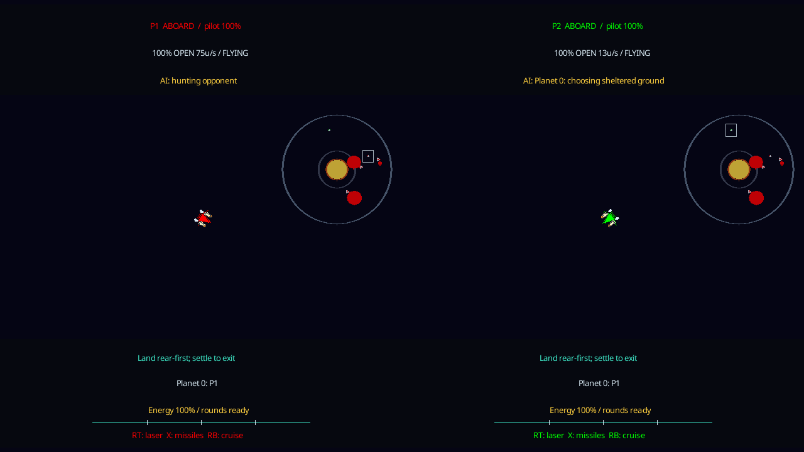
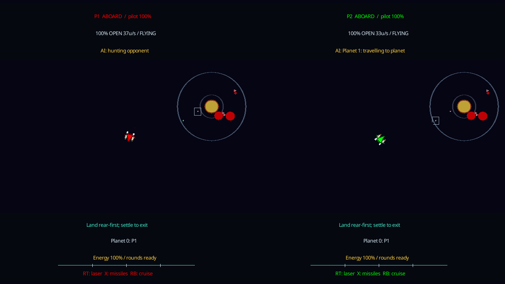

# Fresh-world match survey

Investigation on `surface-terrain-integration`, 2026-09-10 (Pacific).
Baseline: `bfc49b8`. The only Rust changes in this investigation add read-only
runner output; the game, physics and bot policies are unchanged.

## Assessment for the first default experience

The generated destructible-planet match is suitable for an initial playable
Spacewars default, with explicit AI limitations. All sixteen fresh desktop
cases pass the physical/material audits and capture ground. Thirteen make real
weapon contact; six reach a real pilot-death result. The other ten remain
unfinished at the three-minute cutoff. This is evidence that the integrated
loop works across more worlds, not a claim of finished balance or universal
bot reliability.

The highest-value AI follow-up is a **bounded response to repeatedly finding
no usable landing route**. One quiet world reproduces a long local survey
stall on desktop and Pi. Recovery also remains vulnerable to impact deaths
and slow landing/ground journeys. These are documented below with exact cases;
this investigation does not close the parked landing work.

On this branch, `spacewars` already selects the material match, including both
independent human/bot seats and world/rematch menus. `spacewars-classic` retains
the old game. The eventual merge would carry that existing registration into
main. No merge, push, deployment or gameplay tuning was performed here. FPS
work remains with the separate effort.

## Method and retained evidence

Eight seeds were fixed before observing any outcomes: the first eight bytes,
read as an unsigned big-endian integer, of SHA-256 of
`spacewars-fresh-world-survey-v1:0` through `:7`. None comes from the historical
0/2/7/42 regression set. Each runs twice: no random asteroids, and Mixed
asteroids at a three-second mean arrival interval. Quiet means asteroids Off;
both bots still have normal weapons.

All cases use the normal generated three-planet profile, unreflected, two
`material_mission_v8` bots, 15-second combat-break intervals and four-second
breaks. The headless runner uses the same scenario, observations, action
interface and fixed physics step as normal Spacewars. Previous
[normal-entry/arena comparisons](spacewars-match.md#validation-and-remaining-work)
cover that client boundary. These new runs are a broader world survey, not
sixteen additional UI end-to-end tests.

Each case stops at an actual result or 10,800 physics updates (180 simulated
seconds). No damage, ownership, recovery, winner or extra simulation time is
injected. Two desktop processes ran concurrently; their timing values are not
used as a performance benchmark.

Physical audits check reported terrain issues, material accounting and the
existing speed ceiling every second and at the final tick. Gameplay measures
include ownership captures, completed physical departures, weapon contacts,
actual ship losses/rebuilds and pilot deaths. A long unchanged task label is
only a review candidate: motion, route progress and subsequent events decide
whether it represents a stall.

The runner now writes final pilot/planet observations at the exact last tick,
so results between one-second samples do not lose the final counters. A
diagnostic replay additionally records every already-computed landing-objective
survey. P2's surveys occur fifteen ticks out of phase with P1, so the previous
one-second trace often missed them. No extra survey queries are introduced.
The replay reproduces every non-timing report field of its original case.

Artifacts live at:

```text
/home/oldman/.codex/visualizations/2026/09/06/01a078c0-7d43-7490-9599-f9ce4705c9b8/fresh-world-survey-20260910/
```

`source-manifest.json`, archived binaries, build logs and per-run manifests
identify the source and toolchains. Every case retains its exact command,
report hash, one-second observations, bot decision trace, damage events and
frame snapshots. The original matrix and the additional diagnostic replay
remain separate. `objective-replay-verification.json` records their equality.

## Desktop results

| World | Seed | Asteroids Off | Mixed / 3 seconds |
| --- | --- | --- | --- |
| A | `10897516310764597894` | Unfinished at 180s | Unfinished at 180s |
| B | `9908999338443660350` | P2 wins, 88.35s | Unfinished at 180s |
| C | `3121799525250095703` | Unfinished at 180s | Unfinished at 180s |
| D | `8133499574334006596` | Unfinished at 180s | P2 wins, 164.02s |
| E | `4370644082898307330` | P2 wins, 109.40s | Unfinished at 180s |
| F | `9280419758709011773` | Unfinished at 180s | P2 wins, 176.35s |
| G | `11938241591520715081` | Unfinished at 180s | P1 wins, 148.82s |
| H | `8824630748566686363` | Unfinished at 180s | P1 wins, 142.37s |

- **16/16** pass physical/material audits and contain a capture.
- **13/16** contain actual weapon contact; C quiet, E pressured and F quiet do not.
- **50 captures and 47 completed sorties** occur across the batch. Repeated
  captures of the same planet count separately.
- **Nine runs lose a ship; none rebuilds within its observed window.** Six
  survivors subsequently die; three remain alive and recovering at the cap.
- The six terminal damage events are three planet impacts, one sun impact,
  one world-boundary impact and one missile hit. This identifies the final
  damage source, not the entire cause of losing the fight.
- Total observed desktop simulation time: **2,629.3 seconds (43.82 minutes)**.

The ten unfinished rounds are not ten deadlocks. A/B pressured finish the
window in pursuit; F quiet has five completed capture/departure sorties.
C pressured has a recent ship loss and ongoing pod stabilization. D quiet
and G quiet make physical recovery progress. A quiet and E pressured expose
unsuccessful landing attempts and replanning. H quiet is still attempting
another capture. C quiet contains the clearest prolonged local stall.

## What the detailed traces show

### C quiet: no accepted route to the flag

P1 completes three capture/departure sorties. P2 never completes its first
landing. After earlier approaches and solar avoidance, it remains in the
survey phase from tick 5354 to 10678: **88.73 seconds**. At tick 10679 it
abandons Planet 0, and at 10680 it selects Planet 1. The round continues.
The Pi reproduces those three transition ticks exactly.

The additional trace contains 178 nonempty surveys during that interval.
Each has eight shortlisted sites and zero usable round trips. One site has
`no_destination_footing`; seven have `disconnected` outbound routes. Terrain
revision stays zero. This is not stale or destroyed terrain and does not
establish that a human with a jetpack could not reach the flag. The landing
forecast currently accepts walking/jumping routes and excludes flights.

`tactical_sortie.rs` waits within its 150-second total capture budget when it
cannot select a site. That budget includes time before this survey interval.
The world-level mission eventually defers the target, but a large fraction
of the round has already been spent on an unproductive local task.

**Next focused change:** detect repeated completed surveys with no usable
site for an unchanged objective, then defer that planet through the existing
mission retry/cooldown path. Revalidate after ownership or terrain changes.
Keep this separate from adding prospective jetpack routes. Preserve a case
where a temporary obstruction clears, so a shorter wait does not reject
recoverable approaches indiscriminately.

### D quiet: a slow return, followed by a late tilted approach

P1 loses its ship at approximately 117.5s. At 140/150/160/170/180s, the pod
is respectively 342.9/257.9/177.9/124.3/113.4 units from the planet's center.
It is physically returning; the unchanged `land_pod` label is not evidence
of 44 seconds stuck on the ground.

Near the end it reaches the surface at an unfavorable angle. At tick 10800,
the landing observation reports approximately 109 degrees of orientation
error, zero supported feet and a 0.20-unit minimum foot clearance. It remains
alive with 60 pilot health. Reliable final touchdown remains a follow-up;
this bounded run does not prove that the late pose is a permanent stall.

### G quiet: ground recovery is still advancing

P2 lands its pod at tick 9476, exits at 9478, completes a measured jetpack
crossing, and follows a long route toward the enemy flag. At 170s it has
made seven jumps and reached waypoint 10; by 180s it has made seventeen jumps
and replanned the remaining route. Its last progress tick is 10785. It remains
alive with full pilot health, but has not reclaimed ground or rebuilt.

This is useful recovery progress, not a successful rebuild and not a stuck
spaceling. The three-minute whole-match window leaves only about 22 seconds
after exiting the pod.

### B quiet and the impact deaths: recovery vulnerability remains

P1 exits its pod, is displaced from its ground route, and enters the existing
wait-for-footing behavior. It blocks at tick 4966 with `no supported claim
progress`, then dies in a sun collision at tick 5301. The trace shows a
knocked-down, unsupported actor issuing neutral controls. This is a concrete
example of the already recorded airborne recovery gap; the final sun impact
alone would hide the preceding loss of control.

The other five desktop deaths occur 4.6–82.8 seconds after their recovery
tasks begin. Consequently, zero rebuilds in this sample does not mean the
rebuild mechanism failed nine times. It does mean these worlds provide no
new end-to-end recovery success evidence. Keep the earlier physical rebuild
contracts and [pilot-impact investigation](pilot-impact-survival.md), and
resume airborne/posture work from actual displacement and control traces.

## Selected Pi checks

Four cases were selected after the desktop survey for their suspect behavior;
this is a diagnostic subset, not an unbiased Pi completion-rate estimate.
The runner binary and copied reports were SHA-256 verified. These runs use
the Pi's AArch64 toolchain, while desktop uses Rust 1.89. Architecture and
toolchain differences are not isolated by this comparison.

| Case | Desktop | Pi |
| --- | --- | --- |
| C quiet: long survey | Unfinished; P2 defers at tick 10679 | Same delay and deferral tick; unfinished |
| D quiet: pod return | Alive, recovering at 180s | P2 wins at 160.95s; planet impact |
| E pressured: failed approaches | Unfinished; P1 has no completed sortie | P2 wins at 125.80s; planet impact |
| G quiet: ground recovery | Alive, progressing at 180s | P1 wins at 155.28s; laser hit |

All four Pi audits pass. All four contain captures, three contain weapon
contact and three finish. None rebuilds. Different finish times and outcomes
are retained as observations; a seed is not an architecture-independent replay.
The Pi kiosk and its saved play settings were left alone. An initial attempt
to run the Python wrapper on the Pi found that Python is absent; the retained
`run_pi_cases.py` instead orchestrates its native runner over SSH from desktop.

## Actual application screenshots

An isolated desktop instance of ordinary `spacewars` played C quiet with both
seats set to bots. These are actual Slint screenshots under Xvfb, separate from
the runner's frame JSON. The 150-second wall capture shows P1 hunting while P2
still surveys Planet 0; the 180-second capture shows P2 travelling to Planet 1
after abandoning the survey. The latter status records 10,776 updates
(179.60 simulated seconds), so wall labels are not exact simulation timestamps.
The screenshot history, startup configuration and client hash are retained in
`rendered-survey/`; `rendered-summary.json` records the sampled update counts.





## Checks on the investigation tools

Both existing mission-metric example tests pass. Formatting and Clippy pass,
with existing advisory warnings in dependencies. All twenty desktop/Pi reports
pass the wrapper's final-tick, termination and counter checks. Deliberate
runner failure remains a failed result, reuse of an output directory is
rejected without changing evidence, and an out-of-range seed is rejected.
The screenshot images were inspected and the local documentation links checked.

The full game/UI validation remains the preceding
[world/rematch checkpoint](match-worlds.md#results-2026-09-10). This change only
adds runner diagnostics, a repeatable survey script and investigation notes.
`harness-validation.json`, test/build logs and `report-manifest.json` retain
the scoped checks and report hashes.

## Repeat this investigation

Build the current example and run the fixed fresh-world matrix:

```sh
cargo +1.89.0 build --locked --release -p spacewars-ai --example surface_mission_soak
python3 tools/run-match-world-survey.py \
  --binary target/release/examples/surface_mission_soak \
  --out /tmp/spacewars-fresh-worlds --jobs 2
```

The output directory must be new; existing evidence is never overwritten.
When using `CARGO_TARGET_DIR`, pass that directory's example binary instead.
Use `--seeds SEED` and `--asteroid-intervals 0` or `3` for a single case.
The wrapper enforces the original 180-second cap, captures failures and
writes `summary.json`. A clean process exit means valid execution/audits;
inspect `termination` and the gameplay counters separately.

For C quiet's full route-rejection trace:

```sh
cargo +1.89.0 run --locked --release -p spacewars-ai --example surface_mission_soak -- \
  --world generated --seed 3121799525250095703 --seat 0 --mirror false \
  --mode duel --match true --seconds 180 --asteroid-interval 0 \
  --break-interval 15 --break-duration 4 --frames true --trace true \
  --out /tmp/spacewars-no-route
```

Inspect P2's `landing_objective` records at ticks 5355–10665, the mission
deferral at 10679, and the following selection at 10680. For ordinary rendered
play, select two bots, asteroid arrivals Off and combat breaks 15/4, then
launch `spacewars --seed 3121799525250095703`. All saved seeds and same-world
rematches work through the [normal world flow](match-worlds.md).

Continue the [landing investigation guide](landing-investigation-guide.md)
from these reproductions. Broader worlds, prospective jetpack landing access,
airborne knockdown recovery and balance remain follow-ups; merge readiness
does not require exhaustive landing perfection.
