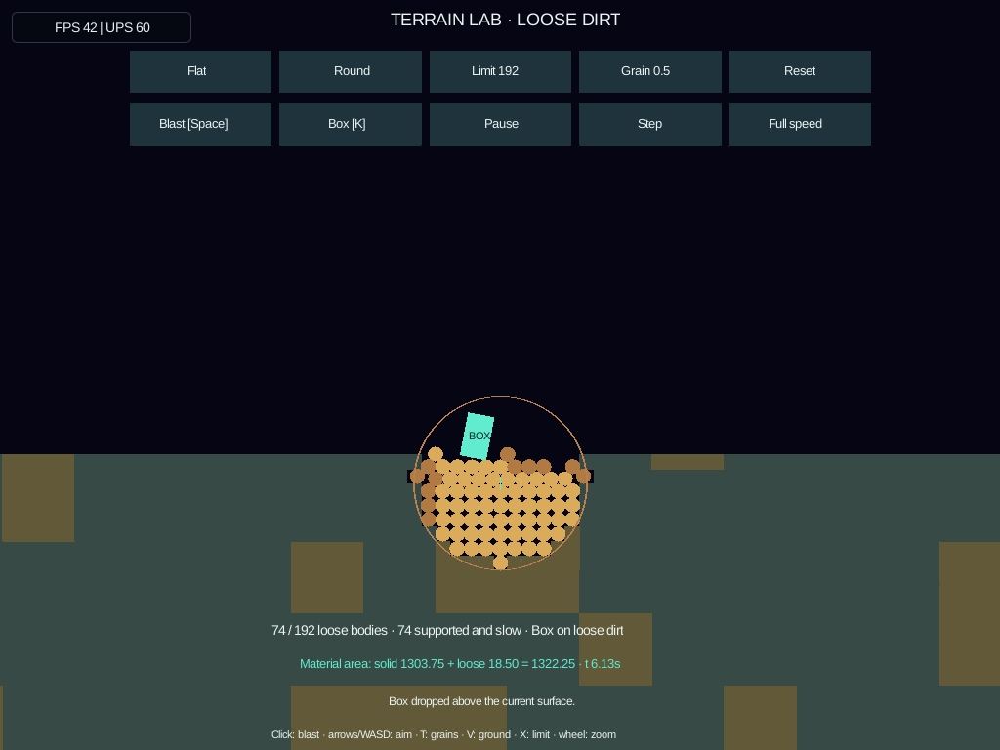
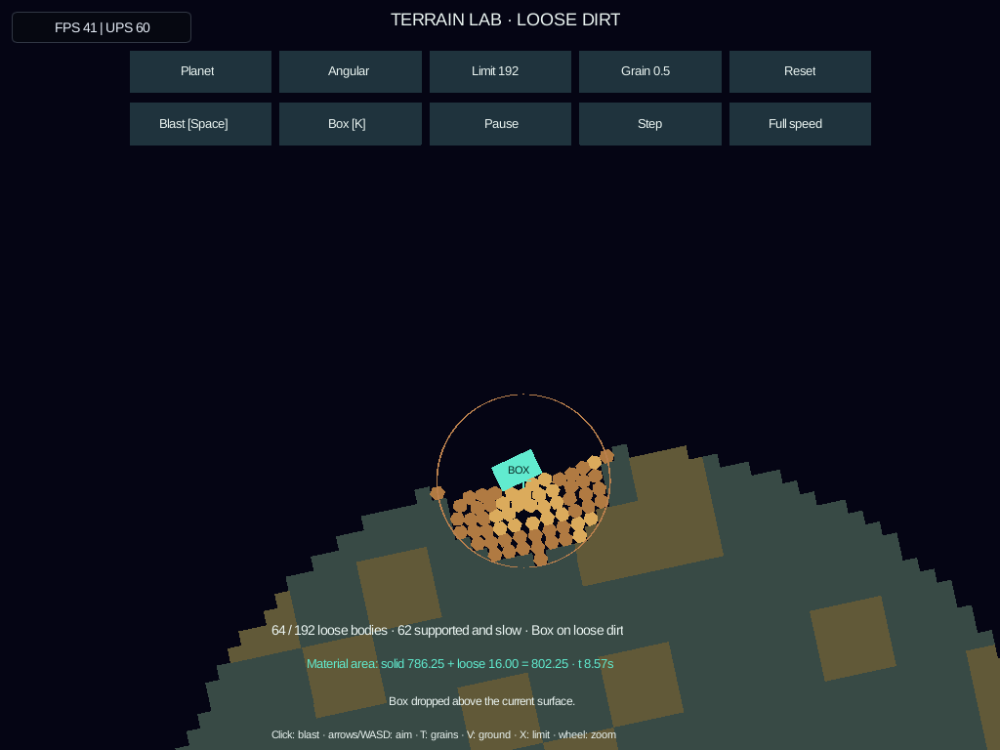

# Live granular terrain

The **terrain-grains** launcher entry is the live sandbox for shared dirt physics
[#165](https://github.com/aortez/space-wars/issues/165). Blast actual material
terrain into loose grains, drop a box onto the changed surface, and blast it
again. Terrain, grains and the box collide in the same Rapier world.

```sh
cargo run --locked -p engine-client -- --scenario terrain-grains --seed 42
```

The original mining/spaceling **terrain-lab** and the recorded
[MPM comparison](soil-mpm-lab.md) remain available.

Actual screenshots from `sw-picade.local`:

| Round grains on flat terrain | Angular grains on the moving planet |
| --- | --- |
|  |  |

[A second blast throws the box and loose dirt upward](screenshots/granular-terrain/picade-reblast.png).

## Controls and experiments

| Action | Keyboard / pointer | Gamepad |
| --- | --- | --- |
| Aim | WASD / arrows | Right stick, left stick horizontal, or d-pad |
| Blast | Click/tap terrain, Space, or Blast button | Bottom face or left shoulder / right trigger |
| Drop/reposition box | K or Box button | Left face |
| Round → grippy → angular | T or shape button | Top face |
| Flat → slope → moving planet | V or ground button | Right shoulder |
| Loose-body limit: 96 / 192 / 384 | X or limit button | Right face |
| Grain size: 0.5 / 0.25 / 1 | Grain button | Pointer required |
| Pause / single step / quarter speed | On-screen buttons | Pointer required |
| Zoom: overview / surface / detail | Mouse wheel | — |
| Reset with current choices | Reset button | — |
| Restart with defaults / host pause | R / Esc | Pause menu / Start |

Shape, ground, population and resolution changes reset the experiment with the
same seed. Fire, drop and configuration buttons require a release before firing
again. Clicks on HUD buttons do not also blast. The retained aim follows the
ground's translation and rotation. Box placement casts a ray along gravity
against current colliders, including the loose grains; it does not use the
original, unedited surface.

Start with a blast at the initial aim, wait for the grains to fall, then drop the
box. Aim just below the box and blast again to disturb its support. Try the same
sequence with angular grains, then on a slope or planet. Angular grains have
hexagonal contacts and matching rendered outlines. Round/grippy friction is
0.6/1.0; angular uses 0.6 so the shape comparison retains the same friction.

The default is 0.5-unit round grains with a 192-body limit. A 0.25-unit blast
needs more than 192 bodies near the initial surface: raise the limit to 384 to
try it. A full limit rejects the entire blast, including velocity changes to
existing bodies. The HUD reports the rejection; no material disappears to make
room. The box is separate from both the terrain ledger and loose-material limit.
Material remaining outside the camera still exists and counts toward the limit.

“Supported and slow” requires an upward contact path to the ground and low
relative speed/spin. A grain can be supported through another grain or the box.
This is a diagnostic; it never freezes, deletes or deposits material. “Box on
loose dirt” reports an upward grain contact, not a guarantee of permanent rest.

## Integration with the terrain engine

The first reusable boundary is implemented in the shared crates:

1. **Field ownership — `engine-terrain`.**
   `Terrain::extract_individual_cells` transfers selected cells to `DetachedCell`
   samples. Each retains material, remaining durability, original local center
   and cell size. Duplicate/void selections are ignored in stable row-major
   order. Invalid coordinates leave the whole field unchanged. Field/chunk
   revisions and signed surface samples update through the normal edit path.
2. **Moving material — `engine-rapier`.**
   `TerrainGrain::insert_with_shape` consumes a transferred sample and creates a
   dynamic round or hexagonal contact proxy. It retains nominal square-cell
   mass/inertia and inherits the source body's velocity at the release point,
   including angular motion. `GrainSeed` remains an alias for compatibility.
3. **Transaction and gameplay policy — the caller.**
   `BlastLab::blast` prepares edits on cloned fields, checks the total resulting
   body count, then commits the field edits, refreshes `TerrainGeometry`,
   synchronizes `TerrainAssembly`, inserts released bodies and applies the blast
   before the next physics step. Disconnected solid pieces remain physical
   fragments. Neither the terrain kernel nor the grain type awards mining yield
   or knows about a weapon, tank, ship or score.

Spacewars, Clock/Scorched Earth and standalone Scorched Earth can use these same
field and contact APIs. Their adapters choose which damaged cells become loose
material, supply source-body motion and local gravity, and retain their own
weapon/game rules. This change exercises the complete handoff in Terrain Lab;
it does not yet change the games' explosion policies.

The next integration slice should route one bounded Spacewars terrain explosion
through this release path and check ships, spacelings and base-support
invalidation against the changed ground. Scorched Earth can supply a tank as the
ordinary supported body. Transfer admission and per-material accounting should
move into a common adapter when those callers share the transaction, rather
than copying the lab's control or fixture code into a game.

The return path belongs to conserved deposition
[#51](https://github.com/aortez/space-wars/issues/51): select supported, quiet
material; prepare an addition in the destination field's moving local frame;
check space/material quantities; then atomically add that material and retire
its loose bodies. Failed admission must leave the bodies intact. Update surface
geometry/colliders at the same boundary. Deposition is not implemented here.

Counts and masses conserve nominal cell quantity (`cell_size²`, unit depth),
not exact occupied contact area. Inscribed circles/hexagons introduce pore space;
this is experimental granular mechanics, not a calibrated continuum soil model.
Cells can retain partial damage, but this lab's blast releases selected cells
directly rather than calculating a stress or fracture threshold.

## Repeatable workload and timing

```sh
cargo run --locked --release -p scenario-terrain-lab --example granular_sandbox -- \
  --verify-replay > target/granular-sandbox.json

cargo run --locked --release -p scenario-terrain-lab --example granular_sandbox -- \
  --fixture flat --cell-size 0.25 --limit 384 --verify-replay
```

The workload runs 600 fixed updates: blast at tick 0, drop the box at 180, blast
below its actual position at 360, and blast fresh ground at 450. JSON records
population, rejected events, conserved quantities, box support, timings and a
final fingerprint. Optional replay uses the exact recorded world-space actions
and compares observations every tick within the same build. Each normal run
audits per-material conservation, physical mass, collider geometry and finite
motion outside its timed update.

Measured on **sw-picade.local**, Raspberry Pi 4, aarch64 release, on 2026-10-03:

| Ground / grain | Peak loose bodies | Mean update | p95 update |
| --- | ---: | ---: | ---: |
| Flat / round | 159 | 1.95 ms | 3.52 ms |
| Flat / grippy | 159 | 1.80 ms | 3.29 ms |
| Flat / angular | 161 | 2.03 ms | 3.88 ms |
| Slope / round | 139 | 1.57 ms | 2.87 ms |
| Slope / grippy | 139 | 1.52 ms | 2.82 ms |
| Slope / angular | 174 | 2.10 ms | 4.11 ms |
| Moving planet / round | 154 | 1.77 ms | 3.50 ms |
| Moving planet / grippy | 151 | 1.70 ms | 3.41 ms |
| Moving planet / angular | 151 | 2.07 ms | 4.06 ms |

These native scenario update times include periodic HUD diagnostics; event
updates and `RenderFrame` construction are reported separately. They exclude
pixel rendering, host/UI work, transport and replay. Maximum event updates in
these cases were 4.57–6.21 ms. All nine cases admitted three blasts, conserved
material, physically supported the box on grains and passed same-build replay.

Finer 0.25-unit grains with limit 384 on flat ground reached 302–355 bodies:
7.07–8.37 ms mean and 8.88–10.04 ms p95, with a worst event update of 17.00 ms.
One or two later blasts were rejected depending on preset. The desktop workload
also covers limit 96 and size 1.0 with replay checks. These are different
populations and evolving configurations, not equal-work algorithm benchmarks.

The Pi kiosk continued running during these headless measurements. A sampled
temperature was 76.9°C at 1.5 GHz. Raw JSON/logs and executable hashes are retained
under `target/granular-sandbox/`; performance is a development measurement, not
a frame-rate guarantee. The earlier 1,024-particle MPM/grain comparison remains
useful for comparing those solvers under its own workload.

The installed native app was also checked at the device's existing 1024×768,
raster scale 2 settings. After one blast and box drop, sampled updates cost
1.87–2.07 ms on average; the app maintained approximately 60 updates/s while
displaying 38–42 FPS across flat/round and flat/slope/planet/angular scenes.
Pixel rendering and presentation still contribute substantial cost. The client
and CLI hashes matched the deployed bundle and the service remained healthy with
zero automatic restarts. A second blast beneath the box was exercised through
the live virtual controller as well.

## Validation

Shared physics/terrain/soil and lab tests cover atomic extraction/rejection,
damage retention, dirty geometry, original mass/inertia, release-point velocity,
box support and a second blast, moving ground, malformed input, held/released
controls, pause/step/slow mode, resets, fresh replay and clone continuation.
Native functional coverage launches the new entry, fires and drops a box through
the virtual controller, checks visible grain pixels in raster and vector,
pauses, restarts and returns to the launcher. Actual screenshots are inspected
in addition to these checks.

Validation: 197 shared/lab unit tests, 100 client-scenario tests, and the native
functional workflow passed. Eighteen desktop benchmark cases and nine Pi cases
passed exact same-build replay. Formatting and shared/lab Clippy passed (allowing
the existing `collapsible_else_if` warning in the spaceling implementation).
Full client Clippy completed with existing warnings in unrelated code and no
warnings in the new sandbox files.
