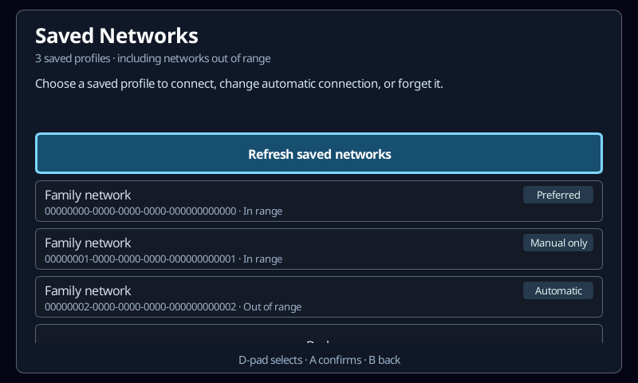
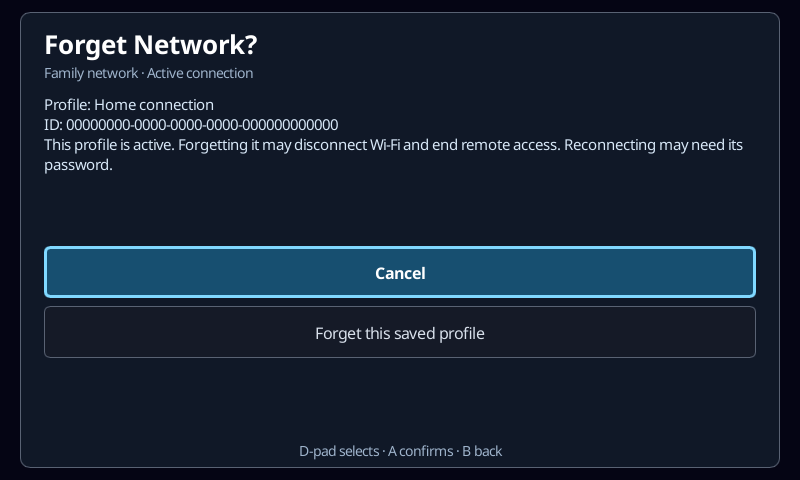

# Wi-Fi setup

Choose **App Settings → Network** from either the launcher or a paused scenario.
The game stays paused; Back returns one menu level. The Picade controls, a
gamepad, touch, and a physical keyboard all use the same workflow.

1. Open Network to scan automatically, then choose a nearby network. **Rescan**
   requests fresh results; the existing list stays visible during discovery.
   SSIDs appear above smaller security/signal details, with **Connected** and
   **Saved** badges. Duplicate access points for the same SSID/security are
   grouped per adapter. Periodic updates preserve the selected network.
2. Use **Connect using saved settings**, **Connect to open network**, or
   **Enter password…**. The on-screen keyboard has lowercase, uppercase and
   punctuation, Space and Erase. D-pad moves the highlight; A types/selects,
   B goes back, Select (or the west face button) erases, and Start connects.
   A physical keyboard can type directly; Backspace erases and Enter submits.
   **Show password / Hide password** toggles visibility without losing input.
   Passwords start masked, hide on focus loss, and are cleared when submitted,
   cancelled or the panel closes. Visibility resets for each new entry.
3. Wait for association and IP configuration (up to 40 seconds).
4. Choose **Keep this network** within 30 seconds. Otherwise the previous
   network configuration is restored. A Wi-Fi connection does **not** prove
   Internet access; captive-portal login is not provided in this first pass.

The initial scope is visible infrastructure networks using open, WPA/WPA2
Personal or WPA3 Personal security. Password entry supports printable ASCII;
WPA/WPA2 accepts 8–63 characters or a 64-digit hexadecimal PSK. Unsupported
security remains visible, but cannot be activated. Hidden-SSID entry, enterprise
username/certificate authentication, WEP, captive-portal browsing, radio toggles,
and hotspot setup are not included yet.

## Saved networks

Choose **Saved networks…** from Network. This includes profiles whose access
point is out of range, and remains available when the radio is disabled. Each
row shows the SSID and full NetworkManager UUID; the details page also shows
the profile name. Identical names/SSIDs remain separate choices.

- **Connect automatically: On/Off** changes eligibility for future automatic
  connections. Off preserves the profile and credentials for manual use.
- **Prefer this network** chooses the highest automatic-connection priority and
  displays a **Preferred** badge. Enable automatic connection first. Other
  eligible saved networks remain available as fallbacks. This does not promise
  Internet access or switch away from the current connection.
- **Connect using this profile** activates that exact saved profile, including
  when automatic connection is off. It is enabled only for a visible, supported
  network. The usual temporary connection and **Keep / Restore** trial applies.
- **Forget network…** opens a confirmation identifying the profile and UUID,
  with **Cancel** selected first. An active profile carries an explicit warning
  about losing Wi-Fi and remote access. If it becomes active while the dialog
  is open, the warning changes and selection returns to Cancel. Forget removes
  only that profile and its credentials, not others sharing its SSID.

Preference changes do not activate or reapply a connection. Settings are stored
in the existing NetworkManager profile, with no second app-owned database.
The app reads secret-free `GetSettings`, preserves unrelated fields, and uses
`Update2` with `TO_DISK | NO_REAPPLY` and a `version-id` check. NetworkManager
preserves existing secrets during this secret-free update. A concurrent edit
is rejected rather than overwritten.

Prefer normally raises the selected profile above the other autoconnect Wi-Fi
profiles without changing their priorities. At NetworkManager's maximum (999),
other profiles tied at 999 move to 998. This rare case spans several writes:
there is no atomic multi-profile transaction. A failure or timeout refreshes
the actual state and asks the user to check it before retrying. Equal highest
priorities do not get a Preferred badge; existing distinct priorities are
recognized when the page opens. These are ordinary NetworkManager priorities,
so another network-settings tool can change them too.

Management commands re-read profiles by UUID and check permission/current
state before editing. Changes and manual connects are blocked during a pending
connection trial or another operation. Incomplete profile enumeration disables
management until refresh succeeds; cached profiles remain visible after a read
failure. Management has a 15-second total deadline, including validation;
ordinary inventory reads have a five-second deadline. Closing the panel stops
new requests but does not undo a preference write already sent to the daemon.

References: [automatic-connection selection and priority](https://networkmanager.dev/docs/api/latest/settings-connection.html),
[profile update API](https://networkmanager.dev/docs/api/latest/gdbus-org.freedesktop.NetworkManager.Settings.Connection.html),
and [NetworkManager 1.46 secret-preserving update implementation](https://github.com/NetworkManager/NetworkManager/blob/1.46.0/src/core/settings/nm-settings-connection.c).

## Safety and ownership

The Linux client talks directly to NetworkManager's D-Bus API, not a shell or a
new privileged helper. NetworkManager remains the authorization and credential
storage boundary. The app checks the caller's `network-control`,
`settings.modify.system`, `checkpoint-rollback` and `wifi.scan` permissions.
It does not grant them, use sudo, or try to bypass a desktop authorization prompt.
Missing permissions, service, adapter, or a blocked radio leave Back/Rescan
available. Other operating systems display an unsupported message.

The protocol targets the kiosk's NetworkManager 1.46 API:

- A checkpoint covers **only the selected Wi-Fi adapter**, not wired interfaces.
  It expires after 100 seconds independently of the app. No attempt starts if
  checkpoint creation fails; another program's checkpoint is never destroyed.
- A new profile is volatile until Keep, so an unconfirmed password is not
  written to disk. Keep persists the candidate and destroys our checkpoint.
  Saved profiles are activated without reading their secrets or editing them.
- Cancel, failure, panel close, or confirmation timeout requests rollback.
  After confirmed rollback, cleanup removes only the profile created by this
  attempt. An uncertain rollback never deletes a possibly successful connection
  whose Keep reply was lost. If the app crashes,
  NetworkManager's own checkpoint timer is the recovery mechanism. Restoring
  configuration does not guarantee the old access point is still reachable.
- If recovery cannot be confirmed, the UI says so rather than claiming success.
  The app never restarts NetworkManager, unloads Wi-Fi drivers, changes adapter
  power, or resets the shared Bluetooth/Wi-Fi hardware.
- Passwords are not included in `settings.toml`, CLI status, error messages or
  app logs, even while revealed on screen. **Photos and screenshots can include
  a revealed password**; hide it before capturing or sharing the display. Do
  not record CLI key-entry commands for real passwords: a command history could
  reconstruct typed characters.
- Profiles are saved by NetworkManager. On the kiosk, its root-owned
  `/etc/NetworkManager/system-connections` is already backed by persistent
  `/data/NetworkManager/system-connections`; ordinary A/B updates preserve it.

Only one bounded background worker runs, and only while Network is open (plus
bounded cancellation cleanup). Inventory refreshes every three seconds and
one scan is requested on opening (when permitted), with subsequent scans
explicit/rate-limited. RequestScan acknowledges a request, not scan completion;
the UI says results update automatically rather than promising a finished scan.
Discovery never presents a connection-cancellation or rollback action. There
is no gameplay/frame-loop polling, no unbounded scan thread, and no UI-thread
network calls. Rapid close/reopen cannot
overlap connection attempts. AP lists and saved-profile enumeration are capped.

API references: [connection checkpoints and activation](https://networkmanager.dev/docs/api/1.46.0/gdbus-org.freedesktop.NetworkManager.html),
[profile persistence](https://networkmanager.dev/docs/api/1.46.0/gdbus-org.freedesktop.NetworkManager.Settings.Connection.html).
DirtSim's network flow and Wi-Fi investigation informed the separate network
list/credential/connecting pages and explicit recovery. Scanner/driver-switching
features are deliberately outside this setup screen.

## Automation and tests

```sh
spacewars-cli ui activate launcher.sound
spacewars-cli ui activate settings.network
spacewars-cli ui state --json
# Read the exact network.select.* ID from that snapshot before selecting it.
# Background refreshes change revisions: guard the screen, not an old revision.
spacewars-cli ui activate network.scan --expect-screen launcher.network
# Saved profiles have stable network.profile.<uuid> control IDs.
spacewars-cli ui activate network.saved --expect-screen launcher.network
spacewars-cli ui activate network.refresh --expect-screen launcher.network
spacewars-cli ui activate network.back --expect-screen launcher.network
```

Use `pause.sound` from a paused scenario. Screen IDs are `launcher.network` and
`pause.network`. `network.status` and `network.summary` are read-only; credentials
are never exposed. Character keys and Connect/Keep/Cancel go through the same
callbacks as the hardware controls. No separate privileged CLI API is added.

```sh
cargo test --profile ci -p engine-client --bin engine-client network
SPACEWARS_NETWORK_ARTIFACTS=/tmp/spacewars-network-ui \
  cargo test --profile ci -p engine-client --bin engine-client \
  network_controls::tests
xvfb-run -a cargo test --profile ci -p engine-client --test ui_control_functional \
  network:: -- --ignored --test-threads=1
```

Unit/worker tests cover validation, stale selection, checkpoint failure, explicit
Keep, wrong-password failure, timeout, cancel/close during both activation and
confirmation, save failure and recovery failure. Discovery tests verify an
automatic first scan, rate limiting, retaining cached results on a read failure,
and rejecting cancellation of a scan. A private `dbus-daemon` with fake
NetworkManager services verifies real D-Bus signatures,
volatile profiles, secret-free inventory, saved-profile reuse, and targeted
rollback. No test changes the host's networks. UI tests exercise masked/revealed
typing (including CLI redaction), hide-on-focus-loss, Start/Select shortcuts,
parent navigation, cleanup, and 800×480 / 1024×768 / 480×800 layouts. The
real-process workflow verifies missing-service behavior and paused
session preservation, with the host system bus isolated.

Saved-profile tests use a second stateful private D-Bus fixture, including
duplicate names/SSIDs, an out-of-range profile, and disabled radio. They verify
exact-profile manual activation/deletion, autoconnect and priority edits,
unchanged unrelated fields/secret storage, no implicit activation, stale-version
rejection, denied updates with redacted errors, incomplete reads, and partial
priority failure at the ceiling. Worker tests change daemon state after the UI
snapshot and verify revalidation, refreshed results, and rejection of edits
during every busy phase. UI tests exercise controller navigation and actual
pointer hit testing, cancellation, active-state changes during confirmation,
removed profiles, and the three cabinet layouts. The real-process test also
visits Saved networks from both launcher and paused gameplay.

Rendered test fixtures (800×480, synthetic network names and UUIDs):





## Hardware verification

The release build was deployed to the Pi 4 cabinet `sw-picade-2` on 2026-09-28.
The user confirmed these manual checks:

- Switching between two password-protected networks and back, including saved
  connection reuse.
- The refined Network/password-entry UI looks correct on the cabinet.
- Wrong-password recovery and cancellation of a connection trial.
- Letting the Keep countdown expire restores the previous connection.
- Keeping a connection, rebooting, and reconnecting automatically.

Deployment checks also verified a healthy application/control socket, matching
client/CLI checksums, and unchanged app settings. The application-only update
did not reboot or change Wi-Fi; the subsequent recovery/reboot checks above
were performed by the user.

Open networks, WPA3-only access points, and physical HyperPixel touch entry have
not yet been hardware-verified. The portrait layout is covered by render tests;
that is not a substitute for testing a real touch device/access point.

On 2026-09-30, the saved-profile extension was deployed to `sw-picade` with a
matching application-only release build and NetworkManager 1.46.6. Cabinet
checks used the public UI-control API and two temporary, out-of-range profiles
with identical names/SSIDs:

- Both UUIDs appeared separately; explicit Connect was disabled out of range.
- Autoconnect and preference edits took effect without switching Wi-Fi. Choosing
  the other profile raised its priority; disabling it restored the first
  profile's Preferred badge.
- The synthetic test password survived preference edits. No existing network's
  password was retrieved.
- Cancel preserved the selected profile; confirmed Forget removed only that
  UUID. The real active profile showed the remote-access warning, with Cancel
  selected, and was not deleted.
- Preferences and deletion remained visible after restarting the application.
- Original profiles' autoconnect settings/priorities, the active Wi-Fi
  connection, and the app settings checksum were unchanged. The temporary
  profiles were removed afterwards.

Actual two-access-point automatic selection/fallback, reboot/A/B persistence,
and physical controller/touch acceptance remain separate hands-on checks.
Preference/deletion persistence uses the same existing NetworkManager data
directory; an application restart does not prove a reboot or an A/B update.

For future recovery tests, keep a wired connection or local console available
before deliberately interrupting Wi-Fi. Do not test a remote-only network
switch without a recovery plan.
