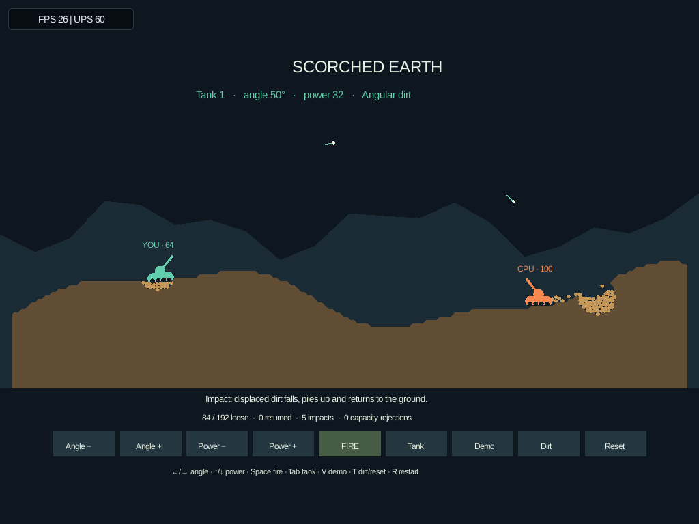
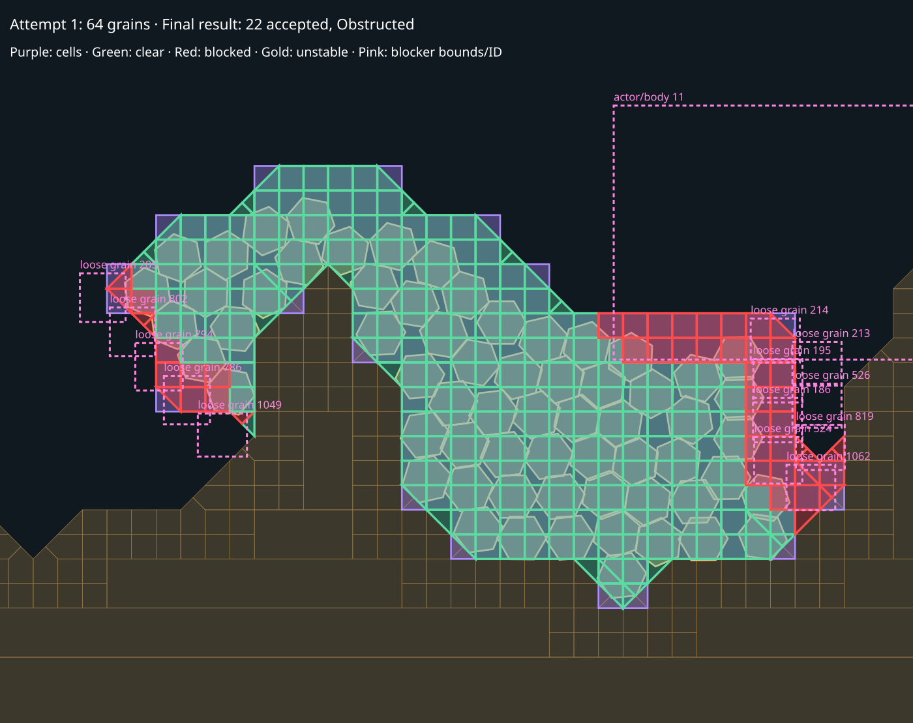
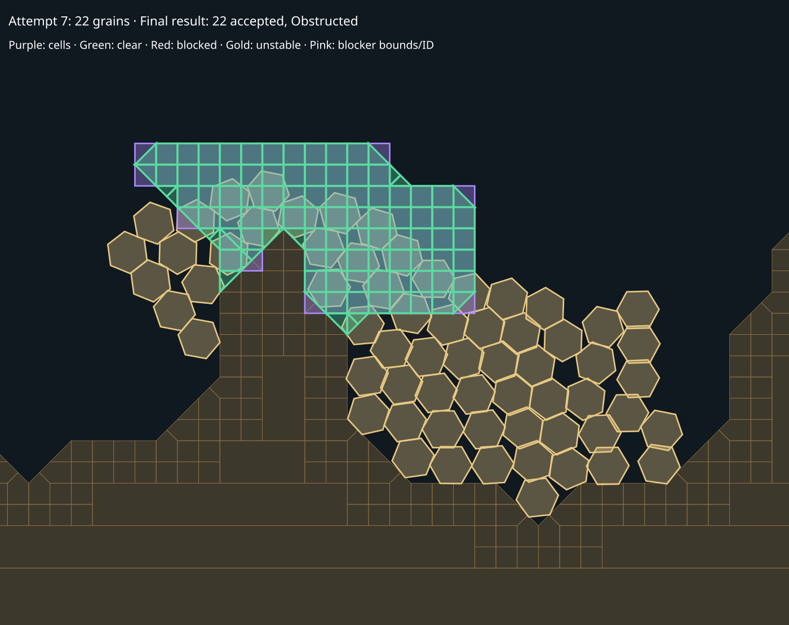
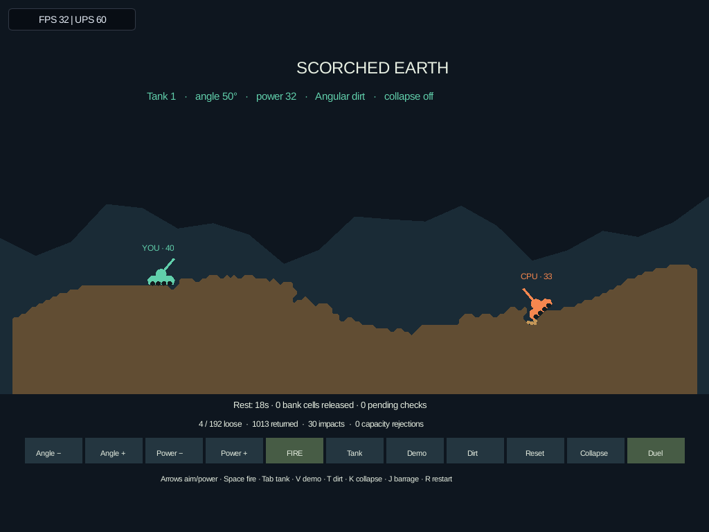
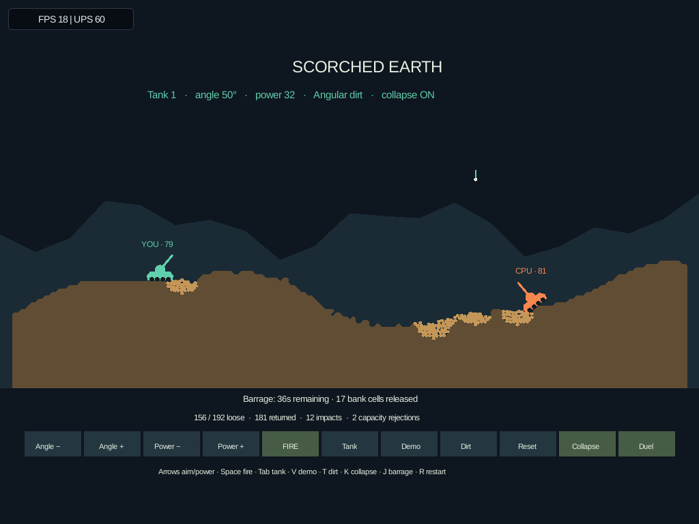
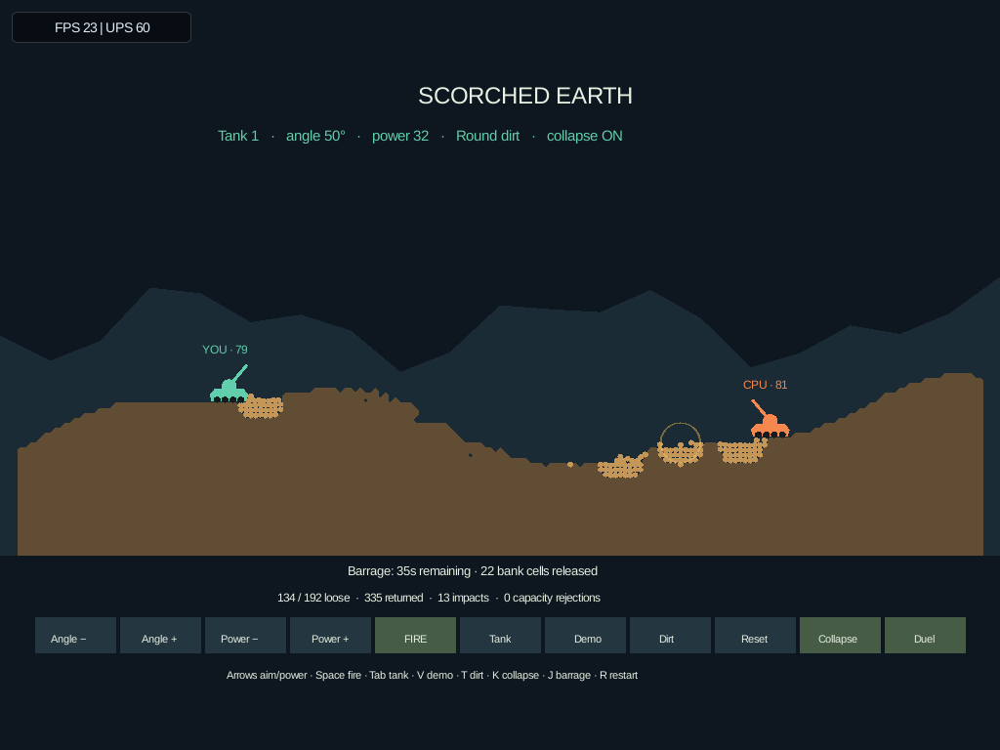
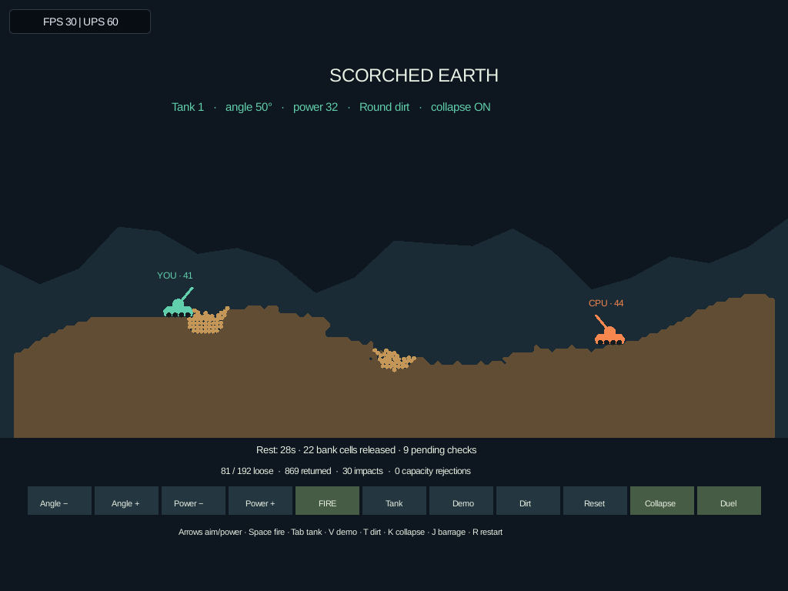

# Scorched Earth

Choose **scorched-earth** in the launcher, or launch directly:

```sh
cargo run --locked --release -p engine-client -- --scenario scorched-earth --seed 42
```

This first playable slice of [#25](https://github.com/aortez/space-wars/issues/25)
puts two physical tanks on seeded hills with downward gravity. Aim and fire at
the opponent, or undermine its footing. The other tank returns fire every five
seconds. The first tank reduced to zero health loses; **Reset** starts again on
the same hills. A simultaneous destruction is a draw.



## Controls

| Action | Keyboard | Controller |
| --- | --- | --- |
| Lower / raise elevation | Left / Right, A / D | D-pad left / right, right-stick X |
| Lower / raise power | Down / Up, S / W | D-pad down / up, right-stick Y |
| Fire (hold to repeat) | Space | Bottom face, right trigger |
| Take control of the other tank | Tab | Left face |
| Toggle the scripted CPU duel | V | Right shoulder |
| Switch Angular / Round dirt and reset | T | Top face |
| Toggle bank collapse and reset | K | Right face |
| Switch barrage / duel and reset | J | Left shoulder |
| Restart with defaults and the same seed | R | Pause → Restart |
| Pause | Esc | Start |

The on-screen controls also adjust aim/power, fire, select a tank, toggle Demo,
switch dirt, and reset. The on-screen **Reset** retains the current dirt shape
and Demo, collapse and barrage choices. Camera framing fits the entire battlefield in landscape and
narrow windows. The host provides the normal launcher, pause, and renderer controls.

**Angular** is the initial dirt choice. **Demo** drives both tanks with the same
seeded aiming sweep used by the headless runner. It estimates ballistic range
but varies its aim; intervening terrain and loose grains can intercept shots.
Power is muzzle speed (12–48 world units/s); elevation ranges from 5° to 85°.
Human shots have a 1.25-second cooldown. The tanks currently cannot drive.

## Bank-collapse comparison

**Collapse** (K / right face) enables the shared bank-yield prototype and resets
on the same seed. It starts **off**. **Barrage** (J / left shoulder) resets into
60 seconds of falling shells, one every two seconds, followed by unlimited rest.
It keeps firing after tank deaths. Press **Duel** to leave this mode; **Demo** also
returns to the duel. Switching dirt or collapse restarts the current comparison.
The header shows the choices; the status line shows time and released bank cells.

For a packing comparison, choose **Angular**, leave **Collapse off**, then **Barrage**.
Watch the ground during the quiet tail and repeat with Round dirt. Enable collapse
separately to compare crater-rim shedding. These changes alter later impacts and
pile shapes, so equal seeds do not imply identical contact workloads.

The shared layer peels exposed tops with a steep adjacent drop in the direction
of gravity. It watches a two-cell neighborhood of material release/deposition,
waits 0.35 seconds, and can release up to four cells from one field per 0.1 seconds.
It checks at most 64 queued candidates per scan and tracks at most 4,096.
Automatic shedding pauses if it would take the total loose population above 48;
impacts retain access to the normal 192-grain pool. Refusals retain the dirt and
retry later. Removed cells inherit the source's velocity and spin without a kick.

The 50° repose setting is a grid-sampled threshold, not a measured soil angle.
This prototype applies equally to eligible materials; it has no hardness-based
cohesion or internal stress. It leaves undisturbed terrain alone. Blocked deposits
can still leave piles permanently loose. Collapse
is optional because it can increase obstruction, saturation and update cost.

The same `LooseTerrain::slump` call is wired into Spacewars' existing edit boundary,
using its point/spherical gravity solver and body poses. Released grains and
fragments join the ordinary actor/query registries; base/flag support is reconciled
with the new geometry. Spacewars enables it through `LooseTerrainConfig::slumping`
and the headless runner's `--slumping` switch. Launcher loose-dirt settings retain
their existing behavior. Terrain Lab retains the default with collapse off.

```sh
cargo run --locked --release -p scenario-scorched-earth --example scorched_benchmark -- \
  --shape round --seconds 120 --bombardment-seconds 60 --slumping --replay --diagnostics
cargo run --locked --release -p scenario-spacewars --example loose_terrain_benchmark -- \
  --mode angular --scene combat --seconds 60 --slumping --diagnostics
```

Omit `--slumping` to compare the existing behavior. The bombardment runner reports
active and tail timings separately, with per-second samples on stderr. The tail
begins when launches stop; an already airborne shell can still land in it.
Slumping diagnostics include pending checks, releases, tracking overflow and
cumulative capacity/fragment refusals; rejection counts are attempts, not lost cells.
All auditing, hashing and replay remain outside the timed update.

## Packing recovery measurements — 2026-10-04

[Full before/after runs and binary hashes](data/dirt-packing-20261004.json) and
[per-second traces](data/dirt-packing-traces-20261004.jsonl.gz) cover 54 executions.
The comparison is PR #171 runtime `b1c6a58` versus packing runtime `5d02c6d`, with
Rust 1.89.0/release and the same seed-42, 60-second barrage plus 60-second tail.
Desktop Scorched values use three serial repetitions; Picade and other benchmark
timings are single-run comparisons. The kiosk was paused during device timing.

After #171 merged, this work was rebased onto `main` at `08e730f`; its runtime
commit is now `e0a262a`. The shared physics/terrain crates and the Scorched Earth,
Spacewars, and Terrain Lab source trees are unchanged by that rebase. These
measurements and the Picade deployment retain their original build revisions
and binary hashes.

Successful ordinary placements are preserved. A failed group that remains quiet
for 1.5 seconds can try bounded alternative cells; an eight-surface-check limit
caps work for that group. With collapse enabled, new deposits must also satisfy
its local gravity/repose rule. That prevents a deposit/release cycle, but changes
which piles can pack. [Shared-layer details and frozen inspection commands](shared-loose-terrain.md#frozen-packing-inspection--172).

Picade whole physics-update measurements, milliseconds; all rows conserve 10,393
cells and pass full replay with hashes matching the desktop:

| Shape | Collapse | Loose before → after | Mean before → after | P95 before → after | Quiet-tail mean before → after |
| --- | --- | ---: | ---: | ---: | ---: |
| Round | Off | 36 → 0 | 2.429 → 1.222 | 9.340 → 4.418 | 0.871 → 0.203 |
| Angular | Off | 52 → 0 | 2.602 → 1.475 | 8.745 → 5.065 | 1.386 → 0.103 |
| Round | On | 0 → 63 | 2.690 → 5.591 | 9.740 → 27.756 | 0.163 → 2.596 |
| Angular | On | 163 → 48 | 5.152 → 4.461 | 20.082 → 15.516 | 4.805 → 2.061 |

The collapse-off desktop means also improve: Round 0.223→0.112 ms and Angular
0.252→0.138 ms. Standard packing is better in these scenes; collapse remains a
mixed experiment. Round/collapse regresses, and the new collapse-on tails retain
grains whose recovery searches hit their work limit. It would be incorrect to
call this complete settling for all scenes or a general performance win.
Worst Picade steps still reach 36.445 ms (Round/off), 32.616 ms (Angular/off),
73.145 ms (Round/on), and 65.846 ms (Angular/on). These are physics-update costs,
not rendered frame timings, and no 60-fps guarantee follows from the mean.

Spacewars uses the same recovery planner. In its 30-second three-planet match,
collapse-off leftovers improve from 105→64 Round and 87→45 Angular; ordinary
combat retains 26 and 17. With collapse on, combat changes 66→35 Round and 9→72
Angular, while the match changes 110→66 and 48→92. All retain their material and
match desktop/Picade hashes. Existing terrain, fragment, mining, impact, and
Spacewars terrain runners preserve all non-timing results in 22 desktop cases;
the eight repeated-edit/Spacewars terrain cases also match on the Picade.

The captured regression below isolates packing around a tank and excluded grains.
Its original shrinking plan accepted none; the bounded recovery accepts 22 of
64 without expanding through another body. The first attempted surface is shown
above the later accepted subset. Pink boxes
identify blockers; the actual added polygons determine clearance.




Remaining work is better search under the repose constraint and fewer repeated
checks of unchanged blocked piles. Keep the current work and grain limits while
using the frozen cases to distinguish genuine lack of room from search failure.

Runtime `5d02c6d` is deployed to `sw-picade.local`. The live check exercised both
shapes, collapse on/off, a complete barrage, ordinary firing, and restart with
the existing 2× raster renderer. Its different hills retained four loose grains
18 seconds into the quiet tail; complete recovery above is a benchmark result,
not a promise for every scene. [Live status samples and deployed hashes](data/dirt-packing-picade-live-20261004.txt).
The device was left paused at a fresh Angular/collapse-off barrage for review.



## Collapse measurements — 2026-10-04

[Raw data, binary hashes and paused-device checks](data/dirt-slumping-20261004.json)
and [per-second diagnostic traces](data/dirt-slumping-traces-20261004.jsonl.gz)
retain 35 runner executions from runtime `b1c6a58`, with pre-slumping comparison
source `9327948`. Both use Rust 1.89.0/release/fat LTO; the Pi runner uses the static
CRT command below. Scorched Earth runs seed 42 for 120 seconds: 60 seconds of
bombardment and 60 seconds of rest, with full replay. Desktop values are medians
of three serial runs (worst is the largest step); Picade values are single-run
smoke measurements. All times are milliseconds per simulation update.

| Host | Dirt | Collapse | Runs | Mean | P95 | Worst | Tail mean | Final loose |
| --- | --- | --- | ---: | ---: | ---: | ---: | ---: | ---: |
| Desktop | Round | Off | 3 | 0.226 | 0.879 | 5.043 | 0.087 | 36 |
| Desktop | Round | On | 3 | 0.247 | 0.805 | 6.719 | 0.015 | 0 |
| Desktop | Angular | Off | 3 | 0.252 | 0.793 | 3.687 | 0.142 | 52 |
| Desktop | Angular | On | 3 | 0.518 | 2.313 | 5.831 | 0.501 | 163 |
| Picade | Round | Off | 1 | 2.261 | 8.249 | 40.745 | 0.824 | 36 |
| Picade | Round | On | 1 | 2.543 | 8.597 | 54.996 | 0.152 | 0 |
| Picade | Angular | Off | 1 | 2.491 | 7.668 | 28.936 | 1.329 | 52 |
| Picade | Angular | On | 1 | 4.946 | 19.436 | 47.022 | 4.628 | 163 |

All four modes conserve 10,393 cells and reproduce their final hashes on desktop
and Picade. Round with collapse sheds 45 bank cells, returns 1,030 cells in total
(including cells released more than once), and finishes with no loose material.
Angular sheds 23 bank cells, returns 801, and finishes with 163 obstructed grains
and nine pending bank checks. It rejects one impact; the other modes reject none.
Neither enabled mode releases further bank cells in the final 30 seconds. Angular
therefore exposes a packing/clearance stall rather than perpetual yielding. The
48-cell shedding ceiling defers 412 Round and 920 Angular transactions across the
run; those are retry counts, not material loss.

This is useful visual and diagnostic progress, **not a general performance or
settling win**. Angular's Picade P95 exceeds the 16.7 ms update budget; peak steps
reach 55 ms even for Round. Changed terrain also changes subsequent impacts and
contacts, so these are whole-workload comparisons, not isolated grain-shape costs.
Collapse remains off by default. Next tuning should address obstructed angular
packing and impact/edit spikes without growing the grain budget or deleting dirt.

Spacewars' existing 30-second combat/match runner also conserves material with
both shapes and both settings. In the combat case, collapse changes final loose
counts from 26→66 (Round) and 17→9 (Angular); in the match case, 105→110 and 87→48.
Its Picade mean/P95 changes from 0.581/2.038→0.713/2.201 ms for Round combat,
1.172/4.539→0.965/3.514 for Angular combat, 7.671/17.957→7.214/15.947 for Round
match, and 7.330/18.287→8.992/19.022 for Angular match. These single runs reinforce
that the tradeoff depends on the evolving scene. Full rows and diagnostics are
in the raw data; these timings exclude frame rasterization.

With collapse disabled, all non-timing results match the pre-change build in
28 desktop cases across repeated edits, fragments, mining, impacts, existing
Spacewars terrain and loose-terrain benchmarks. The eight repeated-edit and
Spacewars terrain cases repeated on the Pi also match. Single-run timing noise
prevents a strong unchanged-performance claim. Pi temperature endpoints span
70.1–76.9°C, reported CPU0 frequency stays at 1.5 GHz, and undervoltage reads zero;
endpoint probes do not exclude intervening throttling. The kiosk stayed paused.

Validation passed: 120 engine-rapier tests, 61 Terrain Lab tests, nine Scorched
Earth tests, 18 Spacewars terrain tests, three actor/flag lifecycle tests with
collapse both on and off, three client tests, and the display test on both
renderers. Strict Clippy for engine-rapier/Scorched Earth and workspace formatting
passed. Bank tests cover local gravity, source motion, damage conservation,
fragment/pool admission, bounded tracking, clone continuation and a quiet tail.

## Current Picade review build

Runtime `b1c6a58` is deployed to `sw-picade.local`, verified after the live checks
with service PID 2346, active state and zero restarts. Client SHA-256:
`9bf8925b0672c6e8151394ecbb164c6c8ce43ec03b37927e9c22f52d07bcf3f1`;
CLI SHA-256: `970fb7c88423601fef4889226ba5d8f88fc258054b2e855c1375424ccee5fae5`.

The live pass exercised both shapes, collapse and barrage, a completed barrage
and resting tail, return to the ordinary duel, and host restart. It leaves a
fresh **Round / collapse on / barrage** comparison paused; Resume starts it.
Changing shape/collapse restarts the same scenario seed. Host Restart restores
the defaults. [Paused review state](screenshots/scorched-earth/picade-collapse-ready.png)
and [return to the ordinary duel](screenshots/scorched-earth/picade-collapse-off-duel.png)
are captured too.







The live smoke run uses launcher-selected terrain, without pinning the headless
benchmark seed. It still has 81 loose cells after 28 seconds of rest: complete
settling is not a general result. The existing 2× raster setting is retained;
[three live status snapshots](data/dirt-slumping-picade-live-20261004.txt) report
17.9, 19.4 and 28.3 submitted FPS during Angular fire, Round fire and Round rest,
respectively, at 59.6–60.1 simulation updates/sec. These short snapshots
include rendering and are distinct from headless timings. Rendering and blocked
packing both remain follow-up work.

## Shared mechanics

The scenario owns hills, gravity, tanks, shell trajectories, health and controls.
It calls the existing [shared loose-terrain layer](shared-loose-terrain.md):

1. A shell sweeps through the canonical physics world each fixed update, so
   fast shots collide with terrain, tanks and loose grains.
2. At impact, `PreparedRelease` plans the affected fields before changing them.
   Admission covers the complete event. `LooseTerrain::commit` transfers removed
   cells into conserved grains and detached material fields.
3. `RadialImpulse` throws nearby loose material and kicks tank hulls. Rapier
   supplies gravity and contact response in the same world as the terrain.
4. `LooseTerrain::settle` returns eligible quiet groups to existing terrain
   through the ordinary deposit boundary. Published geometry and collision
   shapes update together, with actor clearance checked by the shared layer.

There is no second soil solver or Scorched-specific deposition algorithm. New
improvements to the shared layer can benefit this scene, the lab and Spacewars.
The flat scene is also a small consumer to exercise before adding the Clock
event in [#132](https://github.com/aortez/space-wars/issues/132).

The default pool is 192 grains; the headless runner accepts 1–512. Detached fields
are capped at 64. A release that cannot fit is rejected atomically and reported
on screen. Existing material is retained, including offscreen dirt. Combat damage
and tank knockback still apply, so a full pool does not make tanks invulnerable.

This is bounded rigid-grain behavior, not a calibrated soil model. Whole-cell
deposition can leave ledges, a settled pile may remain loose, and sustained fire
can exhaust the pool. Cohesion, stress-based slope failure, shock propagation, compression,
fluids and napalm remain later work. Tank traction/driving, weapons, sound and
broader round progression are also outside this first slice.

## Repeatable development

```sh
cargo test --locked --profile ci -p scenario-scorched-earth
cargo test --locked --profile ci -p engine-client --bin engine-client \
  client_scenarios::scorched_earth
cargo test --locked --profile ci -p scenario-spacewars deposited_flag_footing

cargo run --locked --release -p scenario-scorched-earth \
  --example scorched_benchmark -- --shape angular --seconds 30 --seed 42 --replay
cargo run --locked --release -p scenario-scorched-earth \
  --example scorched_benchmark -- --shape round --seconds 30 --seed 42 --replay

SPACEWARS_KEEP_FUNCTIONAL_ARTIFACTS=1 xvfb-run -a \
  cargo test --locked --profile ci -p engine-client --test ui_control_functional \
  scorched_earth_launch_pause_restart_and_both_renderers -- --ignored --nocapture
```

The duel runner emits JSON with whole-step mean/P95/maximum time, body/contact
and grain peaks, shots, impacts, rejected releases, deposition and material
balance. Audits, observation hashing, replay and rendering are outside the timer.
`--replay` repeats the full seeded run and compares observation hashes every
second. The result describes this workload; it is not a rendered FPS claim or a
guarantee of cross-platform physics lockstep. After a tank loses, existing shells
and material continue simulating but the tanks stop firing; a longer duration
therefore measures the same duel followed by settling, not endless combat.

Simulation tests cover both grain shapes, repeated release/deposition, clone
continuation, capacity rejection, loss of tank support, fast swept shells, reset,
bad input and the full `u64` seed range. Client tests cover keyboard/controller
parity, disconnection, narrow-window framing and both render paths. The display
test launches, fires, verifies visible displaced dirt, pauses, restarts and
returns to the launcher on both renderers.

The accompanying Spacewars regression completes the flag lifecycle from #51:
claim a deposited footing, blast it away, observe neutralization, let material
return, then require a fresh full claim. Returning dirt never restores ownership
by itself. Both Round and Angular exercise that path.

## Initial Picade deployment and presentation

The scene was deployed and exercised on `sw-picade.local` on 2026-10-04. Live
checks covered launcher selection, both grain shapes, repeated firing, taking
control of the second tank, aim/power, Demo, pause and restart. The final device
state is a fresh Angular round in the pause menu, with Demo off. The service was
healthy with zero restarts after deployment.

Runtime source is `43d1128`. The deployed client SHA-256 is
`e892a13133466a97f8bae911fb45e029a096acc57599cf67e25d701aa31731a3`;
the CLI is `970fb7c88423601fef4889226ba5d8f88fc258054b2e855c1375424ccee5fae5`.
The client was built before committing those sources, so its embedded revision
is `83a0fca0604c-dirty`; the deployed binary hash is the exact identity used for
these live checks.

The [live timing snapshot](data/scorched-earth-picade-live-20261004.txt) reports
26.1 submitted FPS and 59.9 simulation updates/sec at a 1024×768 viewport with
the existing **2× raster scale** (2048×1536 internal image). Its 120-sample window
averages 6.13 ms of simulation per callback (2.08 updates/callback), 1.01 ms of
scene creation and 16.16 ms of render preparation; these units differ from the
one-update headless measurements. Detailed KMS profiling was enabled on the
device. The screenshots and CLI checks are a short live smoke run, not a
steady-state rendered benchmark. This scene does not yet achieve 60 rendered
frames/sec with these settings; rendering and impact spikes remain work to do.


## Simulation baseline — 2026-10-04

[Raw results and build/host metadata](data/scorched-earth-20261004.json) retain all
16 runs. Both executables use Rust 1.89.0, release/fat LTO and one codegen unit
from source `43d1128`. Desktop is a Ryzen 7 9800X3D; the Picade is a Raspberry Pi
4 Model B Rev 1.4. The AArch64 runner uses static CRT linkage:

```sh
cargo +1.89.0 build --locked --release -p scenario-scorched-earth \
  --example scorched_benchmark
RUSTFLAGS='-C target-feature=+crt-static' cargo +1.89.0 build --locked --release \
  --target aarch64-unknown-linux-gnu -p scenario-scorched-earth --example scorched_benchmark
```

Each run simulates 30 seconds at 60 Hz with a 192-grain budget and replay enabled.
Seed 42 has three repetitions per host/shape, alternating Round/Angular order;
seed 4242 has one per host/shape. Runs are serial. The table reports the median
of run means and P95s, and the worst individual step across repetitions, all in
milliseconds. The one-run seed 4242 values are smoke measurements.

| Host | Seed | Shape | Runs | Mean | P95 | Worst step |
| --- | --- | --- | ---: | ---: | ---: | ---: |
| Desktop | 42 | Round | 3 | 0.266 | 0.720 | 4.922 |
| Desktop | 42 | Angular | 3 | 0.409 | 1.181 | 5.061 |
| Desktop | 4242 | Round | 1 | 0.396 | 1.430 | 4.391 |
| Desktop | 4242 | Angular | 1 | 0.471 | 1.958 | 4.008 |
| Picade | 42 | Round | 3 | 2.862 | 7.556 | 41.958 |
| Picade | 42 | Angular | 3 | 4.128 | 11.366 | 40.352 |
| Picade | 4242 | Round | 1 | 4.152 | 12.405 | 37.146 |
| Picade | 4242 | Angular | 1 | 4.738 | 16.374 | 35.040 |

The kiosk remained paused throughout the retained Picade runs, verified before
and after every run. Earlier measurements with an idle launcher were discarded:
its 30-second autostart policy could add bot-game load. Target temperature
endpoints were 67.7/73.5°C, CPU0 frequency 1.5 GHz, undervoltage alarm 0 at both
endpoints. These endpoint probes do not rule out intervening thermal changes.

All retained runs preserve every material cell, pass same-build replay, and
produce matching desktop/Picade final observation hashes for all four seed/shape
cases. None reject a blast in this 30-second workload. At seed 42, Round returns
159 cells and ends with 71 loose; Angular returns 135 and ends with 131 loose.
Both produce 11 impacts. Round costs less for this evolving duel, which does not
isolate per-contact shape cost: the piles and later collisions differ.

This workload is smaller than the existing multi-planet Spacewars stress run;
its lower mean is not evidence that the shared solver became faster. No shared
physics implementation changed in that initial Scorched Earth baseline. The earlier
[existing-benchmark comparison](shared-loose-terrain.md#picade-benchmark-comparison-2026-10-03)
remains the integration baseline. The Picade's occasional 35–42 ms steps and
the live rendering cost above are explicit follow-up performance targets.
