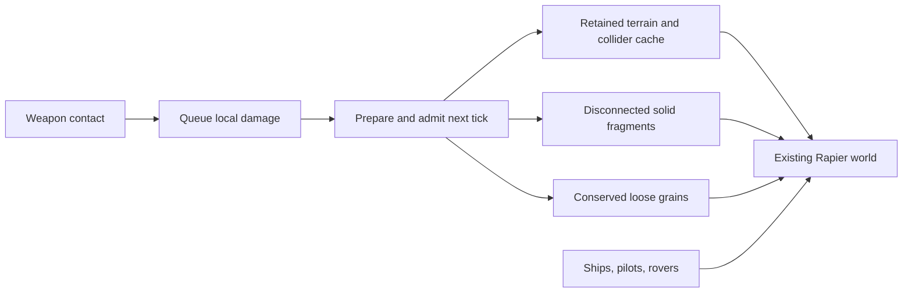

# Shared loose terrain — #165

Terrain Lab and Spacewars now use the same material-release lifecycle. In the
launcher, choose **Space-Wars → Settings → Loose dirt (trial): On**. The setting
also applies to the existing combat/duel, travel and arena scenarios. It persists
across restart; old settings files default to Off.

Use cannon impacts or enable asteroid arrivals to break ground into moving dirt.
The trial uses round, one-world-unit cells, friction 0.6 and a 192-grain limit.
The HUD shows `Dirt n/192` when no higher-priority actor message is needed.
`Dirt limit · restart` means an impact could not fit. Restart clears the trial.
Mining keeps its existing removal behavior. Lasers keep their existing rules.

## Ownership and the tick boundary



`engine-terrain::apply_releasing` runs the normal damage and surface-edit path.
Only cells whose attachment breaks leave the field. Their material, size and
durability immediately before the breaking hit move into `DetachedCell` samples.
For example, 160 work releases 100-hardness rock but leaves 180-hardness ore at
20 durability. A later breaking hit transfers that 20-durability ore sample.
Damage is a detachment threshold here; it does not consume the cell's material.

`engine-rapier::terrain::PreparedRelease` prepares ordered release/removal edits
and disconnects solid pieces once per source. `LooseTerrain::commit` checks
capacity, source freshness and destination IDs before publishing material,
geometry and bodies. Failed destination insertion removes unpublished bodies.
Every new body inherits the source's velocity at its release point, including
translation and rotation. The shared component owns the loose-body handles and
per-material quantities; it never steps physics, applies gravity or awards yield.

Spacewars groups the preceding tick's edits by their sampled source, preserving
order within each source. Over-capacity impact batches leave that field and its
existing loose velocities unchanged; independent mining edits still proceed.
After accepted releases, the adapter registers solid fragments and grains in
the existing material-body registry and applies bounded radial velocity changes.
Previously released dirt can receive later blasts, including direct shell hits.
Gravity, collision queries, ships, spacelings and renderers use the same world.
Base/flag support is invalidated through the existing terrain lifecycle. No
additional solver or gravity step is introduced.

Diagnostics report solid cells, loose cells and removed cells separately:
`initial = solid + loose + removed`. Released cells are never also counted as
destroyed or mined. Observations include loose material, motion, settings and
queued impulses, allowing clone continuation checks.

The lab also uses `LooseTerrain`, while retaining its own fixture choices,
probe box, blast pulse and aggregate grain-plus-fragment budget. Clock and
Scorched Earth can provide adapters to these same APIs; their game rules have
not been changed in this slice.

## Limits and next work

This remains a trial: there is no deposition, merging, offscreen deletion or
unlimited population fallback. A 192-grain limit can reject a batch before every
slot is filled. Disconnected solid fragments retain Spacewars' existing policy.
Contact circles have pore space; nominal cell quantity and mass are conserved,
not the exact area covered by collision proxies. The radial kick is a gameplay
parameter, not a calibrated blast-pressure model.

Conserved settling/deposition belongs to [#51](https://github.com/aortez/space-wars/issues/51).
It must prepare an addition in the destination's moving frame, validate space
and material quantity, then publish the field and retire the loose bodies at
one boundary. That return path and performance tuning are prerequisites for
enabling this in ordinary games by default.

## Verification

```sh
cargo test --locked --profile ci -p engine-terrain -p engine-rapier \
  -p scenario-terrain-lab -p scenario-spacewars --lib
cargo run --locked --release -p scenario-spacewars --example loose_terrain_benchmark
```

Tests exercise real cannon and asteroid contacts, all three terrain surfaces,
moving/rotating sources, ore damage thresholds, mining mixed with release,
support loss, repeated hits on loose material, capacity rejection, conservation
and clone continuation. Native functional checks exercise launcher settings,
restart/persistence and vector/raster rendering.

The benchmark runs 3,600 fixed updates per case with seed 42 and heavy asteroids
arriving about once per second. The ordinary combat and three-planet match
scenarios include their actors; no bots are driven. It audits conservation and
world/cache ownership once per simulated second, outside the timing interval.
Frame time measures primitive construction, not final rasterization/display.
On/Off cases diverge physically after the first release, so these are workload
costs rather than a controlled solver-only comparison.

On `sw-picade.local` (Pi 4, aarch64, 1.5 GHz, release build, kiosk active,
77–81 °C), the October 3, 2026 run measured:

| Scene | Trial | Final grains | Rejected impacts | Step p95 | Step p99 | Step max | Frame p95 |
| --- | --- | ---: | ---: | ---: | ---: | ---: | ---: |
| Combat | Off | 0 | 0 | 0.731 ms | 1.139 ms | 2.152 ms | 0.175 ms |
| Combat | On | 188 | 11 | 6.025 ms | 7.221 ms | 10.233 ms | 0.312 ms |
| Three-planet match | Off | 0 | 0 | 1.855 ms | 2.574 ms | 9.640 ms | 4.569 ms |
| Three-planet match | On | 182 | 30 | 14.634 ms | 19.543 ms | 47.962 ms | 4.333 ms |

Both On cases ended with zero removed cells and passed every conservation and
ownership audit. The large world exceeds the 16.7 ms simulation budget in its
tail even before final rendering. This is a useful bounded integration trial,
not a claim of sustained 60 FPS at the population limit.
