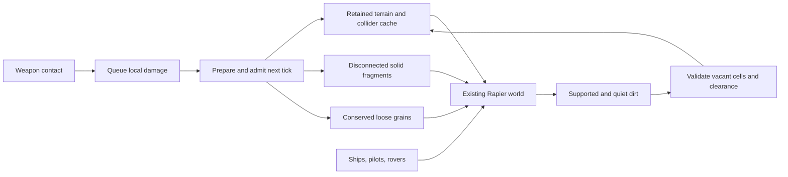

# Shared loose terrain — #165

Terrain Lab and Spacewars now use the same material-release lifecycle. In the
launcher, choose **Space-Wars → Settings → Loose dirt (trial): On**. The setting
also applies to the existing combat/duel, travel and arena scenarios. It persists
across restart; old settings files default to Off.

Use cannon impacts or enable asteroid arrivals to break ground into moving dirt.
The trial uses round, one-world-unit cells, friction 0.6 and a 192-grain limit.
The HUD shows `Dirt n/192` when no higher-priority actor message is needed.
The HUD also reports cumulative settled cells. Settling returns budget slots;
an impact that still cannot fit leaves its material intact.
Mining keeps its existing removal behavior. Lasers keep their existing rules.

## Ownership and the tick boundary



`engine-terrain::apply_releasing` runs the normal damage and surface-edit path.
Only cells whose attachment breaks leave the field. Their material, size and
durability immediately before the breaking hit move into `DetachedCell` samples.
For example, 160 work releases 100-hardness rock but leaves 180-hardness ore at
20 durability. A later breaking hit transfers that 20-durability ore sample.
Damage is a detachment threshold here; it does not consume the cell's material.

`engine-rapier::terrain::PreparedRelease` prepares ordered release/removal edits
and disconnects solid pieces once per source. `LooseTerrain::commit` checks
capacity, source freshness and destination IDs before publishing material,
geometry and bodies. Failed destination insertion removes unpublished bodies.
Every new body inherits the source's velocity at its release point, including
translation and rotation. The shared component owns the loose-body handles and
per-material quantities; it never steps physics, applies gravity or awards yield.

Spacewars groups the preceding tick's edits by their sampled source, preserving
order within each source. Over-capacity impact batches leave that field and its
existing loose velocities unchanged; independent mining edits still proceed.
After accepted releases, the adapter registers solid fragments and grains in
the existing material-body registry and applies bounded radial velocity changes.
Previously released dirt can receive later blasts, including direct shell hits.
Gravity, collision queries, ships, spacelings and renderers use the same world.
Base/flag support is invalidated through the existing terrain lifecycle. No
additional solver or gravity step is introduced.

Diagnostics report solid cells, loose cells and removed cells separately:
`initial = solid + loose + removed`. Released cells are never also counted as
destroyed or mined. Observations include loose material, motion, settings and
queued impulses and settling timers, allowing clone continuation checks.

`Terrain::deposit_cells` is the representation-independent return boundary.
It admits whole cells of matching size into vacant coordinates, preserving
material and remaining durability. Invalid, duplicate or occupied destinations
reject the batch without changing the field. Interpolated surfaces get a fresh
midpoint sample for each added cell; adjacent geometry caches refresh normally.
An eventual MPM adapter can accumulate cell quantities and use the same API.

`LooseTerrain::settle` requires a direct terrain contact and 0.5 seconds of low
relative speed/spin, with little drift in the supporting body's local frame.
Translation and rotation are included in the reference velocity. A candidate
must fit a nearby, vacant, face-connected cell of the same material scale.
Clearance checks include current collider edits and protect actors and grains
that remain loose. Blocked placements retry after another quiet interval.
At most 32 grains transfer per tick. Each destination publishes material and
geometry and retires its accepted grain bodies at the same boundary. Dynamic
destinations receive the grains' linear and angular momentum; prescribed
terrain retains its commanded motion. Deposited cells can be blasted loose again.

The lab also uses `LooseTerrain`, while retaining its own fixture choices,
probe box, blast pulse and aggregate grain-plus-fragment budget. Clock and
Scorched Earth can provide adapters to these same APIs; their game rules have
not been changed in this slice.

## Limits and next work

This remains a trial: there is no field expansion, solid-fragment merging,
offscreen deletion or unlimited population fallback. A 192-grain limit can reject a batch before every
slot is filled. Disconnected solid fragments retain Spacewars' existing policy.
Contact circles have pore space; nominal cell quantity and mass are conserved,
not the exact area covered by collision proxies. The radial kick is a gameplay
parameter, not a calibrated blast-pressure model.

This implements the initial conserved return path for
[#51](https://github.com/aortez/space-wars/issues/51). Only grains with direct
terrain support pack; upper layers can follow as the surface grows. Dense piles,
incompatible materials/sizes, field edges and nearby actors can prevent packing.
Contour/interpolated surfaces use a conservative neighboring-cell clearance
band. Blocked and orbiting grains remain physical and continue counting against
the budget. This is cell packing, not calibrated soil compaction or cohesion.
The trial remains Off by default while those limits and terrain growth are explored.

## Verification

```sh
cargo test --locked --profile ci -p engine-terrain -p engine-rapier \
  -p scenario-terrain-lab -p scenario-spacewars --lib
cargo run --locked --release -p scenario-spacewars --example loose_terrain_benchmark

# Select one scene or grain shape; default is both scenes and all three modes.
cargo run --locked --release -p scenario-spacewars --example loose_terrain_benchmark -- \
  --scene match --mode angular --seed 42 --seconds 60 --limit 192
```

Tests exercise real cannon and asteroid contacts, all three terrain surfaces,
moving/rotating sources, ore damage thresholds, mining mixed with release,
support loss, repeated hits on loose material, capacity rejection, conservation
and clone continuation. Deposition tests cover repeated release/settle/release
with a one-grain budget, damage retention, all three surfaces and both shapes,
stationary and translating/rotating ground, dynamic momentum, obstructed growth,
airborne/sliding rejection, registry retirement and real lab blast cycles.
Native functional checks exercise launcher settings,
restart/persistence and vector/raster rendering.

The benchmark runs up to 3,600 fixed updates per case with seed 42 and heavy asteroids
arriving about once per second. The ordinary combat and three-planet match
scenarios include their actors; no bots are driven. It audits conservation and
world/cache ownership once per simulated second, outside the timing interval.
It stops at a match outcome and verifies that each timed call advanced a tick;
the steps column reports active updates. Modes are `off`, `round` and `angular`.
The grain comparison changes only the contact shape (circle or hexagon), with
the same friction, restitution, nominal cell size and population budget. The
final observation hash is reported outside timing to check repeatability.
Frame time measures primitive construction, not final rasterization/display.
On/Off cases diverge physically after the first release, so these are workload
costs rather than a controlled solver-only comparison.

## Deposition check on Picade (2026-10-03)

697 library tests across the terrain, Rapier, lab and Spacewars crates pass,
including fair admission when blocked grains outnumber the per-tick budget.
The native granular launcher/pause/restart workflow passes with both renderers.
All nine 600-tick sandbox cases on Picade conserve material and reproduce their
observations on replay. They return 6–10 cells to terrain per run; dense piles
still retain most of their grains under the conservative clearance rule.
The deployed Picade client was also exercised with a blast and a box drop;
[the live capture](screenshots/granular-terrain/picade-deposition.png) shows five
returned cells and the new settled counter. The application was returned to
Spacewars and paused after verification.

A focused 1,800-tick comparison uses the prior archived binary and this return
path, Rust 1.89.0, the same release/static-CRT configuration, seed 42 and limit
192. The kiosk remains paused throughout. This is one run per version/case,
not a repeated regression study. Raw results, binary hashes and commands are in
[the deposition report](data/terrain-deposition-picade-20261003.json).

| Workload | p95 before | p95 with deposition | Cells returned | Rejected releases before → after |
| --- | ---: | ---: | ---: | ---: |
| Combat, round | 4.69 ms | 5.77 ms | 23 | 1 → 0 |
| Combat, angular | 5.37 ms | 7.17 ms | 16 | 2 → 1 |
| Three planets, round | 14.43 ms | 15.70 ms | 3 | 8 → 9 |
| Three planets, angular | 15.26 ms | 16.54 ms | 9 | 9 → 9 |

Deposition recycles capacity but is not yet a performance improvement. Changed
ground and accepted impacts also change subsequent solver work, so these deltas
do not isolate admission cost. The Off cases retain identical final hashes and
p95 remains approximately 0.42 ms / 1.68 ms. The post-run temperature was 80.3°C
and sysfs reported 1.5 GHz; no firmware throttle telemetry was available. Further
packing/performance work is needed before enabling the trial by default.

## Picade benchmark comparison (2026-10-03)

This earlier release-only comparison precedes the deposition change above.

The review ran on `sw-picade.local`, Raspberry Pi 4 Model B Rev 1.4, with the
kiosk running and its game already paused. Baseline `8d7427b` precedes the shared
release lifecycle; current `2d6aa96` includes it and the active-tick benchmark
guard, plus the archived shape-selection patch. Both use Rust 1.89.0, identical
`Cargo.lock`, release/fat LTO, aarch64 and static CRT linkage. Installed binaries,
application settings and service state were not changed.

There are three serial repetitions of each comparison, with model/shape order
rotated and baseline/current order reversed on repetition two. The 66 matrix
executions cover all eight existing terrain runners plus the soil and integrated
loose-terrain comparisons. Geometry has three inner repetitions per executable.
An additional 20 short terrain executions alternate builds on CPU 2 to follow up
the repeated-edit result. No benchmark executables overlap.

All times below are milliseconds. Tables report the median of each runner's
per-run statistic, not a pooled percentile. Parentheses show the observed range
across repetitions, not a confidence interval. The game table's worst step is
the largest single step observed across all three runs.

Temperature ranged from 76.9–84.7 °C. Linux `scaling_cur_freq` reported
1.5 GHz; 0 undervoltage-alarm samples were recorded.
This is a hot, shared cabinet measurement. `vcgencmd` is absent and access to the
hardware clock/firmware interface requires privileges unavailable to this
account. The reported frequency does not rule out firmware throttling; the
[firmware status bits](https://www.raspberrypi.com/documentation/computers/os.html#get_throttled)
are a separate diagnostic. Small timing differences should not be treated as
precise regression estimates.

### Round and angular grains in Spacewars

All six cases completed 3,600 active ticks per run. Every repeated final
observation hash and material counter matched. Both enabled modes retained all
material, with zero removed cells and no ownership/cache audit failures. The
limit is 192 grains; all other grain settings match between shapes.

| Scene | Dirt | Mean | p95 (run range) | p99 | Worst step | Frame p95 | Final grains | Rejected impacts |
| --- | --- | --- | --- | --- | --- | --- | --- | --- |
| combat | off | 0.33 | 0.66 (0.64–0.70) | 0.94 | 1.87 | 0.15 | 0 | 0 |
| combat | round | 3.60 | 6.50 (6.13–6.52) | 6.96 | 8.83 | 0.30 | 188 | 11 |
| combat | angular | 3.90 | 7.14 (7.00–7.52) | 7.95 | 22.23 | 0.33 | 188 | 15 |
| match | off | 1.44 | 1.88 (1.84–1.94) | 2.48 | 10.65 | 4.68 | 0 | 0 |
| match | round | 11.37 | 15.20 (14.62–15.54) | 18.42 | 50.56 | 4.36 | 182 | 30 |
| match | angular | 12.04 | 16.01 (15.51–16.47) | 17.12 | 29.40 | 3.90 | 182 | 30 |

Round grains have lower median mean and p95 cost in both scenes. Angular grains
have a lower match p99 (17.12 versus 18.42 ms) and smaller worst observed match
step (29.40 versus 50.56 ms). Both match configurations exceed the 16.67 ms
simulation budget in their tails before final rendering; neither establishes
sustained 60 FPS at the population limit.

Step timing includes the ordinary scenario's physics and terrain lifecycle.
Frame timing covers primitive construction, not rasterization/display. No bots
are driven. Off/round/angular trajectories differ after the first release, so
these are real workload costs, not an isolated shape-solver overhead. Rejected
impacts preserve material; they also bound the amount of continuing damage.

### MPM versus round grains in the soil lab

These are the existing ten-second pour, support-removal and repeated-blast
fixtures, on flat and moving planetary ground. Each experiment starts with the
same material samples/reservoir and external actions across models. Internal
friction, contact representation and solver stepping differ, as documented in
the [soil lab](soil-mpm-lab.md). These populations and cell sizes are different
from the 192-grain Spacewars trial.

| Fixture / experiment | Samples | MPM mean | MPM p95 (range) | Grains mean | Grains p95 (range) | Grains / MPM mean |
| --- | --- | --- | --- | --- | --- | --- |
| flat / pour | 288 | 2.54 | 3.14 (3.13–3.69) | 4.25 | 7.01 (6.32–7.14) | 1.67× |
| flat / bank | 494 | 4.93 | 5.59 (5.14–6.45) | 11.00 | 18.85 (18.68–19.63) | 2.23× |
| flat / blasts | 1024 | 9.32 | 10.42 (9.85–12.13) | 25.07 | 31.48 (31.35–32.60) | 2.69× |
| moving-planet / pour | 288 | 3.02 | 3.63 (3.23–3.82) | 4.64 | 7.59 (7.46–7.99) | 1.53× |
| moving-planet / bank | 494 | 7.80 | 8.38 (7.37–8.72) | 11.42 | 14.28 (13.84–14.41) | 1.46× |
| moving-planet / blasts | 1024 | 11.36 | 12.47 (11.09–13.38) | 28.45 | 45.92 (43.37–46.91) | 2.50× |

MPM is faster in all six cases. At 1,024 samples, its median mean cost is
9.32 ms on flat ground and 11.36 ms on the moving planet, versus 25.07 and
28.45 ms for grains: a 2.5–2.7× mean-cost advantage in these blast fixtures.

The zero-internal-friction MPM control was also repeated; its complete results
are in the archive and CSV. Every case retained its prescribed samples and
material mass, and repeated physical diagnostics exactly within each model.
These runs audit each step but omit playback/replay cost. MPM still uses
prescribed, one-way contacts here: terrain release/deposition, actor reactions
and two-way Rapier coupling are not measured. These results do not establish an
MPM game-frame cost or readiness to replace the integrated grain path.

### Existing terrain benchmarks before and after integration

The following p95 columns measure physics/scenario updates, except **Geometry**,
which measures geometry refresh after cuts. Each row's workload counters,
material hashes and other reported non-timing evidence match between revisions
and across repetitions. The archived CSV also includes editing, collider
synchronization, initial construction and frame-building timings.

| Benchmark | Case | Before p95 | After p95 | Change |
| --- | --- | --- | --- | --- |
| Edits | 1 / craters | 0.168 | 0.193 | +14.9% |
| Edits | 1 / tunnels | 0.167 | 0.289 | +73.1% |
| Edits | 0.5 / craters | 0.723 | 0.995 | +37.6% |
| Edits | 0.5 / tunnels | 0.907 | 0.995 | +9.7% |
| Fragments | equator / 20 | 0.137 | 0.135 | -1.5% |
| Fragments | blocks / 20 | 3.355 | 3.238 | -3.5% |
| Fragments | equator / 150 | 3.130 | 3.046 | -2.7% |
| Mining | Precision / 20 | 0.344 | 0.357 | +3.8% |
| Mining | Drill / 20 | 0.158 | 0.153 | -3.2% |
| Mining | Excavator / 20 | 0.153 | 0.145 | -5.2% |
| Mining | Precision / 150 | 4.686 | 4.646 | -0.9% |
| Mining | Drill / 150 | 4.714 | 4.751 | +0.8% |
| Mining | Excavator / 150 | 4.564 | 4.591 | +0.6% |
| Impacts | equator / 20 / false | 0.148 | 0.135 | -8.8% |
| Impacts | equator / 20 / true | 0.157 | 0.147 | -6.4% |
| Impacts | blocks / 20 / true | 4.241 | 4.172 | -1.6% |
| Impacts | blocks / 40 / true | 17.935 | 17.659 | -1.5% |
| Impacts | equator / 150 / true | 3.261 | 3.149 | -3.4% |
| Spacewars | fixture | 1.085 | 1.054 | -2.9% |
| Spacewars | tunnel | 2.117 | 1.988 | -6.1% |
| Spacewars | blocks | 8.749 | 8.520 | -2.6% |
| Spacewars | multi_planet | 3.019 | 3.028 | +0.3% |
| Geometry | 0 / Interpolated | 2.650 | 2.588 | -2.4% |
| Geometry | 1 / Interpolated | 18.484 | 18.639 | +0.8% |
| Geometry | 2 / Interpolated | 14.384 | 13.931 | -3.1% |
| Colliders | Blocks / Separate | 10.132 | 10.261 | +1.3% |
| Colliders | Blocks / ChunkCompound | 0.330 | 0.337 | +2.1% |
| Colliders | Interpolated / Separate | 168.861 | 173.466 | +2.7% |
| Colliders | Interpolated / ChunkCompound | 0.329 | 0.342 | +4.0% |

The ordinary Spacewars cases change by -6.1% to +0.3% in median step p95.
Mining, fragmentation, impacts and geometry remain close in these runs;
collider step p95 rises 1.3–4.0%. The initial repeated-edit fixture shows larger
increases, including 0.167 → 0.289 ms for one-unit tunnels and 0.723 → 0.995 ms
for half-unit craters. Those cases warranted a focused follow-up instead of a
blanket claim that the integration has no performance cost.

The short edit fixture times only 80 edits per case. Its fixed-core follow-up
uses ten runs per build with alternating order and the original measured
binaries; the paused kiosk and thermal limitations still apply.

| Cell size / edit | Before p95 (range) | After p95 (range) | Change |
| --- | --- | --- | --- |
| 1 / craters | 0.21 (0.17–0.27) | 0.19 (0.17–0.24) | -7.3% |
| 1 / tunnels | 0.23 (0.16–0.29) | 0.19 (0.17–0.30) | -17.0% |
| 0.5 / craters | 0.99 (0.81–1.08) | 0.99 (0.67–1.07) | -0.2% |
| 0.5 / tunnels | 0.94 (0.81–1.07) | 0.88 (0.82–1.00) | -7.3% |

The larger step-time increases do not reproduce on the fixed core: current
median p95 is similar or lower in every case, and all before/after ranges
overlap. Edit, geometry and collider-update ranges also overlap. This points
to substantial measurement sensitivity in the short fixture; it does not prove
which scheduling/cache/thermal effect caused it, or establish a code speedup.
No large, reproducible slowdown in the unchanged ordinary terrain path was
established by this review. Keep the short fixture when profiling future changes.

### Native granular sandbox workload changes

This runner uses 0.5-unit cells, a 192-body budget, three blasts and a dropped
box. Its second blast is aimed below the box's actual position. Each version
passed conservation, finite motion, matching-collider and same-build replay
checks in all nine cases; every repeated result within a version matched.

| Fixture / preset | Before p95 | After p95 | Before peak bodies | After peak bodies |
| --- | --- | --- | --- | --- |
| flat / Round | 3.28 | 2.93 | 159 | 149 |
| flat / Round + grip | 3.07 | 3.03 | 159 | 149 |
| flat / Angular | 3.74 | 3.61 | 161 | 162 |
| slope / Round | 2.74 | 2.97 | 139 | 154 |
| slope / Round + grip | 2.63 | 2.57 | 139 | 139 |
| slope / Angular | 4.07 | 4.10 | 174 | 178 |
| moving-planet / Round | 3.32 | 3.22 | 154 | 154 |
| moving-planet / Round + grip | 3.23 | 2.79 | 151 | 138 |
| moving-planet / Angular | 3.98 | 4.10 | 151 | 162 |

These rows are not an equal-trajectory speed comparison. The shared transaction
inserts destinations before synchronizing source geometry, allowing failed
destination insertion to roll back without changing the source. The former lab
path synchronized the source first. A desktop diagnostic found identical
released material and velocities before the first solve, followed by different
collision results. Changing only that publication order in an isolated
diagnostic worktree restored all 62 recorded initial/release/step samples per
fixture across three fixtures, and all reported physical results/final hashes
for the complete nine-case, 600-tick sandbox workload. That diagnostic patch is archived and was
not applied to production. Later box-targeted blasts therefore select different
cells, explaining the differing populations as well as trajectories.

### Reproduction and retained evidence

[All timing summaries](data/loose-terrain-picade-20261003.csv) include per-run
statistic medians and ranges. The [review archive](data/loose-terrain-picade-20261003.tar.gz)
contains command order, exit statuses, raw runner outputs, thermal samples,
analysis scripts, exact measured-source patches, executable SHA-256 values and
the publication-order diagnostic. Extract it and run `python3 analyze.py` to
rebuild the summary. Binaries remain under `target/terrain-benchmark-review/`;
the archive contains their hashes rather than executable files.

```sh
RUSTFLAGS='-C target-feature=+crt-static' cargo +1.89.0 build --locked --release \
  --target aarch64-unknown-linux-gnu -p scenario-terrain-lab \
  --example soil_mpm_lab --example granular_sandbox --example terrain_benchmark \
  --example fragment_benchmark --example mining_benchmark --example impact_benchmark
RUSTFLAGS='-C target-feature=+crt-static' cargo +1.89.0 build --locked --release \
  --target aarch64-unknown-linux-gnu -p scenario-spacewars \
  --example loose_terrain_benchmark --example spacewars_terrain_benchmark \
  --example surface_geometry_benchmark --example terrain_collider_benchmark
```

Use the archived job arguments and fresh output directories on the target.
Repeat the eight existing runners from a checkout of `8d7427b` for the baseline.
The final CLI also accepts short durations/tiny budgets that release no grains;
its end-of-run assertions still verify the configured limit and conservation.
Those assertion-only refinements are outside the timed regions and are stored
separately from the patch used to build the measured executable.
