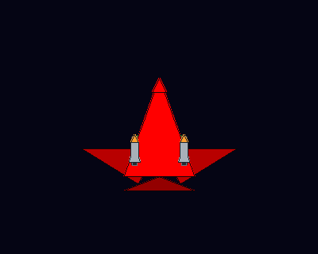
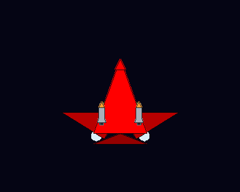
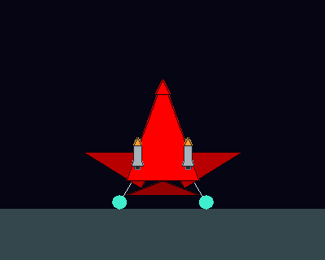
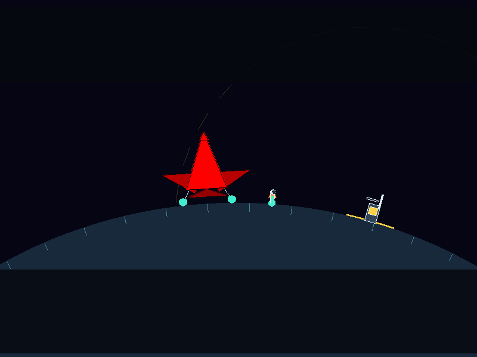
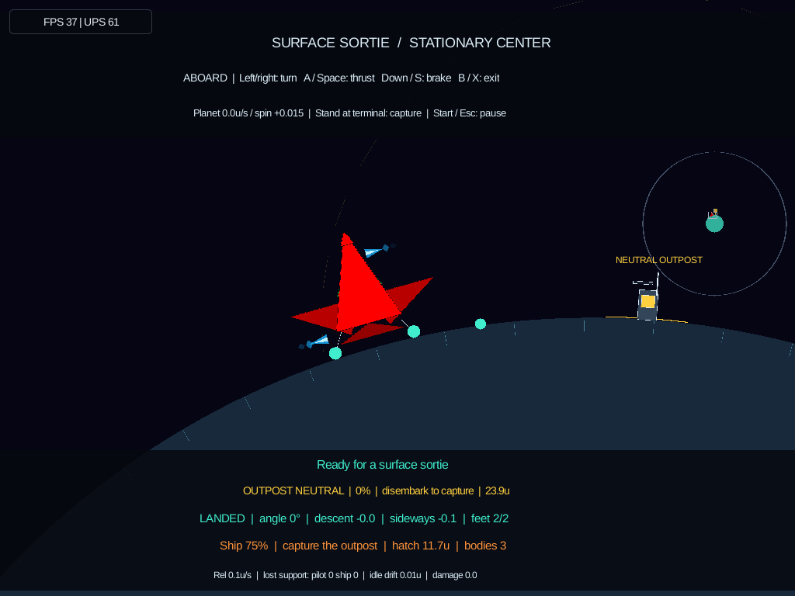

# Automatic ship landing gear

The material-planet Spacewars match and Surface Sortie/Expedition share a small,
automatic landing-gear animation. No new control is required. Classic Spacewars
keeps its existing presentation; escape pods retain their fixed feet.

## Behavior and scope

- With open wings, the feet extend when surface clearance falls to 18 world
  units and the nose points within 50° of outward. Extension takes 0.4 simulation
  seconds, with eased motion from inside the fuselage to the physical pads.
- Once deployed, the gear stays down until clearance exceeds 24 units, alignment
  exceeds 65°, or the wings start sweeping. Retraction takes 0.3 seconds. These
  separate thresholds prevent repeated cycling at the edge of an approach.
- Actual foot support, settling, or landing immediately puts the feet fully down,
  including hard touchdowns and the first moments of takeoff. Landed feet keep
  the existing cyan color. Pause freezes animation.
- Spawned ships start with gear down; free-flight starts retract on their first
  simulation ticks. Vehicle loss resets the animation.

This is **presentation-only**: the physical foot colliders remain in their
existing extended positions, even when the artwork is retracted. Handling,
collision footprint, damage, landing assistance, boarding criteria, and bot
observations are unchanged. There are no added bodies, joints, terrain queries,
or gameplay random-number calls. The animation reuses completed landing telemetry
and adds at most two lines and two circles per player view; stowed gear adds none.

## Unoccupied-ship thruster fix

The parked ship's automatic stabilization can produce angular and linear
corrections even when player thrust, turn, and brake inputs are all zero. These
corrections were lighting its ornamental jets while the spaceling was outside.

An unoccupied ship now suppresses its attached jets and clears both its current
wake and legacy exhaust. Its existing stabilizing physics still runs. The effect
buffer is reused, and reboarding restores normal feedback with a fresh wake.
On-foot walking, jumping, and braking do not operate the ship's effects.

## Repeatable screenshots and tests

```sh
RUST_MIN_STACK=16777216 SPACEWARS_GEAR_ARTIFACTS=target/ship-gear-captures \
  cargo test --locked -p engine-client --bin engine-client landing_gear_visual_fixture
RUST_MIN_STACK=16777216 cargo test --locked -p scenario-spacewars --lib landing_gear
RUST_MIN_STACK=16777216 cargo test --locked -p scenario-spacewars --lib thruster
```

Open `target/ship-gear-captures/index.html`. It includes stowed, extending,
approaching, landed, retracting, and swept-wing flight views at close-up and
Picade player-pane sizes, each at raster scales 1 and 2. PNGs use the production
software renderer; SVGs export the vector adapter, not Slint GPU screenshots.
The two full-scene captures actually land and disembark in the Surface Sortie
simulation; they show scenario rendering without the client's HUD.

Regressions check threshold stability, pause and vehicle transitions, deployed
pad/collider alignment at several rotations, visible raster pixels, vector
inclusion, and unchanged physics/observations with different animation states.
Thruster regressions reproduce unoccupied stabilization, exercise on-foot
controls, and verify clean restoration after boarding.

### Gear sequence

| Stowed | Extending | Landed |
| --- | --- | --- |
|  |  |  |

### Spaceling outside

The ship remains supported, with its gear down and thruster effects off.



### Actual Picade capture

Surface Sortie running on `sw-picade-2`, captured through the app's screenshot
command at 1024×768, raster scale 2. The pilot is still **aboard** here, so the
automatic stabilization jets remain visible. The HUD reports LANDED and feet 2/2.



## Manual check

Use Spacewars or a Surface preset. Take off and watch the feet retract; return
rear-first with open wings and watch them extend. After settling, use B/X to exit,
release the controls, then walk or jump: the ship should remain visually quiet.
Board again and thrust to verify the jets return. The fixed physical landing
criteria have not changed.
